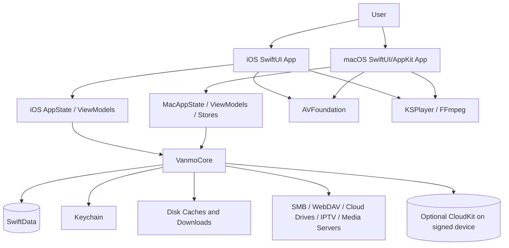
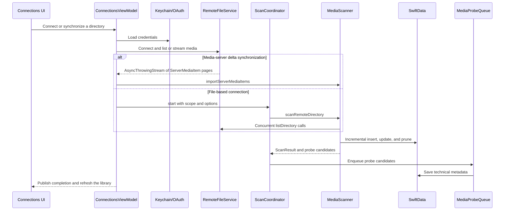
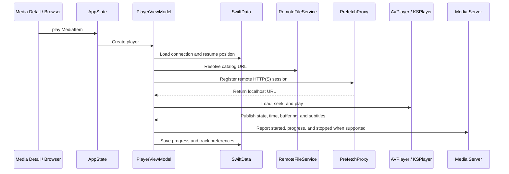

# Vanmo Architecture

> This document describes the repository as of September 16, 2026. It is based on the current working tree, `project.yml`, `Packages/VanmoCore/Package.swift`, application entry points, runtime data flows, and the existing test suite.
> If this document conflicts with the code, treat `project.yml`, `Packages/VanmoCore/Package.swift`, and the current implementation as the sources of truth.

## 1. System Overview

Vanmo is a cross-platform video player with three products:

- `Vanmo`: the iOS 17+ application.
- `Vanmo-macOS`: the native macOS 14+ application.
- `VanmoCore`: a local Swift Package shared by both applications. It owns domain models, persistence, remote connections, scanning, downloads, subtitles, metadata, and playback infrastructure.

The project primarily uses Swift 5.9, SwiftUI, SwiftData, Swift Concurrency, Combine, AVFoundation, and KSPlayer. It is not a strict Clean Architecture implementation. A more accurate description is:

1. iOS and macOS have separate platform UI, navigation, and playback adapters.
2. Both applications use MVVM/Store-style `ObservableObject` types for UI state and use-case orchestration.
3. Reusable domain models and infrastructure live in `VanmoCore`.
4. Application entry points inject a SwiftData `ModelContainer`. Root views obtain a `ModelContext` from the environment and pass it to ViewModels and shared services.



## 2. Repository and Module Boundaries

```text
Vanmo/
├── Vanmo/                       # iOS application
│   ├── App/                     # App entry point, global state, tabs, navigation
│   ├── Core/                    # iOS player engines, probe bootstrap, subtitle UI
│   ├── Features/                # Library / Browser / Player / Search / Settings
│   ├── Shared/                  # iOS components, extensions, UIKit OAuth bridge
│   ├── Resources/               # Info.plist, assets, Lottie resources
│   └── Frameworks/FFmpeg/       # Local build output; normally not versioned
├── VanmoMac/                    # macOS application
│   ├── App/                     # App entry point, routing, window coordination
│   ├── Player/                  # macOS AVPlayer/KSPlayer and player window
│   ├── Metadata/                # macOS KSPlayer media-probe bridge
│   ├── UI/                      # Library / Browser / Search / Settings / Detail
│   ├── Shared/                  # AppKit OAuth bridge and platform extensions
│   └── Resources/
├── Packages/VanmoCore/          # Cross-platform domain and infrastructure package
│   ├── Sources/VanmoCore/
│   └── Tests/VanmoCoreTests/
├── scripts/                     # Build and static architecture checks
├── docs/                        # Durable product, design, plan, quality, and operating knowledge
├── project.yml                  # XcodeGen source of truth
├── Vanmo.xcodeproj/             # Generated and committed Xcode project
├── init.sh                      # Dependency resolution and repository baseline checks
├── run_device.sh                # Build, install, and launch iOS/macOS apps
└── build_ipa.sh                 # Archive and export the iOS Release build
```

Boundary rules:

- `VanmoCore` must not depend on UIKit, AppKit, or SwiftUI.
- iOS UI belongs in `Vanmo/`; macOS UI belongs in `VanmoMac/`.
- Platform player engines remain outside `VanmoCore`. The package exposes common playback types, format detection, prefetching, and playback URL resolution.
- Target definitions, dependencies, resources, compilation conditions, and entitlements must be changed in `project.yml`, followed by `xcodegen generate`. Do not edit `project.pbxproj` by hand.
- The macOS target directly reuses only `Vanmo/Shared/Components/MediaTitleLogoView.swift` and `LoadingIndicatorView.swift`; the rest of the application UI is platform-specific.

### 2.1 Documentation Boundaries

- `docs/` is the sole Harness system of record for product intent, design decisions, execution plans and progress, quality, reliability, security, frontend standards, SOPs, and maintained references.
- Active plans record unfinished execution state and evidence. Completed plans preserve outcomes, `QUALITY_SCORE.md` owns quality history, and the tech-debt tracker owns confirmed deferred work.
- Start at `AGENTS.md`, then read `ARCHITECTURE.md`, `docs/QUALITY_SCORE.md`, and `docs/PLANS.md`. Follow the active-plan index and relevant product spec before opening detailed reliability, security, frontend, design, SOP, or reference material.
- [`docs/PLANS.md`](docs/PLANS.md) defines durable planning and archival policy. [`docs/exec-plans/active/index.md`](docs/exec-plans/active/index.md) and [`docs/product-specs/index.md`](docs/product-specs/index.md) provide current discovery routes.

## 3. Build Targets and Dependencies

### 3.1 Platforms and Targets

| Target / Product | Platform | Minimum Version | Entry Point |
|---|---|---:|---|
| `Vanmo` | iOS | 17.0 | `Vanmo/App/VanmoApp.swift` |
| `VanmoDownloadWidget` | iOS app extension | 17.0 | `VanmoDownloadWidget/VanmoDownloadWidget.swift` |
| `Vanmo-macOS` | macOS | 14.0 | `VanmoMac/App/VanmoMacApp.swift` |
| `VanmoCore` | iOS / macOS | 17.0 / 14.0 | `Packages/VanmoCore/Package.swift` |

`project.yml` and `Package.swift` define the current deployment targets.

### 3.2 Dependencies

- Both apps depend on `VanmoCore`, Kingfisher, KSPlayer, and Lottie.
- The iOS target also declares direct dependencies on SWXMLHash and SMBClient.
- `VanmoDownloadWidget` is an iOS WidgetKit extension embedded in `Vanmo`. It renders the download Live Activity only. Shared `DownloadLiveActivityAttributes` and `DownloadLiveActivityIntents` are compiled into both targets; the widget does not import `VanmoCore`. Expanded pause / resume / cancel reach `DownloadManager` through an app-registered relay. Lock-screen taps use `vanmo://downloads`.
- `VanmoCore` itself depends on SWXMLHash and SMBClient.
- System frameworks include SwiftUI, SwiftData, AVFoundation, Network, and Security. iOS also uses UIKit; macOS uses AppKit.
- `FFMPEG_ENABLED` is still defined for both app targets, but no current Swift source consumes the condition and the Xcode project does not link static libraries from `Vanmo/Frameworks/FFmpeg/`.
- Current FFmpeg decoding is provided by the KSPlayer package. The standalone FFmpeg 7.1 workflow in `scripts/build-ffmpeg-ios.sh` appears to be a legacy path and is not a current build prerequisite.

### 3.3 Debug and Release Differences

- `CLOUDKIT_SYNC_ENABLED` is defined for VanmoCore and for iOS/macOS Debug and Release app configurations. Personal-team fallback files `Vanmo.entitlements` and `Vanmo-Mac.entitlements` still omit iCloud.
- Debug and Release use `Vanmo-Cloud.entitlements` and `Vanmo-Mac-Cloud.entitlements` (`iCloud.com.vanmo.app`). Signed Debug on a physical device or Mac can exercise real CloudKit; a Simulator Debug launch cannot.
- Real CloudKit still requires a paid Team, an iCloud account on the device, and that container bound to both `com.vanmo.app` and `com.vanmo.app.mac`.

### 3.4 Privacy Manifests

iOS, macOS, and `VanmoCore` each ship `PrivacyInfo.xcprivacy`. The files declare no tracking, the Required Reason APIs used by first-party code (User Defaults and File Timestamp), and the CloudKit plus online-subtitle data types. They do not cover third-party package binaries. The durable privacy rules live in [`docs/SECURITY.md`](docs/SECURITY.md).

## 4. iOS Application Architecture

### 4.1 Entry Point and Dependency Injection

`VanmoApp` performs the following global setup:

- Locks the interface language for the process from `AppLanguagePreference`.
- Installs `UIKitOAuthPresentationContextProvider`.
- Removes orphaned prefetch temporary files.
- Registers the KSPlayer media-probe provider.
- Registers the iOS background scan task.
- Registers OpenSubtitles, Shooter, and SubHD providers with `OnlineSubtitleService`.

The app creates and injects:

- `AppState`
- `ConnectionsViewModel`
- `CloudSyncCoordinator.shared`
- `DownloadManager.shared`
- `DownloadHeroController.shared`
- The SwiftData container returned by `ModelContainerFactory.makeSharedContainer()`

There is no dependency-injection framework. SwiftUI environment objects, local `@StateObject` instances, and a small number of shared singletons provide dependency ownership.

### 4.2 Navigation

`ContentView` uses four tabs:

- Library: `LibraryView`
- Files and connections: `ConnectionsView`
- Search: `SearchView`
- Settings: `SettingsView`

Each tab owns a separate `NavigationStack`. The settings path is stored in `AppState.settingsPath`, preserving nested navigation when a theme change recreates `ContentView`.

Playback is driven by `AppState.currentPlayingItem` and `isPlayerPresented`. `PlayerPresentationModifier` presents `PlayerView` through a `fullScreenCover`.

`AppState` owns:

- The selected tab.
- The currently playing item and player presentation state.
- The settings navigation path.
- A favorite-change counter that preserves cross-tab notifications while views are not mounted.

### 4.3 Startup and Lifecycle

`ContentView.task`:

1. Injects the environment `ModelContext` into the connections ViewModel and download manager.
2. Restores and resumes the download queue.
3. Restores security-scoped local-folder access and attempts automatic reconnection.
4. Performs an application-launch cloud synchronization pass.

When the app enters the foreground, it resumes downloads, performs synchronization, and reloads saved connections. When it enters the background, it suspends the download queue.

### 4.4 iOS Features

- `Features/Library`
  - `LibraryViewModel` combines local SwiftData media, scanned libraries, and live Emby/Jellyfin home data.
  - It provides continue-watching, favorites, collection previews, filters, detail navigation, and episode hierarchy.
  - `HomeCollectionCache` stores server folders and previews to reduce cold-start gaps and duplicate requests.
- `Features/Browser`
  - `ConnectionsViewModel` manages connection CRUD, Keychain credentials, OAuth, local bookmarks, directory browsing, scanning, and media-server synchronization.
  - `ScanCoordinator` publishes scan progress and pause, resume, and cancellation controls.
- `Features/Player`
  - `PlayerViewModel` orchestrates playback URL resolution, prefetching, dual engines, subtitles, chapters, episode switching, progress persistence, and Emby playback reporting.
- `Features/Search`
  - `SearchViewModel` searches both the local SwiftData library and remote connections.
  - Remote searches are limited to four concurrent sources. Media servers use server-side search when available; file services use bounded recursive search.
- `Features/Settings`
  - Settings cover playback, subtitles, downloads, library behavior, appearance (including interface language), metadata, and iCloud synchronization.

## 5. macOS Application Architecture

### 5.1 Scenes and Global Objects

`VanmoMacApp` locks the interface language, then configures the AppKit OAuth provider, prefetch cleanup, media probing, and online subtitle providers. It creates:

- `MacAppState`
- `MacLibraryViewModel`
- `MacConnectionsViewModel`
- `MacSearchViewModel`
- `CloudSyncCoordinator.shared`
- `DownloadManager.shared`
- `MacDownloadHeroController.shared`
- The shared SwiftData container

The app declares:

- A main `WindowGroup` containing `VanmoMacRootView`.
- A dedicated downloads `WindowGroup`.
- A native `Settings` scene.
- A `MenuBarExtra` for basic playback control.
- A playback command menu with keyboard shortcuts.

### 5.2 Routing and Main Window

macOS does not use the iOS tab structure. `MacAppState` owns an explicit `MacContentRoute`:

- Library Home, Favorites, and History
- Collection Folder, Scanned Library, Emby Folder, and Show Detail
- Connection Browser
- Search

`VanmoMacRootView` combines a custom sidebar with a content area. Library root views remain mounted and switch through opacity and hit testing. This preserves scroll positions and Kingfisher's in-memory cache. Detail content is presented as an overlay.

`MacAppState` coordinates:

- Sidebar state, filters, view mode, and appearance.
- Route context and back navigation.
- In-memory media cleanup before deleting a connection.
- Favorite and watch-history change signals.
- The independent player window and its dependencies.

### 5.3 Independent Player Window

The macOS player is not presented as a sheet inside the main window. `MacAppState.play` creates a `MacPlayerWindowController`, which hosts `MacPlayerView` in an `NSWindow` through `NSHostingView`.

Closing the window, invoking the close command, or switching to another item converges on one cleanup path:

- Save playback progress.
- Stop media-server playback reporting.
- Stop AVPlayer or KSPlayer.
- Unregister the prefetch session.
- Notify the home and history views.

This window lifecycle is one of the largest platform differences between iOS and macOS.

### 5.4 macOS ViewModels and Stores

- `MacConnectionsViewModel` mirrors the iOS connection flow and adds local-file readability checks. Drag-and-drop playback is coordinated by `VanmoMacRootView` and `MacLocalFilePlayback`.
- `MacLibraryViewModel` adds desktop-specific home-cache, refresh coalescing, and redraw-suppression behavior.
- `MacMediaDetailStore` concurrently loads cached metadata, network metadata, seasons, and collections. Generation checks prevent stale async results from overwriting the active detail.
- `MacSearchViewModel` owns desktop search state.
- `MacSettingsViewModel` drives the native settings window.

## 6. VanmoCore

`VanmoCore` is the shared domain and infrastructure layer. It is not a stateless domain-only package: it includes SwiftData models, shared services, file-system caches, network implementations, and several observable coordinators.

### 6.1 Models

Key models:

- `MediaItem`: media identity, metadata, playback state, source, remote version, probe results, audio tracks, subtitle preferences, optional server `contentRating`, and probed or server-supplied video dimensions.
- `RemoteFile` and `ServerMediaItem`: Sendable transport models for file services and media servers. `ServerMediaItem` can carry optional `contentRating`, `videoWidth`, `videoHeight`, and `dynamicRange` from Emby, Jellyfin, or Plex.
- `SavedConnection`: non-sensitive remote connection configuration. Passwords and OAuth tokens are stored separately.
- `PlaybackRecord`: local playback-history snapshot.
- `FolderBookmark`: a remote directory selected for synchronization.
- `CloudMediaState`: the minimal progress and favorite state synchronized across devices.
- `ConnectionTombstone`: a per-device CloudStore hide marker for a `SavedConnection`. Other devices ignore tombstones that are not theirs.
- `ScanJobRecord`: persistent scan status and progress.

### 6.2 Persistence and Scanning

`ModelContainerFactory` splits SwiftData into two configurations:

| Store | Models | CloudKit |
|---|---|---|
| `LocalStore` | `MediaItem`, `PlaybackRecord`, `ScanJobRecord` | Never enabled |
| `CloudStore` | `SavedConnection`, `FolderBookmark`, `CloudMediaState`, `ConnectionTombstone` | When `CloudSyncPreferences.isEnabled` is true, launch uses `.private("iCloud.com.vanmo.app")`. A throwing create falls back to `.none`; an unreadable store is deleted once and recreated locally |

The full media catalog is never uploaded to CloudKit. Only connections, folder bookmarks, and minimal media state are synchronized. Media-server progress and favorites can be excluded through flags on `MediaItem`, allowing the server to remain authoritative.

CloudStore models must stay CloudKit-compatible: every persisted property is optional or has a default, relationships stay optional, CloudKit does not allow unique constraints (`CloudMediaState.mediaKey` is matched in code, not by `@Attribute(.unique)`), and enums are stored as raw strings. SwiftData persists a `Codable` enum as a composite attribute (`NSCompositeAttributeType`); CloudKit rejects that type, so `SavedConnection.type` is a computed wrapper over `typeRawValue`.

The project currently has no `VersionedSchema`, `SchemaMigrationPlan`, or other explicit migration path. It relies primarily on SwiftData's lightweight evolution for additive field changes. When iCloud sync is enabled, launch attaches CloudKit to CloudStore. A CloudStore that was first created with `cloudKitDatabase: .none` cannot start mirroring in place: opening that same file with `.private` can create `com.apple.coredata.cloudkit.zone` while leaving the Private Database empty. Launch therefore snapshots CloudStore models, opens a new `CloudStore-ck3` file under `.private`, restores the snapshot (keeping `SavedConnection.id` so Keychain `conn_<id>` still matches), and deletes the previous CloudStore files only after that restore succeeds. Generation `2` replaced the composite `SavedConnection.type` with `typeRawValue`. Generation `3` recreates the CloudKit-backed file after a Development-environment reset so local mirroring metadata is not reused against a wiped zone. `LocalStore` is left in place. A TestFlight `1.0.0 (3)` crash showed `CKContainer(iCloud.com.vanmo.app)` asserting on a background thread when the container was unbound; Swift `do/catch` cannot recover that assert. If ModelContainer creation throws, the factory logs and retries the same stores with `.none`. If the on-disk LocalStore or CloudStore still cannot be opened, it deletes those two store files and retries once locally. A second local failure can still `fatalError`. Changing the sync toggle still requires an app restart; there is no hot-swap of `ModelContainer`.

Scanning has two layers:

- `ScanCoordinator` is a `@MainActor ObservableObject` responsible for task lifecycle, UI progress, pause/resume/cancel operations, and `ScanJobRecord`.
- `MediaScanner` is an actor responsible for concurrent directory traversal, incremental comparison, batched saves, pruning missing items, NFO parsing, and collecting media-probe candidates.

Scan results are sent to `MediaProbeQueue`, which fills technical metadata such as codec, dimensions, and dynamic range. `VideoThumbnailQueue` then fills missing `posterURL` values with a local JPEG under Application Support. App-target `KSPlayerVideoThumbnailExtractor` opens one `KSMEPlayer` at a time (`maxConcurrent = 1`), waits for the first decoded keyframe, and copies it with `thumbnailImageAtCurrentTime()`. JPEG covers are stored at the source frame size with quality `1.0` (`maxPixelSize = 0` means no scale). When `StreamingRequestHeaders` supplies a provider (Google Drive Bearer), the queue registers `PrefetchProxy` and extracts from the localhost URL; a failed register skips the raw HTTPS open. Baidu Netdisk is an official download link, not a seekable original stream: covers use `filemetas thumb=1` (`thumbs.url3/url2/url1/icon`) and skip KSPlayer keyframe extraction; play opens the ephemeral `dlink` with `User-Agent: pan.baidu.com` and does not Range-probe it through `PrefetchProxy`. The public open platform has no own-file M3U8 streaming method; share-link `method=streaming` is out of scope. `smb` / `ftp` / `sftp` thumbnail opens, media probes, and iOS `KSPlayerEngine` playback all share `LibavformatOpenGate` for the lifetime of that FFmpeg protocol context; concurrent `avformat_open_input` on `smb://` aborts in libsmbclient `talloc`. KSPlayer `shutdown()` returns before `avformat_close_input` finishes, so `LibavformatOpenGate.exclusive` and iOS playback `releaseAfterProtocolCloseDrain()` wait a short close drain before the next open. Presenting the player pauses the cover queue; dismissing it resumes. macOS playback stays on the localhost prefetch proxy and does not take this gate. Those JPEG files stay on-device in LocalStore and are not CloudKit-synced.

File-based connections (`requiresManualDirectorySync`) still use manual deep directory sync. On this device, the first connect with no local `MediaItem` rows also runs a shallow root scan (`ScanScope.shallowRoot`, `maxDepth = 1`, `pruneMissing = false`) of the browser root plus immediate subfolders. A later connect that already has local rows does not scan again; if any of those rows still lack `posterURL`, only cover extraction is resumed. An empty shallow result keeps the connection off the Home scanned-library rows. Scan identity uses a normalized `serverId` path key (`ScanItemPathKey`) so slash spelling differences do not insert a second row. Same-folder episode clusters are decided by `EpisodeClusterPlanner` and grouped for display by `ScannedShowGrouping` using `connectionId + parent directory + show title`. Media servers and IPTV follow service-specific flows.

### 6.3 Remote Connection Abstraction

File-based services implement `RemoteFileService`, which defines:

- Connect and disconnect
- Directory listing
- Playback URL resolution
- Download

`MediaServerService` adds paged streaming synchronization. Services that support server-side search implement `MediaSearchProviding`.

`RemoteServiceCapabilities` describes:

- Single-shot or paged listing
- Playback URL persistence strategy
- Full-rescan or server-delta synchronization
- Range-read and server-search support
- Directory concurrency and request-rate limits

`RemoteServiceFactory` currently maps connection types as follows:

- Concrete service classes: Local Folder, SMB, FTP, SFTP, WebDAV/AList/fnOS, Baidu Netdisk, Google Drive, OneDrive, Box, pCloud, Yandex.Disk, IPTV, Emby, Jellyfin, and Plex. Baidu listing uses official `categorylist` (`category=1`, `recursion=0`, `show_dir=1`, `start`/`cursor`) so scan and Files only see videos and folders in the current directory; `method=list` `page+limit` is not used.
- Explicitly unsupported placeholders: the removed Aliyun Drive type, 115, Quark Drive, and MEGA.
- FTP is a real RFC 959 client (`PASV`/`EPSV`, `MLSD`/`LIST`, `REST`/`RETR`) with prefetch `source=ftp`. SFTP is a password-authenticated Citadel client (SSH + SFTP subsystem) with prefetch `source=sftp`. First-version host-key policy accepts any server key. SSH public-key and known-hosts UI are not implemented.
- NFS, DLNA, and other types without dedicated implementations fall back to a generic HTTP placeholder.
- SMB uses `kishikawakatsumi/SMBClient` via the MIT-licensed [PR #234](https://github.com/kishikawakatsumi/SMBClient/pull/234) fork revision `d8baadc`, which sits on the already-used `66eafaa` signing commit. `SMBService` normalizes `smb://` / UNC hosts and `DOMAIN\user` accounts, negotiates SMB 2.02, 2.10, 3.0, 3.02, and 3.1.1 with signing required, and retries an IPv4 target via reverse DNS plus `_smb._tcp` `.local` names. 3.1.1 sessions can wrap messages with AES-GCM when the server requires encryption. 3.0/3.02 AES-CCM encryption is not implemented. Share listing probes tree connect, hides IPC / `*$` / access-denied entries, and falls back to a configured share when `IPC$` enumeration fails. A guest-downgraded session that cannot open the configured share is treated as a Mac File Sharing NTLM-hash gap, not a successful browse.

`ConnectionType.availableConnectionTypes` therefore represents UI-visible choices, not a guarantee that every protocol is production-ready.

Credential boundaries:

- Connection passwords are stored through `KeychainManager`, primarily under `conn_<UUID>` keys.
- OAuth credentials are stored through `OAuthCredentialStore`.
- `SavedConnection` stores only non-sensitive configuration.
- Local folders use security-scoped bookmarks to restore access across launches.

### 6.4 Playback URLs and Prefetching

Scanning persists catalog URLs in the `vanmo://playback/...` form instead of storing expiring or credential-bearing URLs. Before playback or technical probing:

1. Resolve the `SavedConnection` through `sourceConnectionId`.
2. Load credentials from Keychain or OAuth storage.
3. Create and connect the matching `RemoteFileService`.
4. Use `PlaybackURLResolver` to obtain a currently valid URL.
5. Optionally register remote HTTP(S) content with `PrefetchProxy`.

`PrefetchProxy` is an actor-managed local HTTP Range proxy:

- It listens on a random `127.0.0.1` port.
- Each item receives a token and a `PrefetchSession`.
- `RemoteFetcher`, `RangeCache`, and temporary files handle remote Range requests and caching.
- Header providers come from `StreamingRequestHeaders` and inject dynamic credentials such as Google Drive bearer tokens and the Baidu Netdisk User-Agent. Play and Google/Baidu cover extraction share that helper. iOS play falls back to `KSOptions.appendHeader` only when prefetch registration fails; it does not open those sources without headers.
- `smb://`, `ftp://`, and `sftp://` registrations use protocol-specific byte sources. KSPlayer loads the localhost proxy for FTP and SFTP on both platforms.

### 6.5 Downloads

`DownloadManager` is a `@MainActor` singleton:

- It persists download snapshots and `.part` files.
- It restores unfinished downloads after relaunch.
- A single worker currently consumes the queue serially.
- Local files use chunked copying.
- SMB, FTP, and SFTP use resumable downloads.
- HTTP(S) uses 4 MiB Range chunks and handles refreshed URLs after 401/403 responses as well as 200, 206, and 416 responses.
- Completed files are moved through a temporary destination into the default or security-scoped custom directory.

The queue is suspended and resumed with application lifecycle changes.

iOS maps `DownloadManager.tasks` through `DownloadActivityPresentation`. The `Vanmo` `App` scene, `ContentView`, Settings, and media detail do not subscribe to per-tick progress or hero frames, so TabView and the player do not remount when a download starts. Only the island overlay, notch status bar, fallback bar, and the detail download button observe `DownloadManager`. While the app is active on a Dynamic Island device, ActivityKit is requested alongside the in-app overlay. A 2026-09-17 operator walk confirmed the system island does not steal Compact/Expanded hits, and requesting in the foreground lets the scene absorb into the hardware island on background. The foreground overlay uses an explicit `hidden | flying | compact | expanded` mode. Compact matches LibraryHome `569:38` (262×41 artwork, title, status, trailing ring). Compact paused matches `572:14` (ring hidden, pause icon resumes). Expanded matches `570:259` (poster, title, status • percent, bar, bytes, pause pill). Compact and Expanded share one pure-black blob. Compact→Expanded uses a system-island spring; Expanded→Compact is critically damped so the blob cannot shrink below the hardware island. The flying capsule grows from the island top, not its center, so the Compact handoff does not jump. Compact tap expands; a press outside Expanded collapses. Compact has no pause button; Expanded pause/resume and the Compact pause-icon resume call the same `DownloadManager` APIs as Live Activity intents and read `task.status` only. Appear runs only on `hidden → compact`. Pause/resume never changes mode. Detail enqueue flies a material capsule to the hardware island, aligns, then morphs once to Compact; `restoreAndResume` and Reduce Motion skip the flight and show Compact whenever a presentable task exists. Island phones hide the system status bar while the app is active. Those phones never show the status-bar fallback bar. `UIApplication.willResignActive` hides the in-app overlay immediately (no dismiss spring), unhides the status bar, and requests ActivityKit on the same callback so the home snapshot cannot keep the fake island and the system can absorb the scene into the hardware island. Returning to the foreground keeps the activity and restores Compact with `playAppear`. Expanded content sits below the hardware island. `.background` retries the request after `DownloadManager.suspend`. ActivityKit compact stays leading/trailing replicas of `569:38` because it cannot draw a free-floating 262pt capsule; Expanded and lock screen follow `570:259`. The widget can pause or resume the displayed task. Notch iPhones without a Dynamic Island hide the system status bar, shrink the capsule to the leading slot during flight, then show a solid-blue capsule (white icon, white progress border, no video info, no Expanded) in the key-window overlay. The system location/microphone/hotspot privacy indicator is not a third-party host; island and notch phones both request ActivityKit for lock-screen / banner Live Activities. A 2026-09-17 operator recording `tem/cmp.mp4` on iPhone 13 mini passed the shrinking flight, the landed blue capsule, lock-screen Live Activity, and pause-control sync. iPhone SE and iPad still show an in-app fallback bar after the capsule lands. macOS uses the same presentation rules only for title text on the flying capsule; progress remains in the downloads window.

### 6.6 Metadata

Metadata has two complementary paths:

- Catalog identification uses `FileNameParser`, `DirectorySemanticsParser`, `NFOMetadataParser`, `MediaIdentificationPipeline`, `EpisodeClusterPlanner`, and `MediaItemFactory`.
- Detail refresh uses `MetadataRefreshCoordinator` to load metadata, episodes, and cast from Emby, Jellyfin, or Plex before persisting a `MetadataCacheRecord`.

`MetadataCache` is an actor that serializes disk-cache operations. The UI first renders basic `MediaItem` fields and then merges cached or network-enriched data.

### 6.7 Subtitles

- `SubtitleParser` defines the parser abstraction; SRT and WebVTT implementations are available.
- `SubtitleManager` loads external subtitles, handles encoding, and finds the active cue.
- `OnlineSubtitleService` aggregates providers. OpenSubtitles, Shooter, and SubHD are registered at app startup.
- AVFoundation or KSPlayer supplies embedded subtitles. Platform code converts them into renderable SwiftUI state.

### 6.8 CloudKit Synchronization

`CloudSyncCoordinator` is a `@MainActor ObservableObject`:

- It responds to app launch, foreground transitions, and write-path triggers.
- It debounces frequent writes by 500 milliseconds.
- Overlapping `performSync` calls coalesce into one in-flight run plus one pending follow-up.
- It uses `CloudSyncConflictResolver` to merge conflicts that SwiftData and CloudKit have delivered locally. File-based progress keeps the later `lastPlayedAt` (and the farther position when those timestamps are within two seconds). File-based favorites keep the later `favoriteUpdatedAt`. Watched stays true once set. Duplicate host-based `SavedConnection` rows with the same identity (`type + host + port + username`, with port `0` treated as the type default and SMB `guest` treated as empty) collapse to the earlier `addedAt` (then UUID) winner: local media, bookmarks, and `CloudMediaState` keys remap, then the extra CloudStore row is deleted so CloudKit does not keep two records. Duplicate `CloudMediaState` rows with the same `mediaKey` and duplicate live folder bookmarks with the same `connectionId + path` collapse to one winner. Emby / Jellyfin / Plex items do not take CloudKit progress or favorites; the media server stays authoritative.
- Connections and bookmarks use modification timestamps and device identifiers. Deleting a connection cancels an in-flight scan, drops in-memory `MediaItem` UI references, then writes a per-device `ConnectionTombstone` and clears that device's LocalStore `MediaItem` / `PlaybackRecord` rows. The CloudStore `SavedConnection` row stays so other devices keep the connection. The legacy global `deletedAt` field still hides a row everywhere if it is already set; new deletes do not write it.
- Playback progress and favorites synchronize through `CloudMediaState`, not the complete `MediaItem`. The CloudKit `mediaKey` is `connectionId + normalized server path`, not `fileURL.absoluteString`, so a catalog placeholder (`vanmo://playback/smb/...`) and a live `smb://` stream URL for the same file share one row. Live SMB URLs must not carry credentials into CloudKit.
- Home continue-watching rows whose `sourceConnectionId` is not a connection visible on this device are hidden.

The coordinator does not implement a transport protocol. The CloudKit-enabled SwiftData `ModelConfiguration` performs the underlying synchronization.

After launch or foreground merge, iOS and macOS reload CloudStore connections visible on this device and activate IDs that this device has not processed yet (`cloudSync.processedConnectionIDs`). Activation reuses the existing `connectAndScan` / Emby live refresh / bookmark-sync path. Local folders are not full-scanned. A newly imported connection that still lacks a Keychain item or OAuth token is marked failed and does not auto-present the editor; selecting that connection does. An empty Keychain password is a confirmed no-password save and does not re-prompt. Saving a host-based connection (`type + host + port + username`) reuses the matching live or locally tombstoned CloudStore row instead of inserting a second one. A CloudKit-imported duplicate of a visible identity is collapsed onto that winner and deleted from CloudStore; it is not scanned as a second connection. Local folders and OAuth drives are not merged. Credentials stay out of CloudKit and do not use iCloud Keychain; the 2026-09-03 decision keeps on-device Keychain only.

### 6.9 Interface Language

`VanmoCore` owns the interface-language preference, process lock, string catalog, and duration/episode formatters. It still must not import SwiftUI, UIKit, or AppKit.

- `AppLanguagePreference` stores `chinese`, `english`, or `system` under `app.interfaceLanguage`. The default is Chinese.
- `AppLanguage.lockForCurrentProcess()` runs at iOS and macOS app launch. Changing the preference does not restyle the current process.
- `L10n.tr` reads Chinese source keys from `Localizable.xcstrings` and an embedded English table.
- Follow System maps system Chinese to `zh-Hans` and every other system language to `en`.
- Brand and protocol names stay in their original form. Server titles and system `localizedDescription` values are not translated.

Appearance settings on both apps expose the three options and remind the user that the next launch applies the change.

## 7. Playback Architecture

### 7.1 Engine Selection

`SupportedFormat.detect(from:)` selects a playback path:

- Native formats use AVFoundation.
- FFmpeg formats use KSPlayer.
- `smb://` URLs always use KSPlayer. iOS plays the `smb://` URL directly. macOS serves the file through the localhost prefetch proxy, which range-reads the share with `SMBService` so seeks do not rely on libsmbclient.
- `ftp://` and `sftp://` URLs always use KSPlayer through the localhost prefetch proxy on both platforms. iOS KSPlayer builds typically lack libssh, so raw `sftp://` is not loaded.
- Disc images and disc structures:
  - iOS currently sends candidates to a KSPlayer proof-of-concept path.
  - macOS explicitly reports them as unsupported and recommends direct `.m2ts` playback.

### 7.2 iOS

`PlayerEngine` unifies playback state, time, duration, buffering, subtitles, track selection, and controls:

- `AVPlayerEngine` wraps AVPlayer, native media selection, system buffering state, and text subtitles.
- `KSPlayerEngine` handles FFmpeg demuxing and decoding, software-decode fallback after hardware-decode failure, rich-text/image subtitles, chapters, and Picture in Picture adaptation. Direct `smb` / `ftp` / `sftp` loads hold `LibavformatOpenGate` from `prepareToPlay` until shutdown plus a short close drain so probe and cover extraction cannot open a second libsmbclient context.

`PlayerViewModel` subscribes to engine Combine publishers and manages:

- Catalog URL resolution and prefetch registration.
- Resume position, progress persistence, completion state, and CloudKit change markers.
- Emby/Jellyfin playback reporting.
- External and online subtitles with preference restoration.
- Episode lists and episode switching.
- Live-stream retries, gesture state, playback rate, and chapters.

### 7.3 macOS

macOS does not reuse the iOS `PlayerEngine` implementation:

- The native path is an AVPlayer owned directly by `MacPlayerViewModel`.
- The FFmpeg path is adapted by `MacKSPlayerEngine`.
- `MacPlayerEngineFactory` returns an engine kind that the ViewModel uses to select the implementation.

This supports AppKit window and keyboard-command integration, but creates two playback orchestration paths that must remain behaviorally aligned.

## 8. Key Data Flows

### 8.1 Connection, Scan, and Import



The Emby/Jellyfin home screen also has a live path. A Library ViewModel directly loads resume items, favorites, virtual folders, and previews, then merges relevant items into SwiftData. This is separate from a full catalog scan.

### 8.2 Playback



### 8.3 Metadata Detail

1. The detail screen immediately renders base fields from `MediaItem`.
2. It concurrently reads `MetadataCache` and media-server detail data.
3. Network results are converted into `MetadataCacheRecord` values and related images are cached.
4. The Store or ViewModel merges metadata, seasons, episodes, and collections.
5. Generation and cancellation checks prevent stale requests from overwriting the current detail.

### 8.4 iOS Visual Verification

iOS UI evidence is visual. The repository has no UI-test target and no automated UI driver.

1. Physical-device journeys use `./run_device.sh` to install and launch Vanmo. The operator captures screenshots and a screen recording of the exact walk, plus sanitized Console lines when behavior is stateful.
2. Simulator journeys are agent-operated. The agent launches Vanmo with `./run_device.sh --simulator`, interacts with the Simulator, and captures screenshots or recordings through `simctl io`.
3. A screenshot or recording proves only the frames that were captured. It does not replace Figma comparison, accessibility review, or a real-source product journey.
4. Device-only behavior still requires a connected, trusted, signed device. Simulator frames do not prove physical-device hardware, signing, background execution, or Dynamic Island behavior.

## 9. State, Concurrency, and Events

### 9.1 State Ownership

- App navigation and player presentation: `AppState` / `MacAppState`.
- Screen state and use-case orchestration: platform ViewModels and Stores.
- Persistent entities: SwiftData `@Model` types.
- Shared long-lived services: singletons such as `DownloadManager` and `CloudSyncCoordinator`.
- Concurrent file and network state: actors such as `MediaScanner`, `PrefetchProxy`, `MetadataCache`, and `SubtitleManager`.

### 9.2 Concurrency Rules

- UI ViewModels are generally isolated to `@MainActor`.
- Network DTOs use `Sendable`; SwiftData `@Model` objects should not be returned directly from task groups.
- `ModelContext` access generally returns to the main actor.
- Directory scanning, remote search, home previews, and detail aggregation use task groups or `async let` with concurrency limits.
- Long-running work uses cancellation, generation identifiers, or idempotent cleanup to reject stale results and release resources.

### 9.3 Cross-Screen Events

The project uses three event mechanisms:

- SwiftUI environment objects for directly shared state.
- `@Published` nonces and counters for events that must survive view unmounting.
- `NotificationCenter` for favorite changes and macOS playback commands.

New cross-module events should first have an explicit state owner. Global notifications are best reserved for platform commands or lifecycle boundaries.

## 10. Tests and Verification

The repository has `VanmoCore` package tests. iOS UI is verified visually: physical-device screenshots and recordings, plus agent-operated Simulator walks. There is no UI-test target.

```bash
swift test --package-path Packages/VanmoCore
```

The tests cover:

- File-name, directory-semantics, and NFO parsing.
- `MediaItemFactory` and incremental scanning.
- Download task persistence and directory resolution.
- Catalog playback URLs.
- Remote-service capability declarations.
- Schema and foundational enum mappings.

As of September 17, 2026, all three `./init.sh` baseline stages complete with no failures: the `VanmoCore` suite, the CloudKit/multiplatform static check (including XcodeGen drift, target source whitelist, and VanmoCore UI-import guards), and the Advanced Harness documentation and live narrative-consistency check. The documentation stage checks required files, repository-local links, init stage count, plan-index Status, spec/plan Status, and QUALITY current-baseline command paths.

Focused iOS Simulator Debug compile remains a separate evidence command. iOS physical-device UI evidence is a screenshot and screen-recording walk. Simulator UI evidence is an agent-operated `./run_device.sh --simulator` walk with `simctl` captures.

Other verification entry points:

```bash
# Resolve dependencies and run the shared, boundary, and documentation baseline
# The documentation stage requires Python 3.
./init.sh

# After the fast baseline, add Debug compile evidence for both apps
./init.sh --full

# Check CloudKit and multiplatform boundaries without building
./scripts/check-cloud-sync-multiplatform-scope.sh

# Check XcodeGen drift, target source whitelist, and VanmoCore UI imports
./scripts/check-architecture-guards.sh

# Compile one application target without launching it.
# Run the two platforms serially; they share SourcePackages and stay off Xcode's cache.
./scripts/check-app-build.sh ios-simulator
./scripts/check-app-build.sh macos

# Build and run on an iOS device, simulator, or macOS
./run_device.sh
./run_device.sh --simulator
./run_device.sh --macos

# Build the iOS Release IPA
./build_ipa.sh
```

See `docs/RELIABILITY.md` for the complete command stages and evidence boundaries.

## 11. Known Constraints and Risks

1. **Substantial platform-layer duplication.** iOS and macOS maintain separate connection, library, search, and player ViewModels. `VanmoCore` shares infrastructure, but use-case orchestration remains platform-specific.
2. **Large ViewModels and views.** The iOS `PlayerViewModel`, `ConnectionsViewModel`, `LibraryViewModel`, and their macOS counterparts combine state, network orchestration, mapping, and persistence. Changes require focused data-flow verification.
3. **Placeholder protocol support.** UI-visible connection types are not all production-ready. NFS, DLNA, and several official cloud-drive integrations require further implementation. FTP is implemented; 2026-08-31 iOS Simulator and VanmoMac runs recorded login, listing, KSPlayer prefetch play, and Files-browser download. SFTP is implemented as a password-authenticated Citadel client; 2026-08-31 iOS Simulator and VanmoMac runs recorded login, listing, KSPlayer prefetch play (`source=sftp`), and Files-browser download.
4. **No explicit SwiftData migration strategy.** There is no `VersionedSchema` or `SchemaMigrationPlan`. Launch can delete an unreadable LocalStore or CloudStore once; a second local failure can still `fatalError`.
5. **CloudKit attach can still assert.** Launch uses `.private("iCloud.com.vanmo.app")` when sync is enabled. A thrown create falls back to `.none`, but an unbound-container `CKContainer` assert is not catchable. Real sync evidence still requires a signed device or Mac, an iCloud account, and the bound container. Simulator Debug is not CloudKit evidence.
6. **iOS UI evidence is visual, not automated.** Physical-device walks require screenshots and a screen recording. Simulator walks are agent-operated. Broader iOS/macOS player or real-source journeys still depend on later recorded visual evidence.
7. **Playback implementations can drift.** iOS and macOS do not share one AVFoundation/KSPlayer adapter protocol.
8. **Legacy FFmpeg configuration remains.** Playback currently uses FFmpeg through KSPlayer, while the repository retains an unused `FFMPEG_ENABLED` definition, an effectively empty bridging header, and a standalone FFmpeg build script.
9. **Documentation routing can drift.** All Harness state belongs under `docs/` and must remain consistent with current code, `project.yml`, package manifests, and this architecture document.

## 12. Extension Guidelines

Place new work according to these rules:

- Cross-platform models, protocols, remote services, scanning, downloads, subtitle logic, and metadata logic belong in `Packages/VanmoCore/Sources/VanmoCore/`.
- New iOS screens and platform behavior belong in `Vanmo/Features/` or `Vanmo/Core/`.
- New macOS screens, windows, and platform behavior belong in `VanmoMac/UI/` or `VanmoMac/Player/`.
- Share a visual component between targets only when it has no UIKit/AppKit dependency and both applications need it.
- Add targets, packages, resources, compilation conditions, and entitlements through `project.yml`, then regenerate the Xcode project.
- Every new SwiftData model must be assigned to either `LocalStore` or `CloudStore`, followed by updates to `ModelContainerFactory` and relevant tests.
- Every new remote protocol must implement `RemoteFileService` and define its factory mapping, capabilities, credential strategy, playback URL persistence strategy, and tests.
- Prefer actors for long-lived concurrent state. Keep UI-observable coordinators isolated to `@MainActor`.

## 13. Recommended Reading Order

1. `AGENTS.md` for operating constraints and task routing
2. `ARCHITECTURE.md`, `docs/QUALITY_SCORE.md`, and `docs/PLANS.md`
3. The governing entry in `docs/exec-plans/active/` and related file in `docs/product-specs/`
4. `project.yml` and `Packages/VanmoCore/Package.swift`
5. `Vanmo/App/VanmoApp.swift` and `Vanmo/App/ContentView.swift`
6. `VanmoMac/App/VanmoMacApp.swift` and `VanmoMac/App/VanmoMacRootView.swift`
7. `Packages/VanmoCore/Sources/VanmoCore/Storage/ModelContainerFactory.swift`
8. `Packages/VanmoCore/Sources/VanmoCore/Models/MediaItem.swift`
9. `Packages/VanmoCore/Sources/VanmoCore/Protocols/RemoteFileService.swift`
10. `Packages/VanmoCore/Sources/VanmoCore/Network/ServiceFactory.swift`
11. `Packages/VanmoCore/Sources/VanmoCore/Storage/MediaScanner.swift`
12. The iOS and macOS Connections and Library ViewModels
13. The iOS and macOS Player ViewModels and engine implementations
14. The Metadata, Download, Subtitle, Prefetch, and CloudSync subsystems
