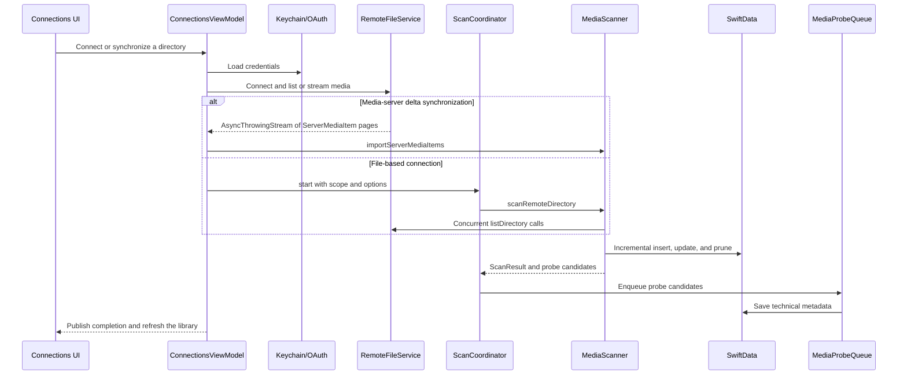
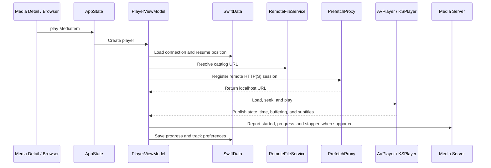

# Vanmo Architecture

> This document describes the repository as of August 26, 2026. It is based on the current working tree, `project.yml`, `Packages/VanmoCore/Package.swift`, application entry points, runtime data flows, and the existing test suite.
> If this document conflicts with the code, treat `project.yml`, `Packages/VanmoCore/Package.swift`, and the current implementation as the sources of truth.

## 1. System Overview

Vanmo is a cross-platform video player with three products:

- `Vanmo`: the iOS 17+ application.
- `Vanmo-macOS`: the native macOS 14+ application.
- `VanmoCore`: a local Swift Package shared by both applications. It owns domain models, persistence, remote connections, scanning, downloads, subtitles, metadata, and playback infrastructure.

The project primarily uses Swift 5.9, SwiftUI, SwiftData, Swift Concurrency, Combine, AVFoundation, and KSPlayer. It is not a strict Clean Architecture implementation. A more accurate description is:

1. iOS and macOS have separate platform UI, navigation, and playback adapters.
2. Both applications use MVVM/Store-style `ObservableObject` types for UI state and use-case orchestration.
3. Reusable domain models and infrastructure live in `VanmoCore`.
4. Application entry points inject a SwiftData `ModelContainer`. Root views obtain a `ModelContext` from the environment and pass it to ViewModels and shared services.


## 2. Repository and Module Boundaries

```text
Vanmo/
├── Vanmo/                       # iOS application
│   ├── App/                     # App entry point, global state, tabs, navigation
│   ├── Core/                    # iOS player engines, probe bootstrap, subtitle UI
│   ├── Features/                # Library / Browser / Player / Search / Settings
│   ├── Shared/                  # iOS components, extensions, UIKit OAuth bridge
│   ├── Resources/               # Info.plist, assets, Lottie resources
│   └── Frameworks/FFmpeg/       # Local build output; normally not versioned
├── VanmoMac/                    # macOS application
│   ├── App/                     # App entry point, routing, window coordination
│   ├── Player/                  # macOS AVPlayer/KSPlayer and player window
│   ├── Metadata/                # macOS KSPlayer media-probe bridge
│   ├── UI/                      # Library / Browser / Search / Settings / Detail
│   ├── Shared/                  # AppKit OAuth bridge and platform extensions
│   └── Resources/
├── Packages/VanmoCore/          # Cross-platform domain and infrastructure package
│   ├── Sources/VanmoCore/
│   └── Tests/VanmoCoreTests/
├── VanmoUITests/                # One-command iOS device XCUITest interaction target
├── scripts/                     # Build and static architecture checks
├── docs/                        # Durable product, design, plan, quality, and operating knowledge
├── project.yml                  # XcodeGen source of truth
├── Vanmo.xcodeproj/             # Generated and committed Xcode project
├── init.sh                      # Dependency resolution and repository baseline checks
├── run_device.sh                # Build, install, and launch iOS/macOS apps
└── build_ipa.sh                 # Archive and export the iOS Release build
```

Boundary rules:

- `VanmoCore` must not depend on UIKit, AppKit, or SwiftUI.
- iOS UI belongs in `Vanmo/`; macOS UI belongs in `VanmoMac/`.
- Platform player engines remain outside `VanmoCore`. The package exposes common playback types, format detection, prefetching, and playback URL resolution.
- Target definitions, dependencies, resources, compilation conditions, and entitlements must be changed in `project.yml`, followed by `xcodegen generate`. Do not edit `project.pbxproj` by hand.
- The macOS target directly reuses only `Vanmo/Shared/Components/MediaTitleLogoView.swift` and `LoadingIndicatorView.swift`; the rest of the application UI is platform-specific.

### 2.1 Documentation Boundaries

- `docs/` is the sole Harness system of record for product intent, design decisions, execution plans and progress, quality, reliability, security, frontend standards, SOPs, and maintained references.
- Active plans record unfinished execution state and evidence. Completed plans preserve outcomes, `QUALITY_SCORE.md` owns quality history, and the tech-debt tracker owns confirmed deferred work.
- Start at `AGENTS.md`, then read `ARCHITECTURE.md`, `docs/QUALITY_SCORE.md`, and `docs/PLANS.md`. Follow the active-plan index and relevant product spec before opening detailed reliability, security, frontend, design, SOP, or reference material.
- [`docs/PLANS.md`](docs/PLANS.md) defines durable planning and archival policy. [`docs/exec-plans/active/index.md`](docs/exec-plans/active/index.md) and [`docs/product-specs/index.md`](docs/product-specs/index.md) provide current discovery routes.

## 3. Build Targets and Dependencies

### 3.1 Platforms and Targets

| Target / Product | Platform | Minimum Version | Entry Point |
|---|---|---:|---|
| `Vanmo` | iOS | 17.0 | `Vanmo/App/VanmoApp.swift` |
| `VanmoUITests` | iOS UI testing | 17.0 | `VanmoUITests/VanmoDeviceInteractionTests.swift` |
| `Vanmo-macOS` | macOS | 14.0 | `VanmoMac/App/VanmoMacApp.swift` |
| `VanmoCore` | iOS / macOS | 17.0 / 14.0 | `Packages/VanmoCore/Package.swift` |

`project.yml` and `Package.swift` define the current deployment targets.

### 3.2 Dependencies

- Both apps depend on `VanmoCore`, Kingfisher, KSPlayer, and Lottie.
- The iOS target also declares direct dependencies on SWXMLHash and SMBClient.
- `VanmoUITests` is an iOS UI-testing bundle that depends on the `Vanmo` application target, uses `TEST_TARGET_NAME = Vanmo`, and participates in the `Vanmo` scheme test action.
- `VanmoCore` itself depends on SWXMLHash and SMBClient.
- System frameworks include SwiftUI, SwiftData, AVFoundation, Network, and Security. iOS also uses UIKit; macOS uses AppKit.
- `FFMPEG_ENABLED` is still defined for both app targets, but no current Swift source consumes the condition and the Xcode project does not link static libraries from `Vanmo/Frameworks/FFmpeg/`.
- Current FFmpeg decoding is provided by the KSPlayer package. The standalone FFmpeg 7.1 workflow in `scripts/build-ffmpeg-ios.sh` appears to be a legacy path and is not a current build prerequisite.

### 3.3 Debug and Release Differences

- `CLOUDKIT_SYNC_ENABLED` is defined only for Release builds.
- Debug configurations use entitlements without iCloud capabilities, which allows personal development-team signing.
- Release configurations use `Vanmo-Cloud.entitlements` and `Vanmo-Mac-Cloud.entitlements`.
- Application code must not assume CloudKit is available in Debug builds.

## 4. iOS Application Architecture

### 4.1 Entry Point and Dependency Injection

`VanmoApp` performs the following global setup:

- Installs `UIKitOAuthPresentationContextProvider`.
- Removes orphaned prefetch temporary files.
- Registers the KSPlayer media-probe provider.
- Registers the iOS background scan task.
- Registers OpenSubtitles, Shooter, and SubHD providers with `OnlineSubtitleService`.

The app creates and injects:

- `AppState`
- `ConnectionsViewModel`
- `CloudSyncCoordinator.shared`
- `DownloadManager.shared`
- The SwiftData container returned by `ModelContainerFactory.makeSharedContainer()`

There is no dependency-injection framework. SwiftUI environment objects, local `@StateObject` instances, and a small number of shared singletons provide dependency ownership.

### 4.2 Navigation

`ContentView` uses four tabs:

- Library: `LibraryView`
- Files and connections: `ConnectionsView`
- Search: `SearchView`
- Settings: `SettingsView`

Each tab owns a separate `NavigationStack`. The settings path is stored in `AppState.settingsPath`, preserving nested navigation when a theme change recreates `ContentView`.

Playback is driven by `AppState.currentPlayingItem` and `isPlayerPresented`. `PlayerPresentationModifier` presents `PlayerView` through a `fullScreenCover`.

`AppState` owns:

- The selected tab.
- The currently playing item and player presentation state.
- The settings navigation path.
- A favorite-change counter that preserves cross-tab notifications while views are not mounted.

### 4.3 Startup and Lifecycle

`ContentView.task`:

1. Injects the environment `ModelContext` into the connections ViewModel and download manager.
2. Restores and resumes the download queue.
3. Restores security-scoped local-folder access and attempts automatic reconnection.
4. Performs an application-launch cloud synchronization pass.

When the app enters the foreground, it resumes downloads, performs synchronization, and reloads saved connections. When it enters the background, it suspends the download queue.

### 4.4 iOS Features

- `Features/Library`
  - `LibraryViewModel` combines local SwiftData media, scanned libraries, and live Emby/Jellyfin home data.
  - It provides continue-watching, favorites, collection previews, filters, detail navigation, and episode hierarchy.
  - `HomeCollectionCache` stores server folders and previews to reduce cold-start gaps and duplicate requests.
- `Features/Browser`
  - `ConnectionsViewModel` manages connection CRUD, Keychain credentials, OAuth, local bookmarks, directory browsing, scanning, and media-server synchronization.
  - `ScanCoordinator` publishes scan progress and pause, resume, and cancellation controls.
- `Features/Player`
  - `PlayerViewModel` orchestrates playback URL resolution, prefetching, dual engines, subtitles, chapters, episode switching, progress persistence, and Emby playback reporting.
- `Features/Search`
  - `SearchViewModel` searches both the local SwiftData library and remote connections.
  - Remote searches are limited to four concurrent sources. Media servers use server-side search when available; file services use bounded recursive search.
- `Features/Settings`
  - Settings cover playback, subtitles, downloads, library behavior, appearance, metadata, and iCloud synchronization.

## 5. macOS Application Architecture

### 5.1 Scenes and Global Objects

`VanmoMacApp` configures the AppKit OAuth provider, prefetch cleanup, media probing, and online subtitle providers. It creates:

- `MacAppState`
- `MacLibraryViewModel`
- `MacConnectionsViewModel`
- `MacSearchViewModel`
- `CloudSyncCoordinator.shared`
- `DownloadManager.shared`
- The shared SwiftData container

The app declares:

- A main `WindowGroup` containing `VanmoMacRootView`.
- A dedicated downloads `WindowGroup`.
- A native `Settings` scene.
- A `MenuBarExtra` for basic playback control.
- A playback command menu with keyboard shortcuts.

### 5.2 Routing and Main Window

macOS does not use the iOS tab structure. `MacAppState` owns an explicit `MacContentRoute`:

- Library Home, Favorites, and History
- Collection Folder, Scanned Library, Emby Folder, and Show Detail
- Connection Browser
- Search

`VanmoMacRootView` combines a custom sidebar with a content area. Library root views remain mounted and switch through opacity and hit testing. This preserves scroll positions and Kingfisher's in-memory cache. Detail content is presented as an overlay.

`MacAppState` coordinates:

- Sidebar state, filters, view mode, and appearance.
- Route context and back navigation.
- In-memory media cleanup before deleting a connection.
- Favorite and watch-history change signals.
- The independent player window and its dependencies.

### 5.3 Independent Player Window

The macOS player is not presented as a sheet inside the main window. `MacAppState.play` creates a `MacPlayerWindowController`, which hosts `MacPlayerView` in an `NSWindow` through `NSHostingView`.

Closing the window, invoking the close command, or switching to another item converges on one cleanup path:

- Save playback progress.
- Stop media-server playback reporting.
- Stop AVPlayer or KSPlayer.
- Unregister the prefetch session.
- Notify the home and history views.

This window lifecycle is one of the largest platform differences between iOS and macOS.

### 5.4 macOS ViewModels and Stores

- `MacConnectionsViewModel` mirrors the iOS connection flow and adds local-file readability checks. Drag-and-drop playback is coordinated by `VanmoMacRootView` and `MacLocalFilePlayback`.
- `MacLibraryViewModel` adds desktop-specific home-cache, refresh coalescing, and redraw-suppression behavior.
- `MacMediaDetailStore` concurrently loads cached metadata, network metadata, seasons, and collections. Generation checks prevent stale async results from overwriting the active detail.
- `MacSearchViewModel` owns desktop search state.
- `MacSettingsViewModel` drives the native settings window.

## 6. VanmoCore

`VanmoCore` is the shared domain and infrastructure layer. It is not a stateless domain-only package: it includes SwiftData models, shared services, file-system caches, network implementations, and several observable coordinators.

### 6.1 Models

Key models:

- `MediaItem`: media identity, metadata, playback state, source, remote version, probe results, audio tracks, and subtitle preferences.
- `SavedConnection`: non-sensitive remote connection configuration. Passwords and OAuth tokens are stored separately.
- `PlaybackRecord`: local playback-history snapshot.
- `FolderBookmark`: a remote directory selected for synchronization.
- `CloudMediaState`: the minimal progress and favorite state synchronized across devices.
- `ScanJobRecord`: persistent scan status and progress.
- `RemoteFile` and `ServerMediaItem`: Sendable transport models for file services and media servers.

### 6.2 Persistence and Scanning

`ModelContainerFactory` splits SwiftData into two configurations:

| Store | Models | CloudKit |
|---|---|---|
| `LocalStore` | `MediaItem`, `PlaybackRecord`, `ScanJobRecord` | Never enabled |
| `CloudStore` | `SavedConnection`, `FolderBookmark`, `CloudMediaState` | Release only, when enabled by the user |

The full media catalog is never uploaded to CloudKit. Only connections, folder bookmarks, and minimal media state are synchronized. Media-server progress and favorites can be excluded through flags on `MediaItem`, allowing the server to remain authoritative.

The project currently has no `VersionedSchema`, `SchemaMigrationPlan`, or other explicit migration path. It relies primarily on SwiftData's lightweight evolution for additive field changes.

Scanning has two layers:

- `ScanCoordinator` is a `@MainActor ObservableObject` responsible for task lifecycle, UI progress, pause/resume/cancel operations, and `ScanJobRecord`.
- `MediaScanner` is an actor responsible for concurrent directory traversal, incremental comparison, batched saves, pruning missing items, NFO parsing, and collecting media-probe candidates.

Scan results are sent to `MediaProbeQueue`, which fills technical metadata such as codec, dimensions, and dynamic range. Most file-based connections require the user to choose a directory before synchronization. Media servers and IPTV follow service-specific flows.

### 6.3 Remote Connection Abstraction

File-based services implement `RemoteFileService`, which defines:

- Connect and disconnect
- Directory listing
- Playback URL resolution
- Download

`MediaServerService` adds paged streaming synchronization. Services that support server-side search implement `MediaSearchProviding`.

`RemoteServiceCapabilities` describes:

- Single-shot or paged listing
- Playback URL persistence strategy
- Full-rescan or server-delta synchronization
- Range-read and server-search support
- Directory concurrency and request-rate limits

`RemoteServiceFactory` currently maps connection types as follows:

- Concrete service classes: Local Folder, SMB, WebDAV/AList/fnOS, Baidu Netdisk, Google Drive, OneDrive, Box, pCloud, Yandex.Disk, IPTV, Emby, Jellyfin, and Plex.
- Explicitly unsupported placeholders: the removed Aliyun Drive type, 115, Quark Drive, and MEGA.
- FTP/SFTP currently establish only a logical connection; directory listing is empty and streaming URLs are unsupported.
- NFS, DLNA, and other types without dedicated implementations fall back to a generic HTTP placeholder.

`ConnectionType.availableConnectionTypes` therefore represents UI-visible choices, not a guarantee that every protocol is production-ready.

Credential boundaries:

- Connection passwords are stored through `KeychainManager`, primarily under `conn_<UUID>` keys.
- OAuth credentials are stored through `OAuthCredentialStore`.
- `SavedConnection` stores only non-sensitive configuration.
- Local folders use security-scoped bookmarks to restore access across launches.

### 6.4 Playback URLs and Prefetching

Scanning persists catalog URLs in the `vanmo://playback/...` form instead of storing expiring or credential-bearing URLs. Before playback or technical probing:

1. Resolve the `SavedConnection` through `sourceConnectionId`.
2. Load credentials from Keychain or OAuth storage.
3. Create and connect the matching `RemoteFileService`.
4. Use `PlaybackURLResolver` to obtain a currently valid URL.
5. Optionally register remote HTTP(S) content with `PrefetchProxy`.

`PrefetchProxy` is an actor-managed local HTTP Range proxy:

- It listens on a random `127.0.0.1` port.
- Each item receives a token and a `PrefetchSession`.
- `RemoteFetcher`, `RangeCache`, and temporary files handle remote Range requests and caching.
- Header providers inject dynamic credentials such as Google Drive bearer tokens and the Baidu Netdisk User-Agent.

### 6.5 Downloads

`DownloadManager` is a `@MainActor` singleton:

- It persists download snapshots and `.part` files.
- It restores unfinished downloads after relaunch.
- A single worker currently consumes the queue serially.
- Local files use chunked copying.
- SMB uses resumable downloads.
- HTTP(S) uses 4 MiB Range chunks and handles refreshed URLs after 401/403 responses as well as 200, 206, and 416 responses.
- Completed files are moved through a temporary destination into the default or security-scoped custom directory.

The queue is suspended and resumed with application lifecycle changes.

### 6.6 Metadata

Metadata has two complementary paths:

- Catalog identification uses `FileNameParser`, `DirectorySemanticsParser`, `NFOMetadataParser`, `MediaIdentificationPipeline`, and `MediaItemFactory`.
- Detail refresh uses `MetadataRefreshCoordinator` to load metadata, episodes, and cast from Emby, Jellyfin, or Plex before persisting a `MetadataCacheRecord`.

`MetadataCache` is an actor that serializes disk-cache operations. The UI first renders basic `MediaItem` fields and then merges cached or network-enriched data.

### 6.7 Subtitles

- `SubtitleParser` defines the parser abstraction; SRT and WebVTT implementations are available.
- `SubtitleManager` loads external subtitles, handles encoding, and finds the active cue.
- `OnlineSubtitleService` aggregates providers. OpenSubtitles, Shooter, and SubHD are registered at app startup.
- AVFoundation or KSPlayer supplies embedded subtitles. Platform code converts them into renderable SwiftUI state.

### 6.8 CloudKit Synchronization

`CloudSyncCoordinator` is a `@MainActor ObservableObject`:

- It responds to app launch, foreground transitions, and write-path triggers.
- It debounces frequent writes by 500 milliseconds.
- It uses `CloudSyncConflictResolver` to merge conflicts that SwiftData and CloudKit have delivered locally.
- Connections and bookmarks use modification timestamps, device identifiers, and soft-delete tombstones.
- Playback progress and favorites synchronize through `CloudMediaState`, not the complete `MediaItem`.

The coordinator does not implement a transport protocol. The CloudKit-enabled SwiftData `ModelConfiguration` performs the underlying synchronization.

## 7. Playback Architecture

### 7.1 Engine Selection

`SupportedFormat.detect(from:)` selects a playback path:

- Native formats use AVFoundation.
- FFmpeg formats use KSPlayer.
- Disc images and disc structures:
  - iOS currently sends candidates to a KSPlayer proof-of-concept path.
  - macOS explicitly reports them as unsupported and recommends direct `.m2ts` playback.

### 7.2 iOS

`PlayerEngine` unifies playback state, time, duration, buffering, subtitles, track selection, and controls:

- `AVPlayerEngine` wraps AVPlayer, native media selection, system buffering state, and text subtitles.
- `KSPlayerEngine` handles FFmpeg demuxing and decoding, software-decode fallback after hardware-decode failure, rich-text/image subtitles, chapters, and Picture in Picture adaptation.

`PlayerViewModel` subscribes to engine Combine publishers and manages:

- Catalog URL resolution and prefetch registration.
- Resume position, progress persistence, completion state, and CloudKit change markers.
- Emby/Jellyfin playback reporting.
- External and online subtitles with preference restoration.
- Episode lists and episode switching.
- Live-stream retries, gesture state, playback rate, and chapters.

### 7.3 macOS

macOS does not reuse the iOS `PlayerEngine` implementation:

- The native path is an AVPlayer owned directly by `MacPlayerViewModel`.
- The FFmpeg path is adapted by `MacKSPlayerEngine`.
- `MacPlayerEngineFactory` returns an engine kind that the ViewModel uses to select the implementation.

This supports AppKit window and keyboard-command integration, but creates two playback orchestration paths that must remain behaviorally aligned.

## 8. Key Data Flows

### 8.1 Connection, Scan, and Import



The Emby/Jellyfin home screen also has a live path. A Library ViewModel directly loads resume items, favorites, virtual folders, and previews, then merges relevant items into SwiftData. This is separate from a full catalog scan.

### 8.2 Playback



### 8.3 Metadata Detail

1. The detail screen immediately renders base fields from `MediaItem`.
2. It concurrently reads `MetadataCache` and media-server detail data.
3. Network results are converted into `MetadataCacheRecord` values and related images are cached.
4. The Store or ViewModel merges metadata, seasons, episodes, and collections.
5. Generation and cancellation checks prevent stale requests from overwriting the current detail.

### 8.4 iOS Device Interaction CLI

`scripts/ios-ui.sh` has intentionally different device and simulator backends:

1. A `device` command resolves a connected iOS destination and invokes the single `VanmoDeviceInteractionTests/testExecuteCommand` XCUITest through the `Vanmo` scheme.
2. The script sets `TEST_RUNNER_VANMO_UI_*` environment variables. Xcode's test runner is expected to expose them to the XCUITest process with the `TEST_RUNNER_` prefix removed, where the test reads `VANMO_UI_*`. That delivery path remains unverified on a physical device. The test implementation launches Vanmo and can perform a screenshot, flat JSON accessibility-tree export, identifier or exact-label tap/type, swipe, or exists/absent wait/assert operation.
3. XCUITest screenshots, trees, failure diagnostics, logs, and result bundles are retained under `build/ui-cli/runs/`; requested screenshot or tree output is copied from the exported `xcresult` attachments.
4. A `simulator` command uses `simctl` only for screenshot and app launch/termination. It does not run XCUITest and explicitly rejects tree, tap, type, swipe, wait, and assert operations that `simctl` does not provide.

This CLI is a bounded interaction and evidence interface, not a replacement for Figma comparison, accessibility review, or a complete golden journey. Device commands require a connected and trusted device plus valid signing; the development team may be supplied through `VANMO_DEVELOPMENT_TEAM` or `--team`.

## 9. State, Concurrency, and Events

### 9.1 State Ownership

- App navigation and player presentation: `AppState` / `MacAppState`.
- Screen state and use-case orchestration: platform ViewModels and Stores.
- Persistent entities: SwiftData `@Model` types.
- Shared long-lived services: singletons such as `DownloadManager` and `CloudSyncCoordinator`.
- Concurrent file and network state: actors such as `MediaScanner`, `PrefetchProxy`, `MetadataCache`, and `SubtitleManager`.

### 9.2 Concurrency Rules

- UI ViewModels are generally isolated to `@MainActor`.
- Network DTOs use `Sendable`; SwiftData `@Model` objects should not be returned directly from task groups.
- `ModelContext` access generally returns to the main actor.
- Directory scanning, remote search, home previews, and detail aggregation use task groups or `async let` with concurrency limits.
- Long-running work uses cancellation, generation identifiers, or idempotent cleanup to reject stale results and release resources.

### 9.3 Cross-Screen Events

The project uses three event mechanisms:

- SwiftUI environment objects for directly shared state.
- `@Published` nonces and counters for events that must survive view unmounting.
- `NotificationCenter` for favorite changes and macOS playback commands.

New cross-module events should first have an explicit state owner. Global notifications are best reserved for platform commands or lifecycle boundaries.

## 10. Tests and Verification

The repository has `VanmoCore` package tests and an iOS `VanmoUITests` UI-testing target. The UI target exposes one dynamic command test; it is not a broad automated app regression suite.

```bash
swift test --package-path Packages/VanmoCore
```

The tests cover:

- File-name, directory-semantics, and NFO parsing.
- `MediaItemFactory` and incremental scanning.
- Download task persistence and directory resolution.
- Catalog playback URLs.
- Remote-service capability declarations.
- Schema and foundational enum mappings.

As of August 26, 2026, all four `./init.sh` baseline stages complete with no failures: 36 `VanmoCore` tests, the CloudKit/multiplatform static check, the Advanced Harness documentation check, and `./scripts/check-ios-ui-cli.sh`. The iOS UI CLI stage statically checks the target declarations in `project.yml` and the generated project, validates the Bash CLI, and type-checks the XCUITest source. XcodeGen generation succeeded, the generated target is discoverable, and a simulator `simctl` screenshot command completed successfully.

These checks do not prove that the app or UI-test bundle builds or runs on a device. The first Debug compile matrix on 2026-08-26 recorded a macOS pass and an iOS Simulator failure at the pre-existing non-exhaustive `DownloadStatus` switch in `Vanmo/Features/Settings/Views/SettingsView.swift`, which lacks the `.paused` case. No physical-device XCUITest has run, so signing, `TEST_RUNNER_VANMO_UI_*` delivery, and `xcresult` attachment export remain unverified.

Other verification entry points:

```bash
# Resolve dependencies and run the shared, boundary, and documentation baseline
# The documentation stage requires Python 3.
./init.sh

# After the fast baseline, add Debug compile evidence for both apps
./init.sh --full

# Check CloudKit and multiplatform boundaries without building
./scripts/check-cloud-sync-multiplatform-scope.sh

# Check the iOS UI target and CLI statically without running XCUITest
./scripts/check-ios-ui-cli.sh

# Compile one application target without launching it
./scripts/check-app-build.sh ios-simulator
./scripts/check-app-build.sh macos

# Build and run on an iOS device, simulator, or macOS
./run_device.sh
./run_device.sh --simulator
./run_device.sh --macos

# Build the iOS Release IPA
./build_ipa.sh
```

See `docs/RELIABILITY.md` for the complete command stages and evidence boundaries.

## 11. Known Constraints and Risks

1. **Substantial platform-layer duplication.** iOS and macOS maintain separate connection, library, search, and player ViewModels. `VanmoCore` shares infrastructure, but use-case orchestration remains platform-specific.
2. **Large ViewModels and views.** The iOS `PlayerViewModel`, `ConnectionsViewModel`, `LibraryViewModel`, and their macOS counterparts combine state, network orchestration, mapping, and persistence. Changes require focused data-flow verification.
3. **Placeholder protocol support.** UI-visible connection types are not all production-ready. FTP/SFTP, NFS, DLNA, and several official cloud-drive integrations require further implementation.
4. **No explicit SwiftData migration strategy.** There is no `VersionedSchema` or `SchemaMigrationPlan`. Container creation calls `fatalError` on failure and has no recovery or fallback path.
5. **CloudKit is Release-only.** Debug builds can verify local fallback and static boundaries, but cannot prove real CloudKit behavior.
6. **iOS UI automation lacks successful app-build and device evidence.** The `VanmoUITests` target and command runner exist, but the current app build blocker prevents successful `build-for-testing`, no physical-device XCUITest has run, and stable accessibility identifiers cover only a limited set of controls. macOS UI behavior and broader iOS navigation, player, accessibility, and lifecycle journeys still depend primarily on manual verification.
7. **Playback implementations can drift.** iOS and macOS do not share one AVFoundation/KSPlayer adapter protocol.
8. **Legacy FFmpeg configuration remains.** Playback currently uses FFmpeg through KSPlayer, while the repository retains an unused `FFMPEG_ENABLED` definition, an effectively empty bridging header, and a standalone FFmpeg build script.
9. **Documentation routing can drift.** All Harness state belongs under `docs/` and must remain consistent with current code, `project.yml`, package manifests, and this architecture document.

## 12. Extension Guidelines

Place new work according to these rules:

- Cross-platform models, protocols, remote services, scanning, downloads, subtitle logic, and metadata logic belong in `Packages/VanmoCore/Sources/VanmoCore/`.
- New iOS screens and platform behavior belong in `Vanmo/Features/` or `Vanmo/Core/`.
- New macOS screens, windows, and platform behavior belong in `VanmoMac/UI/` or `VanmoMac/Player/`.
- Share a visual component between targets only when it has no UIKit/AppKit dependency and both applications need it.
- Add targets, packages, resources, compilation conditions, and entitlements through `project.yml`, then regenerate the Xcode project.
- Every new SwiftData model must be assigned to either `LocalStore` or `CloudStore`, followed by updates to `ModelContainerFactory` and relevant tests.
- Every new remote protocol must implement `RemoteFileService` and define its factory mapping, capabilities, credential strategy, playback URL persistence strategy, and tests.
- Prefer actors for long-lived concurrent state. Keep UI-observable coordinators isolated to `@MainActor`.

## 13. Recommended Reading Order

1. `AGENTS.md` for operating constraints and task routing
2. `ARCHITECTURE.md`, `docs/QUALITY_SCORE.md`, and `docs/PLANS.md`
3. The governing entry in `docs/exec-plans/active/` and related file in `docs/product-specs/`
4. `project.yml` and `Packages/VanmoCore/Package.swift`
5. `Vanmo/App/VanmoApp.swift` and `Vanmo/App/ContentView.swift`
6. `VanmoMac/App/VanmoMacApp.swift` and `VanmoMac/App/VanmoMacRootView.swift`
7. `Packages/VanmoCore/Sources/VanmoCore/Storage/ModelContainerFactory.swift`
8. `Packages/VanmoCore/Sources/VanmoCore/Models/MediaItem.swift`
9. `Packages/VanmoCore/Sources/VanmoCore/Protocols/RemoteFileService.swift`
10. `Packages/VanmoCore/Sources/VanmoCore/Network/ServiceFactory.swift`
11. `Packages/VanmoCore/Sources/VanmoCore/Storage/MediaScanner.swift`
12. The iOS and macOS Connections and Library ViewModels
13. The iOS and macOS Player ViewModels and engine implementations
14. The Metadata, Download, Subtitle, Prefetch, and CloudSync subsystems
