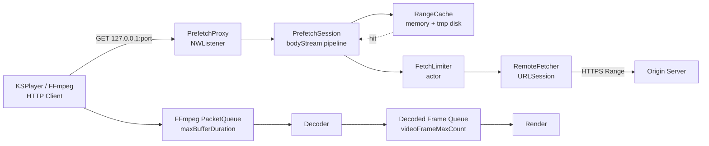
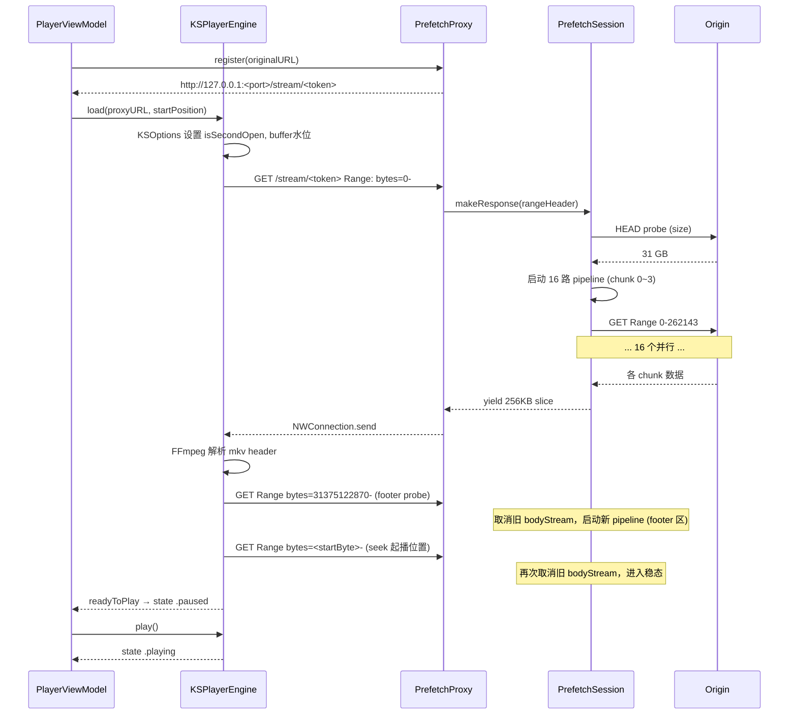

# 播放器缓冲逻辑

> 远程视频播放从“点击播放”到“稳态流畅播放”涉及四层缓冲：本地 HTTP 代理 chunk 缓存、回源并发池、KSPlayer FFmpeg PacketQueue、解码 Frame Queue。本文按数据流向整理每一层的职责、参数和调优依据。

## 数据流总览



## 关键文件

| 文件 | 路径 | 职责 |
|---|---|---|
| `PrefetchConfig.swift` | `Core/Player/Prefetch/` | 所有 prefetch 层常量 |
| `PrefetchProxy.swift` | `Core/Player/Prefetch/` | 本地 HTTP 监听 + 注册/反注册会话 |
| `PrefetchSession.swift` | `Core/Player/Prefetch/` | 单视频会话：Range 解析、bodyStream pipeline、stale GET cancel |
| `RangeCache.swift` | `Core/Player/Prefetch/` | 256KB chunk 缓存：内存 + tmp 磁盘 LRU spill |
| `FetchLimiter.swift` | `Core/Player/Prefetch/` | 全局并发上限（actor 信号量） |
| `RemoteFetcher.swift` | `Core/Player/Prefetch/` | URLSession 回源（含 Basic auth） |
| `KSPlayerEngine.swift` | `Core/Player/` | 配置 KSOptions 的 FFmpeg 缓冲水位 |

---

## 第一层：PrefetchSession bodyStream pipeline

每次 KSPlayer/FFmpeg 发起一次 `GET /stream/<token>`，`PrefetchProxy` 路由到对应的 `PrefetchSession.makeResponse(rangeHeader:)`，生成一个 `AsyncThrowingStream<Data, Error>` 的正文流。流内部按 `chunkSize=256KB` 切块下载并 yield 给 `NWConnection`。

### 16 路并发 pipeline

```swift
let pipelineDepth = PrefetchConfig.maxConcurrentFetches  // 16
```

`bodyStream` 的循环模式：先把 pipeline 填到 16 个 chunk 的 `Task`，然后串行 yield，每 yield 完一个就 enqueue 下一个，pipeline 始终保持 16 个 chunk 在飞。

为什么 16？日志测算：

| 并发 | 单 chunk 平均耗时 | 实际吞吐 |
|---|---|---|
| 4 路 | ~1.1s | 930 KB/s |
| 8 路 | ~1.1s | ~1.86 MB/s |
| 16 路 | ~1.1s | ~3.7 MB/s |
| 24 路 | （未测）| — |

每个 TCP 连接被服务器限速 ~232 KB/s，并发数与吞吐近线性扩展。当前 emby 远程片源平均码率 ~3.6 MB/s，16 路刚好覆盖。

### Stale bodyStream cancel

FFmpeg 在解析 mkv header / footer / seek 时会发**多个 GET**，且不主动关闭旧 connection。`AsyncThrowingStream` 默认 unbounded buffer 不会反压 producer，旧 bodyStream 不主动 cancel 就会持续下载浪费带宽：

```swift
// 新 GET 进来时取消所有旧 bodyStream
activeBodyTasksLock.lock()
let toCancel = activeBodyTasks
activeBodyTasks.removeAll()
activeBodyTasksLock.unlock()
for (_, t) in toCancel { t.cancel() }
```

实测一次播放过程中至少 cancel 3~4 次 stale task（mkv footer probe + seek footer probe + 各种 EBML cluster 探测），不 cancel 时旧 pipeline 会与新 pipeline 在同一个 16 路并发池里互相争抢，单 chunk 耗时从 1.1s 涨到 1.7s+ 直接触发 buffering。

### 共享 Task 去重

不同 GET 可能请求同一个 chunk（FFmpeg 重新打开播放点等场景）。`sharedDownload(chunkStart:chunkEnd:)` 用 `inflight: [Int64: Task<Data, Error>]` 表去重——首个请求创建 Task，并发请求复用同一 Task：

```swift
private func sharedDownload(chunkStart: Int64, chunkEnd: Int64) -> Task<Data, Error> {
    inflightLock.lock()
    if let existing = inflight[chunkStart] {
        inflightLock.unlock()
        return existing
    }
    // ... 创建新 task ...
}
```

注意：复用的 Task **不会被单个 bodyStream cancel**（cancel 会影响所有等待者），仅 session cleanup 时一并 cancel。

---

## 第二层：RangeCache（256KB chunk）

会话级缓存，按 chunk 索引存储，用于满足 FFmpeg 反复读同一段（如 mkv index、再读 EBML header）。

### 内存 + 磁盘 LRU

| 参数 | 值 | 说明 |
|---|---|---|
| `chunkSize` | 256 KB | 与 PrefetchSession yield slice 粒度对齐 |
| `maxMemoryCache` | 64 MB | 内存上限；超出后按 LRU 把**完整 chunk** spill 到 `tmp/prefetch/<sessionId>/<idx>.bin` |
| `prefetchWindow` | 32 MB | 预读窗口常量（当前未启用主动预读，由 16 路 pipeline 实质覆盖） |

### Partial chunk 不可 evict

write 是 byte 级（任何 offset 起的连续写入），同一 chunk 可能在多个 write 调用中逐步写满。维护 `writtenIndexSets[idx]: IndexSet` 标记 chunk 内已写 byte 区间。

关键不变量（**`hasEntire`/`readEntire` 必须严格依赖 IndexSet**）：

- 完整 chunk → 写入 `fullyWrittenChunks` 集合 + 持久化到磁盘
- Partial chunk → 仅留内存，不持久化也不参与 LRU evict

如果 partial chunk 被 evict，下次 `hasEntire` 凭"chunk 在内存"误判命中，会读到 0 填充的脏数据，触发 EBML 解析失败。

---

## 第三层：FetchLimiter（全局并发池）

actor 实现的轻量信号量，限制**同一进程内**所有 PrefetchSession 累计的回源连接数 ≤ `maxConcurrentFetches`。当前只有一个 active session，因此实际等同于单 session 的 16 路上限。

```swift
actor FetchLimiter {
    static let shared = FetchLimiter()
    private var active = 0
    private var waiters: [CheckedContinuation<Void, Never>] = []
    func acquire() async { ... }
    func release() { ... }
}
```

如未来支持后台预载下一集，需要把整体上限再上调或拆分为按 session 配额。

---

## 第四层：KSPlayer / FFmpeg 缓冲水位

`KSPlayerEngine.load()` 通过 `KSOptions` 调整 FFmpeg PacketQueue 的高低水位，吸收第一/二/三层吞吐的瞬时抖动。

```swift
options.isSecondOpen = true                                   // 首屏不再等 buffer，frameCount>=2 即播
options.preferredForwardBufferDuration = 10                   // 起播 / buffering 恢复门槛 (s)
options.maxBufferDuration = 60                                // 反压点 (s)
options.formatContextOptions["buffer_size"] = 8 * 1024 * 1024 // FFmpeg avio 网络 IO buffer
```

### 各参数语义

| 参数 | 默认 | 当前值 | 作用 |
|---|---|---|---|
| `isSecondOpen` | false | **true** | 首帧立即可播，**首屏延迟不受 `preferredForwardBufferDuration` 影响** |
| `preferredForwardBufferDuration` | 3 s | **10 s** | buffering 状态下需累积 10s 才恢复，避免薄 buffer 被吞吐抖动反复穿透 |
| `maxBufferDuration` | 30 s | **60 s** | 反压门槛：`MEPlayerItem` 在 `loadedTime ∈ [30s, 60s]` 区间漂移，buffer 比默认厚一倍 |
| `formatContextOptions["buffer_size"]` | 32 KB | **8 MB** | FFmpeg `avio` 网络 IO 缓冲，降低 syscall 频率与抖动敏感度 |

### 反压机制

`MEPlayerItem.codecDidChangeCapacity()` 中：

```swift
if loadingState.loadedTime > options.maxBufferDuration {
    pause()  // 暂停从 prefetch 代理读
} else if loadingState.loadedTime < options.maxBufferDuration / 2 {
    resume() // 恢复读
}
```

也就是稳态下 PacketQueue 在 `maxBufferDuration/2 = 30s` 到 `maxBufferDuration = 60s` 之间漂移。3.6 MB/s 码率下相当于内存里维持 ~108 MB ~ ~216 MB 的 packet buffer，可吸收最长 ~30s 的吞吐低于码率。

---

## 端到端时序：起播



---

## 调优历程（按时间倒序）

1. **2026-05-08**：固定 16 路并发，移除自适应 4→16（`initialConcurrentFetches`/`rampUpBytes`）。理由：自适应方案首屏阶段 4 路下载完 4MB（~3s）后才切 16 路稳态，中间衔接有真空期。固定 16 路首屏延迟与自适应基本相当（~3s），但稳态完全没有切换抖动。
2. **2026-05-07**：KSOptions 引入 `isSecondOpen`/`preferredForwardBufferDuration=10`/`maxBufferDuration=60`/`buffer_size=8MB`。buffering 次数从 3 → 2。
3. **2026-05-07**：H19 修复——bodyStream 主动 cancel stale task。修复前同一时刻有 3 个 pipeline 互抢带宽，单 chunk 耗时 ~1.7s；修复后稳定 ~1.1s。
4. **2026-05-06**：chunk 大小从 1MB 缩到 256KB，与 NW slice 粒度对齐，首屏更快。

---

## 后续优化方向（如 buffering 仍 ≥ 1 次）

- `maxConcurrentFetches=24`：测试是否突破当前 16 × 232KB/s = 3.7 MB/s 上限（需观察是否触及网络/服务器并发上限）。
- 主动预读：当前 `prefetchWindow=32MB` 常量未实际启用，可在 bodyStream 完成后异步多拉 32MB 填到 cache，对应付频繁 seek 场景。
- 自适应码率：根据测得的稳态吞吐反推视频码率上限，向 KSPlayer 提示降码率轨道。
- 预解码：起播时的 `isSecondOpen` 已让首帧立即可播，但若想做到 0 buffering，可让 FFmpeg 在 startup 阶段先 demux 30s 数据再切 playable。
