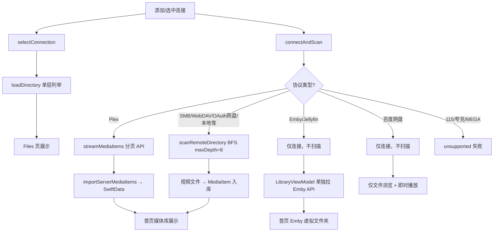

# 连接与媒体库扫描流程

本文档描述 Vanmo 在添加/连接网盘、文件协议时的完整逻辑：连接建立、文件浏览、媒体库扫描入库，以及扫描结果在首页的展示方式。

---

## 概述

所有远程/本地协议统一抽象为 `RemoteFileService` 协议，由 `RemoteServiceFactory` 按 `ConnectionType` 创建具体实现。连接成功后存在 **两条并行路径**：

| 路径 | 入口 | 目的 | 深度 |
|------|------|------|------|
| **文件浏览** | `selectConnection` → `loadDirectory` | Files 页展示当前目录内容 | 仅 **单层** `listDirectory` |
| **媒体库扫描** | `connectAndScan` | 将视频写入 SwiftData `MediaItem` | **递归目录** 或 **服务端 API 分页** |

二者相互独立：浏览不等于入库；入库可在连接时自动触发，也可由用户手动触发。

---

## 架构图

```
添加/选中连接
    │
    ├─ selectConnection()
    │       └─ loadDirectory(path: "/")     ← 单层列举，Files 页展示
    │
    └─ connectAndScan()
            ├─ connect(config)              ← 建立协议连接
            ├─ 按协议类型选择扫描策略
            ├─ 写入 SwiftData MediaItem
            └─ disconnect()（本地文件夹除外，保持 access）

首页 LibraryViewModel
    ├─ Emby/Jellyfin → fetchVirtualFolders（服务端 API）
    └─ 其余协议     → loadScannedLibraries（读本地 MediaItem 聚合）
```

---

## 核心文件

| 文件 | 路径 | 职责 |
|------|------|------|
| `ConnectionModels.swift` | `Features/Browser/Models/` | `ConnectionType`、`SavedConnection`、`RemoteFile` 定义 |
| `BrowserViewModel.swift` | `Features/Browser/ViewModels/` | 连接管理、`connectAndScan`、`loadDirectory` |
| `RemoteFileService.swift` | `Shared/Protocols/` | 统一协议 + `MediaServerService` 扩展 |
| `ServiceFactory.swift` | `Core/Network/` | 按类型创建 Service 实例 |
| `MediaScanner.swift` | `Core/Storage/` | 本地/远程目录扫描、服务端条目导入 |
| `LibraryViewModel.swift` | `Features/Library/ViewModels/` | 首页媒体库分区（Emby 虚拟文件夹 + 扫描库聚合） |
| `PlayerViewModel.swift` | `Features/Player/ViewModels/` | 播放前重新解析过期直链 / 占位 URL |

---

## 连接类型分类

`ConnectionType` 按接入方式分为以下几类，扫描策略各不相同：

| 分类 | 协议示例 | connectAndScan 行为 |
|------|----------|---------------------|
| **本地** | `localFolder` | 递归 `scanRemoteDirectory`；扫描后 **保持** security-scoped access |
| **文件/网络协议** | SMB、WebDAV、AList、fnOS | 递归 `scanRemoteDirectory`，扫描后 disconnect |
| **OAuth 网盘** | Google Drive、OneDrive、Box、pCloud、Yandex.Disk | 同上 |
| **OAuth 简化模式** | 百度网盘 | **仅连接**，不自动扫库（见下文特殊说明） |
| **媒体服务器** | Plex | `streamMediaItems` 分页 API 导入 |
| **媒体服务器** | Emby、Jellyfin | connect 阶段 **不扫描**；首页单独走 API |
| **直播** | IPTV | 不扫库；`connect()` 时下载解析 M3U |
| **占位/不可用** | 115、夸克、MEGA | `connect` 抛 `unsupportedProtocol` |
| **占位/未实现** | FTP、SFTP、NFS、DLNA | `connect` 不报错，但 `listDirectory` 返回空数组，扫描结果为 0 |

相关属性定义见 `ConnectionModels.swift`：

- `supportsOAuthLogin` — 是否走 OAuth 登录 UI
- `usesEphemeralStreamURLs` — 扫描时不持久化含 token 的直链（目前仅百度网盘）
- `requiresStreamingHeaderProvider` — 播放时需 PrefetchProxy 注入自定义请求头
- `requiresBearerStreaming` — 每个 Range 请求都需 Bearer（目前仅 Google Drive）

---

## 连接建立流程

### 1. 添加连接

**凭据类连接**（SMB、WebDAV 等）走 `AddConnectionView` → `saveConnection`：

1. 创建 `SavedConnection` 写入 SwiftData
2. 密码存入 Keychain（`conn_{uuid}`）
3. 本地文件夹额外保存 security-scoped `bookmarkData`
4. 调用 `selectConnection` + `connectAndScan`

**OAuth 网盘** 走 `beginOAuthConnection`：

1. `OAuthCoordinator.authenticate` 完成授权
2. 凭据写入 `OAuthCredentialStore`
3. 创建 `SavedConnection`（`host = "oauth"`）
4. 同样触发 `selectConnection` + `connectAndScan`

### 2. connectAndScan 详细步骤

入口：`ConnectionsViewModel.connectAndScan(_:showErrorAlert:forceFullScan:scanPath:)`

```
1. 更新 UI 状态（connecting / loadingMessage）
2. 创建 Service 并 connect：
   - 本地：复用 activeLocalServices 缓存，或新建 LocalFolderService
   - 远端：Keychain 读密码 → RemoteServiceFactory.create → connect
3. 更新 lastConnectedAt，标记 connected
4. 按协议类型执行扫描（见下一节）
5. 远端协议 disconnect；本地文件夹保持连接
6. 递增 librarySyncCompletionID，通知首页刷新
```

### 3. App 启动自动重连

`attemptAutoReconnectIfNeeded()` 在 App 生命周期内只执行一次：

1. **恢复本地文件夹 access**（`restoreLocalFolderAccess`）— 保证媒体库内本地视频可直接播放
2. 重连上次激活的媒体服务器，或 `lastConnectedAt` 最近的连接
3. 静默执行 `connectAndScan`（失败不弹窗）

---

## 扫描策略

### 模式 A：递归目录扫描（scanRemoteDirectory）

**适用**：SMB、WebDAV、AList、本地文件夹、OAuth 网盘（除百度）等。

实现：`MediaScanner.scanRemoteDirectory(service:path:connectionId:in:maxDepth:batchSize:)`

```
BFS 广度优先遍历
  起始路径：scanPath ?? connection.path ?? "/"
  最大深度：maxDepth = 8
  批量保存：batchSize = 200

对每个目录：
  1. service.listDirectory(path)
  2. 子目录 → 入队（depth + 1）
  3. 视频文件 → 处理入库：
     a. 去重：connectionId + serverPath（serverId）
     b. 获取播放地址：
        - 普通协议：service.streamURL(for:)
        - 百度网盘：catalogPlaybackURL（vanmo://playback/...）
     c. FileNameParser.parse 识别电影/剧集/季集
     d. 创建 MediaItem 写入 SwiftData
  4. 每 200 条 context.save()
```

**增量逻辑**：不做时间戳过滤；已存在相同 `serverId + connectionId` 的条目直接跳过。`forceFullScan` 仅影响 Plex 的 `since` 参数，文件协议始终全量遍历但靠去重避免重复写入。

**视频识别**：`RemoteFile.isVideo` → `RemoteFileType.from(filename:)` → `MediaFormatProbe.isVideo`。

> 注：`MediaScanner.scanLocalDirectory` 使用 `FileManager.enumerator` 递归 + AVFoundation 读取时长，但当前主流程统一走 `scanRemoteDirectory`（通过 `LocalFolderService.listDirectory` 逐层列举）。

### 模式 B：媒体服务器 API 分页（Plex）

Plex 实现 `MediaServerService.streamMediaItems(since:pageSize:)`：

```
connectAndScan 中：
  since = forceFullScan ? nil : connection.lastSyncedAt
  for page in streamMediaItems(since:since, pageSize: 500):
    importServerMediaItems(page) → SwiftData
  connection.lastSyncedAt = syncStart
```

- 从 Plex library sections 分页拉取 `ServerMediaItem`（含海报、简介、时长等完整元数据）
- `importServerMediaItems` 按 `serverId` 去重，已存在则更新元数据
- Plex 的 `streamMediaItems` 目前 **不** 使用 `since` 参数，每次均为全量拉取

### 模式 C：Emby / Jellyfin — connect 阶段不扫描

`connectAndScan` 对 Emby/Jellyfin **两个扫描分支均跳过**，只做连接状态更新。

首页由 `LibraryViewModel.refreshEmbyAndPersist` 单独处理：

```
EmbyConnectionHelper.connect
  → fetchVirtualFolders      // 虚拟文件夹（电影库、电视剧库等）
  → fetchResumeItems         // 继续观看
  → fetchFavoriteItems       // 收藏
  → importServerMediaItems   // 写入/更新 MediaItem
  → fetchFolderPreviewsConcurrently  // 文件夹预览
```

### 特殊：百度网盘

**connect 阶段不做递归扫库**。原因：大目录（如 `/来自：iPhone`）单目录分页即可超过 1 万条，全库 `maxDepth=8` 扫描会导致 loading 长时间不结束。

- 连接成功后仅打开文件浏览器
- UI 「同步当前目录」对百度同样不触发 `scanRemoteDirectory`
- 播放时使用占位 URL `vanmo://playback/baiduNetdisk{path}`，播放前通过 `streamURL` 换取 dlink
- PrefetchProxy 注入 `User-Agent: pan.baidu.com`

### 不可用 / 占位协议

**115 网盘、夸克、MEGA** 使用 `UnsupportedOfficialCloudDriveService`，`connect` 直接抛出 `NetworkError.unsupportedProtocol`。

**FTP、SFTP、NFS、DLNA** 走占位实现（`FTPService` / `GenericHTTPService`）：`connect` 不报错，但 `listDirectory` 始终返回空数组，`connectAndScan` 会进入 BFS 分支但扫不到任何视频文件。Files 页浏览同样为空。

---

## 文件浏览（非扫描）

`loadDirectory(path:)` 供 Files 页使用，与入库扫描无关：

```
1. browserFileService(for:) — 获取/复用缓存的 Service 实例
2. service.listDirectory(normalizedPath) — 仅列举当前一层
3. 排序展示（目录优先，名称升序）
4. IPTV：额外 loadEPGGuide
```

Service 缓存策略：

- `browserService` 在同一连接下复用，切换连接时才 disconnect
- 本地文件夹复用 `activeLocalServices`，持续持有 security-scoped access
- IPTV 在 `connect()` 时一次性下载解析 M3U，后续 `listDirectory` 返回内存缓存

---

## 手动触发扫描

| UI 操作 | 方法 | 效果 |
|---------|------|------|
| 连接卡片「全量重扫」 | `connectAndScan(forceFullScan: true)` | Plex 忽略 `lastSyncedAt`；文件协议仍 BFS + serverId 去重 |
| 浏览页菜单「同步当前目录」 | `scanCurrentDirectory()` | `connectAndScan(scanPath: currentPath)`，从当前目录递归（百度除外） |
| App 启动 | `attemptAutoReconnectIfNeeded()` | 恢复本地 access + 重连最近连接并扫描 |

---

## 扫描结果在首页的展示

`LibraryViewModel.loadScannedLibraries` 读取 SwiftData 中 `sourceConnectionId` 关联的 `MediaItem`，按连接聚合：

```
每个 scannableConnection：
  ├── 电影文件夹（mediaType == .movie 的条目）
  └── 电视剧文件夹（按 showTitle 聚合 tvEpisode）
```

**scannableConnections** 定义（排除不走扫描库的协议）：

- **排除**：Emby、Jellyfin（走服务端虚拟文件夹 API）、IPTV（直播频道）
- **包含**：其余所有已扫描入库的连接

Emby/Jellyfin 首页展示走 `serverCollectionFolders` + `fetchVirtualFolders`，与扫描库分区并行存在。

---

## 播放时的 URL 二次解析

扫描入库的 `MediaItem.fileURL` 在播放时可能需要重新解析（`PlayerViewModel.resolveCloudDriveStreamURLIfNeeded`）：

| 协议 | 扫描时存储 | 播放时处理 |
|------|-----------|-----------|
| OneDrive / Box / pCloud / Yandex | 签名直链（有时效） | 按 `sourceConnectionId + serverId` 重新 `streamURL` |
| Google Drive | API URL | URL 不过期；PrefetchProxy 动态注入 Bearer |
| 百度网盘 | `vanmo://playback/...` 占位 | 重新 `streamURL` 换 dlink + 注入 User-Agent |
| SMB / WebDAV / 本地 | file:// 或稳定 URL | 直接使用 |
| Emby / Jellyfin | `vanmo://emby-item/`、`vanmo://series/`、`vanmo://emby-container/` 占位 | UI/播放器内按 serverId 解析真实流地址 |
| Plex 电影/单集 | 含 `X-Plex-Token` 的真实播放 URL | 直接播放（不走 OAuth 二次解析；token 随 session 过期） |
| Plex 剧集容器 | `vanmo://plex-series/{ratingKey}` 占位 | UI 层识别为可浏览容器，走剧集列表分支 |

---

## 删除连接时的清理

`deleteConnection` 会级联清理：

1. Keychain 密码 + OAuth 凭据
2. 该连接下所有 `MediaItem`（`sourceConnectionId` 匹配）
3. 该连接下所有 `FolderBookmark`
4. `HomeCollectionCache` 缓存
5. 本地 Service / browserService 实例 disconnect

---

## 流程图



---

## 相关文档

- [网络串流模块规范](../.cursor/rules/network-streaming.mdc) — `RemoteFileService` 协议定义与开发规范
- [媒体库模块规范](../.cursor/rules/media-library.mdc) — `MediaItem` 数据模型与扫描规范
- [播放器架构](./ai/player-architecture.md) — PrefetchProxy 与远程 URL 播放
- [播放器缓冲](./ai/player-buffering.md) — PrefetchProxy 详细参数
