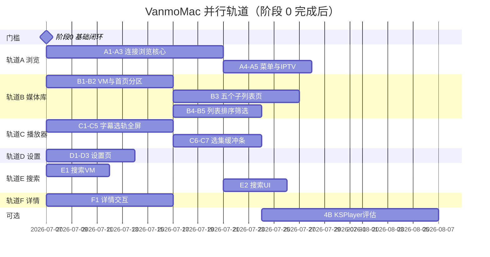

# VanmoMac 功能缺失清单与实施计划

> 基于 Vanmo iOS（`Vanmo/`，约 74 个 Swift 文件）与 VanmoMac（`VanmoMac/`，21 个 Swift 文件）对比整理。  
> 核心业务逻辑在 `Packages/VanmoCore`，Mac 端以新建 View + 薄 ViewModel 为主，从 iOS 移植业务逻辑而非复制 SwiftUI 视图。  
> 最后更新：2026-07-06（含并行推进计划）

---

## 当前基线（已实现，无需重做）

| 模块 | 状态 | 关键文件 |
|------|------|----------|
| App 入口 | ✅ | `VanmoMac/App/VanmoMacApp.swift` |
| 根导航壳层 | ✅ | `VanmoMac/App/VanmoMacRootView.swift` |
| 全局状态 | ✅ | `VanmoMac/App/MacAppState.swift` |
| 设计系统 | ✅ | `VanmoMac/UI/DesignSystem/MacDesignTokens.swift` |
| 侧边栏 | ✅ | `VanmoMac/UI/Components/MacSidebarView.swift` |
| 媒体库首页（基础） | ✅ | `MacLibraryHomeView` / `MacLibraryViewModel` |
| 空状态页 | ✅ | `MacLibraryEmptyStateView` |
| 媒体详情（只读） | ✅ | `MacMediaDetailView` |
| 连接添加 | ✅ | `MacAddConnectionView` / `MacConnectionsViewModel` |
| 基础播放器 | ✅ | `MacPlayerView` / `MacPlayerViewModel` / `MacAVPlayerView` |
| OAuth AppKit Anchor | ✅ | `OAuthPresentationContextProvider+AppKit.swift` |
| 连接图标资源 | ✅ | `VanmoMac/Resources/Assets.xcassets/MacConn*` |

---

## 成熟度对比

| 维度 | iOS | macOS | 差距 |
|------|-----|-------|------|
| 应用壳层 / 导航 | TabView 四 Tab | 侧边栏 + 主内容 | 🟡 |
| 媒体库首页 | 多数据源聚合 | 仅 SwiftData 扁平列表 | 🔴 |
| 连接管理 | 添加 + 浏览 + 书签 + IPTV | 仅添加/扫描 | 🔴 |
| 搜索 | 本地 + 远程并发 | 静态占位 UI | 🔴 |
| 设置 | 完整 8 组 | 无 | 🔴 |
| 媒体详情 | 完整交互 + 元数据 + 剧集 | 只读 + 占位按钮 | 🔴 |
| 播放器 | AVPlayer + KSPlayer | 仅 AVPlayer 基础控制 | 🔴 |
| VanmoCore 复用 | 全面 | 部分（生命周期未接线） | 🟡 |

**估算：** Mac 距 iOS 可用 parity 约 60–70% 功能缺口；VanmoCore 已具备大部分逻辑，实施可行性高。

---

## 图例

- **P0** — 阻断核心体验，优先完成
- **P1** — 重要功能，影响 parity
- **P2** — 增强 / 体验完善
- **复用度** — VanmoCore 或 iOS ViewModel 逻辑可直接复用的比例
- **轨道** — 可并行推进的工作流，见下文「并行推进计划」

---

## 并行推进计划

> **原则：** 不同轨道改不同文件 → 可并行；同一文件多任务 → 串行或同一人负责。  
> VanmoCore 本轮以只读复用为主，一般不产生跨轨道冲突。

### 全局依赖门槛

```text
阶段 0（门槛，必须先完成）
    ├─ 0.2 + 0.3 完成 ──→ 轨道 C（播放器增强）可全面启动
    └─ 阶段 0 全部完成 ──→ 轨道 A / B / D 可全面启动；轨道 E 部分可提前
```

| 门槛 | 解锁的并行轨道 |
|------|----------------|
| 无 | 仅 **轨道 G**（CI）、**轨道 D** 骨架（新建 Settings 目录） |
| 阶段 0.1 完成 | 轨道 D 设置页可接 CloudSync 开关 |
| 阶段 0.2 + 0.3 完成 | 轨道 C 播放器增强 |
| **阶段 0 全部完成** | 轨道 A（浏览）、轨道 B（媒体库）、轨道 E（搜索）、轨道 F（详情） |

---

### 阶段 0 内部：最多 3 条并行线

阶段 0 本身也可拆分并行，预计 **3–5 天**（单人）或 **2–3 天**（三人）。

| 并行线 | 任务 | 主要文件 | 冲突 |
|--------|------|----------|------|
| **0-α App/连接** | 0.1 生命周期 + 0.5 连接删除 | `VanmoMacRootView.swift`、`MacConnectionsViewModel.swift`、`MacSidebarView.swift` | 线内串行：先 0.1 再 0.5 |
| **0-β 播放器** | 0.2 进度持久化 + 0.3 远程 URL / 预取 | `MacPlayerViewModel.swift`、`MacPlayerView.swift` | 同文件，线内串行 |
| **0-γ 连接 UI** | 0.4 扫描进度反馈 | `MacAddConnectionView.swift` | **无冲突，随时可开** |

---

### 阶段 0 完成后：5 条主轨道（核心并行窗口）

这是 **当前最大并行度** 的规划，适合 2–4 人同时推进。

#### 轨道 A — 连接浏览（阶段 1）`🔀 可并行`

| 顺序 | 任务 | 文件 | 轨道内并行 |
|------|------|------|------------|
| A1 | 1.1 扩展 `MacConnectionsViewModel` 浏览逻辑 | `MacConnectionsViewModel.swift` | — |
| A2 | 1.3 `MacAppState` 浏览路由 + 侧边栏接线 | `MacAppState.swift`、`MacSidebarView.swift`、`VanmoMacRootView.swift` | 等 A1 公共 API 就绪 |
| A3 | 1.2 浏览视图 | 新建 `MacConnectionsBrowseView.swift` | 与 A2 可并行（不同文件） |
| A4 | 1.4 编辑/删除/重扫菜单 | 浏览视图 + 侧边栏 | 等 A3 |
| A5 | 1.5 IPTV | 新建 `MacIPTVBrowseView.swift` 或合入 A3 | **与 A3/A4 可并行** |

- **iOS 参考：** `BrowserViewModel.swift`、`BrowserView.swift`
- **验收：** 侧边栏点连接 → 浏览 → 播放

#### 轨道 B — 媒体库首页（阶段 2）`🔀 可并行`

| 顺序 | 任务 | 文件 | 轨道内并行 |
|------|------|------|------------|
| B1 | 2.1 扩展 `MacLibraryViewModel` | `MacLibraryViewModel.swift` | — |
| B2 | 2.2 首页分区 UI | `MacLibraryHomeView.swift`、`MacMediaCards.swift` | 等 B1 数据接口 |
| B3 | 2.3 五个子列表页 | 新建 5 个 View 文件 | **B1 接口稳定后，5 个页面可拆给多人** |
| B4 | 2.4 列表视图 + 排序 | `MacLibraryHomeView.swift`、`MacHeaderToolbar.swift` | 与 B3 可并行 |
| B5 | 2.5 流派/地区筛选 | 新建 `MacFilterChipsRow.swift`（可选） | 与 B3/B4 可并行 |

- **iOS 参考：** `LibraryViewModel.swift`、`CollectionFolderListView.swift` 等
- **验收：** Emby 连接后首页出现媒体库预览分区

#### 轨道 C — 播放器增强（阶段 4A）`🔀 可并行`

> **前置：** 阶段 0.2 + 0.3 完成。

| 顺序 | 任务 | 文件 | 轨道内并行 |
|------|------|------|------------|
| C1 | 4A.3 在线字幕 Provider 注册 | `VanmoMacApp.swift` | **随时可开** |
| C2 | 4A.1 字幕渲染 | 新建 `MacSubtitleOverlayView.swift` | 与 C3/C5 可并行 |
| C3 | 4A.2 音轨/字幕选择 | 新建 `MacTrackSelectorView.swift` | 与 C2/C5 可并行 |
| C4 | 4A.4 倍速 / 缩放 | `MacPlayerControlsOverlay.swift` | 与 C2/C3 可并行 |
| C5 | 4A.5 全屏 + 快捷键 | `MacPlayerView.swift`、`VanmoMacApp.swift` | C1 后改 App；与 C2 可并行 |
| C6 | 4A.6 选集 / 自动下一集 | `MacPlayerViewModel.swift` + 新建 `MacEpisodeSelectorView.swift` | 等 C2/C3 稳定 |
| C7 | 4A.7 缓冲条 | `MacPlayerControlsOverlay.swift` | 低优先级，最后 |

- **验收：** 字幕、倍速、全屏、快捷键可用

#### 轨道 D — 设置页（阶段 5）`🔀 可并行`

> **前置：** 0.1 后即可启动；与 A/B/C **完全无文件冲突**。

| 顺序 | 任务 | 文件 |
|------|------|------|
| D1 | 5.1 设置视图 + ViewModel | 新建 `UI/Settings/MacSettingsView.swift`、`MacSettingsViewModel.swift` |
| D2 | 5.2 各设置分组 | 同上 |
| D3 | 5.3 播放器/扫描读偏好 | 等轨道 C 就绪后联调；`@AppStorage` key 可先定好 |

- **验收：** 设置可保存，与 iOS 共用 `@AppStorage` key

#### 轨道 E — 搜索（阶段 3.1–3.2）`⚠️ 部分可并行`

| 顺序 | 任务 | 文件 | 说明 |
|------|------|------|------|
| E1 | 3.1 `MacSearchViewModel` | 新建 `MacSearchViewModel.swift` | **0 完成后即可开，无冲突** |
| E2 | 3.2 搜索 UI | `MacSidebarView.swift`、`MacSearchResultsView.swift` | ⚠️ 与 **轨道 A2** 同改 `MacSidebarView`，需协调 |

- **建议：** E1 先做；E2 等轨道 A2 合并后再改侧边栏，或两人约定侧边栏分区（搜索框 vs 连接列表）

#### 轨道 F — 详情页交互（阶段 3.3）`🔀 可并行`

> **前置：** 阶段 0 完成；与 A/B/C/D **无文件冲突**。

| 任务 | 文件 |
|------|------|
| 收藏 / 已看 / 元数据刷新 / 剧集 / Collections | `MacMediaDetailView.swift`、新建 `MacMediaDetailStore.swift` |

- **建议：** 独立一人负责，与轨道 B 的剧集数据（2.3）联调即可

#### 轨道 G — CI / 测试（阶段 6.6）`🔀 随时可并行`

| 任务 | 说明 |
|------|------|
| CI 覆盖 `Vanmo-macOS` xcodebuild | 不依赖功能完成 |
| `check-cloud-sync-multiplatform-scope.sh` 纳入 CI | 不依赖功能完成 |
| `VanmoCoreTests` schema 一致性 | 不依赖功能完成 |

---

### 跨轨道文件冲突矩阵

合并 PR 前对照此表，避免互相覆盖。

| 文件 | 涉及轨道 | 协调策略 |
|------|----------|----------|
| `MacAppState.swift` | A2、B（导航）、E2 | **先统一路由枚举**（`browse` / `detail` / `search` / `settings`），各轨道只加 case |
| `VanmoMacRootView.swift` | A2、B2、E2、D1 | 各轨道只加 `switch` 分支；约定先合并 AppState 路由 PR |
| `MacSidebarView.swift` | A2、E2、D1 | 侧边栏分区：导航 / 搜索 / 连接 / 设置入口；A 与 E **不要同时改** |
| `MacConnectionsViewModel.swift` | 0-α、A | 仅轨道 A 长期持有 |
| `MacLibraryViewModel.swift` | B | 仅轨道 B 长期持有 |
| `MacPlayerViewModel.swift` | 0-β、C | 0 完成后仅轨道 C |
| `VanmoMacApp.swift` | C1/C5、D | `init` 与 `commands` 分区合并 |

**低冲突区（可放心并行）：** 所有新建 View 文件、`VanmoCore`（只读）、轨道 G。

---

### 推荐分工方案

#### 单人（串行最优路径）

```text
0-γ → 0-α → 0-β → A → B → F → E → C → D → 6
```

约 **8–10 周**。

#### 双人

| 人 | 轨道 | 阶段 |
|----|------|------|
| **甲** | 0-α → A → E → 6.1 书签 | 连接 + 搜索 + 书签 |
| **乙** | 0-β → 0-γ → B → F → C | 播放器 + 媒体库 + 详情 |

阶段 0 先合力 2–3 天；0 完成后两人完全并行。D（设置）由乙在 C 等待联调间隙完成。

约 **5–6 周**。

#### 三人

| 人 | 轨道 |
|----|------|
| **甲** | 0-α → A → E |
| **乙** | 0-β → C → D |
| **丙** | 0-γ → B → F → 6.6（CI） |

阶段 0：**第一天** 三人分别做 0-α / 0-β / 0-γ；**第二天** 甲补 0.5，乙补 0.2+0.3 收尾。

约 **4–5 周**。

#### 四人

在三人基础上，**乙** 专注 C，**丙** 拆 B3 五个子列表页给 **丁**（`MacCollectionFolderListView` 等新建文件）。

约 **3–4 周**。

---

### 当前立即可并行（按 TODAY 快照）

假设 **尚未开始阶段 0**，今天就能同时开：

| 可立即开工 | 轨道/任务 | 阻塞关系 |
|------------|-----------|----------|
| ✅ | **0-γ** 0.4 扫描进度 UI | 无 |
| ✅ | **轨道 G** CI / xcodebuild | 无 |
| ✅ | **轨道 D** 5.1 设置页骨架（不含 CloudSync 联调） | 无 |
| ✅ | **轨道 C** 4A.3 `VanmoMacApp` 注册字幕 Provider | 无 |
| ⏳ | 0-α、0-β | 建议今天同时开，明天互测 |
| ⏳ | B3 子列表页 UI 骨架（Mock 数据） | 可在 B1 完成前用 Preview 开发 |
| ⏳ | C2/C3 新建字幕/选轨 View 骨架 | 可在 0.3 完成前用 Preview 开发 |

假设 **阶段 0 已完成**，应立即并行：

| 轨道 | 任务 |
|------|------|
| **A** | 1.1 → 1.2 → 1.3 连接浏览 |
| **B** | 2.1 → 2.2 → 2.3 媒体库首页 |
| **C** | 4A.1–4A.6 播放器增强 |
| **D** | 5.1–5.3 设置页 |
| **F** | 3.3 详情页交互 |
| **E** | 3.1 搜索 VM（3.2 等 A2 后再动侧边栏） |
| **G** | 6.6 CI |

---

### 并行时间线（阶段 0 完成后）



---

## 阶段 0：基础闭环（预计 1–2 周）`轨道 0 · 门槛任务`

> 目标：修掉数据不同步、播放失败、进度丢失等 P0 问题，让现有功能「真的能用」。

### 0.1 应用生命周期接线 — P0，复用度：高 `0-α`

- [x] 启动时 `CloudSyncCoordinator.performSync(reason: "app-launch")`
- [x] 前台恢复时 `performSync(reason: "foreground")` + `loadSavedConnections()`
- [x] 启动时 `attemptAutoReconnectIfNeeded()`（从 iOS `ConnectionsViewModel` 移植）
- [x] 参考 iOS：`Vanmo/App/ContentView.swift` `.task` / `.onChange(of: scenePhase)`
- [x] 修改：`VanmoMac/App/VanmoMacRootView.swift`

### 0.2 播放进度持久化 — P0，复用度：高 `0-β`

- [x] 关闭播放器时写回 `lastPlaybackPosition` / `lastPlayedAt` / `isWatched`
- [x] 触发 `CloudSyncCoordinator.markMediaProgressChanged` + `requestSync`
- [x] 参考 iOS：`PlayerViewModel.saveProgress()`
- [x] 修改：`VanmoMac/Player/MacPlayerViewModel.swift`、`MacPlayerView.swift`

### 0.3 远程播放 URL 解析 — P0，复用度：高 `0-β`

- [x] 移植 iOS 云盘流 URL 解析（`resolveCloudDriveStreamURLIfNeeded`）
- [x] 接入 `PrefetchRegistration`（当前 `MacPlayerViewModel` 已声明未使用）
- [x] OAuth 网盘播放时携带 Bearer token 请求头
- [x] 修改：`VanmoMac/Player/MacPlayerViewModel.swift`

### 0.4 扫描进度反馈 — P1，复用度：低 `0-γ`

- [x] `MacAddConnectionView` 绑定 `isLoading` / `loadingMessage` 展示进度遮罩
- [x] 修改：`VanmoMac/UI/Browser/Views/MacAddConnectionView.swift`

### 0.5 连接删除 — P0，复用度：高 `0-α`

- [x] 从 iOS 移植 `deleteConnection`（含 Keychain、FolderBookmark、CloudSync 清理）
- [x] 侧边栏或浏览页提供删除入口
- [x] 修改：`MacConnectionsViewModel.swift`、`MacSidebarView.swift`

**阶段 0 验收标准：**
- 添加 SMB 连接 → 扫描 → 播放 → 退出 → 重开，Continue Watching 有进度
- 与 iOS 同一 iCloud 账号，连接/进度可双向同步
- 云盘/OAuth 媒体可实际播放（非仅 `fileURL` 直读）

---

## 阶段 1：连接浏览 + 即时播放（预计 2–3 周）`轨道 A`

> 目标：补齐 iOS「文件」Tab 等价能力；侧边栏点击连接可浏览目录并播放。

### 1.1 扩展 Connections ViewModel — P0，复用度：高

- [ ] 移植 iOS 浏览相关状态：`selectedConnectionID`、`currentPath`、`pathStack`、`files`、`isBrowsingFiles`
- [ ] 移植方法：`enterConnection`、`navigateTo`、`navigateUp`、`play(RemoteFile)`、`loadDirectory`
- [ ] 移植连接状态：`ConnectionStatus`、`connectionErrorMessages`
- [ ] 修改/扩展：`MacConnectionsViewModel.swift`

### 1.2 连接文件浏览视图 — P0，复用度：中

- [ ] 新建 `VanmoMac/UI/Browser/Views/MacConnectionsBrowseView.swift`
- [ ] 面包屑导航 + 文件/文件夹列表
- [ ] 双击/单击播放视频、进入子目录
- [ ] 右键菜单：编辑、删除、全量重扫、添加书签

### 1.3 侧边栏接线 — P0

- [ ] 连接点击 → 设置 `selectedConnectionID` + 进入浏览态
- [ ] `MacAppState` 增加浏览路由枚举（如 `activeConnectionId`）
- [ ] 修改：`MacSidebarView.swift`、`MacAppState.swift`、`VanmoMacRootView.swift`

### 1.4 连接管理菜单 — P1

- [x] 编辑连接：唤起 `MacAddConnectionView(editingConnection:)`
- [x] 删除连接、全量重扫上下文菜单
- [x] 连接状态指示（连接中/失败）

### 1.5 IPTV 支持 — P1，复用度：高

- [ ] 移植频道分组列表 UI（参考 iOS `BrowserView` IPTV 区块）
- [ ] EPG 指南拉取与展示（`EPGGuide`）
- [ ] 直播播放：LIVE 标识、跳过续播、失败频道标记
- [ ] 新建：`MacIPTVBrowseView` 或合入 `MacConnectionsBrowseView`

**阶段 1 验收标准：**
- SMB/WebDAV/本地文件夹可逐级浏览并播放视频
- IPTV 连接可列出频道并播放
- 可编辑/删除已有连接

---

## 阶段 2：媒体库首页 parity（预计 2–3 周）`轨道 B`

> 目标：Mac 首页展示与 iOS 相同的数据源结构。

### 2.1 扩展 Library ViewModel — P0，复用度：高

- [ ] 移植 `serverCollectionFolders` / `embyConnectionsById`
- [ ] 移植 `scannedLibraryFolders` / `scannedConnectionsById`
- [ ] 移植 `folderBookmarks` / `folderPreviews` / `folderTotalCounts`
- [ ] 移植 `HomeCollectionCache` 磁盘缓存（启动秒开 + 后台刷新）
- [ ] 移植 `loadInitialSections(connections:)`（Emby/Jellyfin live 刷新）
- [ ] 移植排序：`LibrarySortOption`
- [ ] 修改：`MacLibraryViewModel.swift`

### 2.2 首页分区 UI — P0

- [ ] 收藏叠卡区（`FavoritesStackedCard` 桌面版）
- [ ] 文件夹书签横滑区
- [ ] 各 Emby/Plex/Jellyfin 连接媒体库预览横滑
- [ ] 各扫描库（SMB/本地等）预览横滑
- [ ] 库同步状态 Toast（`librarySyncMessage`）
- [ ] 修改：`MacLibraryHomeView.swift`、`MacMediaCards.swift`

### 2.3 子列表页 — P0

- [ ] `MacCollectionFolderListView` — Emby/Jellyfin/Plex Collection 分页网格
- [ ] `MacScannedLibraryListView` — 扫描库电影/剧集网格
- [ ] `MacEmbyFolderBrowseView` — 服务端 Folder/Season/BoxSet 子级浏览
- [ ] `MacScannedShowDetailView` — 扫描库电视剧季/集列表
- [ ] `MacFavoritesListView` — 收藏列表（搜索/编辑/分页）

### 2.4 列表视图 + 排序 — P1

- [ ] 实现 `viewMode == .list` 的 `MacMediaListRow` 布局
- [ ] `MacHeaderToolbar` 排序按钮接入 `LibrarySortOption`（当前占位「暂未适配」）
- [ ] 修改：`MacLibraryHomeView.swift`、`MacHeaderToolbar.swift`

### 2.5 流派/地区筛选 — P2

- [ ] 移植 `LibraryFilters` + `FilterChipsRow` 桌面版
- [ ] 新建：`MacFilterChipsRow.swift`（可选）

**阶段 2 验收标准：**
- 配置 Emby 后，首页可见该服务器的电影/剧集库预览
- 点击可进入 Collection 列表 → 详情 → 播放
- 列表/网格切换、排序生效

---

## 阶段 3：搜索 + 详情交互（预计 1.5–2 周）`轨道 E + F`

### 3.1 搜索 ViewModel — P0，复用度：高 `轨道 E`

- [ ] 新建 `MacSearchViewModel`（直接复用/薄封装 iOS `SearchViewModel`）
- [ ] 本地 SwiftData 搜索 + 远程连接并发搜索（Emby/Plex 等）
- [ ] 按连接分组：`SearchResultSection`
- [ ] 防抖 250ms

### 3.2 搜索 UI — P0 `轨道 E · ⚠️ 与 A2 协调 MacSidebarView`

- [ ] `MacSearchField` 改为可输入 `TextField` + 绑定 `searchText`
- [ ] 新建 `MacSearchResultsView`（主内容区或搜索结果覆盖层）
- [ ] 点击结果 → `MacMediaDetailView`
- [ ] 修改：`MacSidebarView.swift`

### 3.3 详情页交互 — P0/P1 `轨道 F · 🔀 可与 A/B/C 并行`

- [ ] 收藏切换 + `CloudSyncCoordinator.markMediaFavoriteChanged`（当前按钮空 action）
- [ ] 已看标记切换 + 进度云同步
- [ ] 接入 `MetadataRefreshCoordinator` 元数据刷新
- [ ] Cast 从元数据缓存读头像与角色名（当前仅 `item.cast` 字符串，无头像）
- [ ] TV Show 季/集列表 + 选集播放（当前硬编码 `"Episodes"`）
- [ ] 关联合集（Collections）展示
- [ ] 更多菜单：刷新元数据、标记已看等
- [ ] 修改：`MacMediaDetailView.swift`；可选新建 `MacMediaDetailStore.swift`

**阶段 3 验收标准：**
- 侧边栏搜索可找到本地 + 远程媒体
- 详情页可收藏/取消收藏，双端同步
- 电视剧可浏览季/集并播放

---

## 阶段 4A：播放器增强（不依赖 KSPlayer，预计 2 周）`轨道 C`

> 优先完成 AVPlayer 路径下的完整体验。

### 4A.1 字幕 — P1

- [ ] 新建 `MacSubtitleOverlayView`（SwiftUI/AppKit）
- [ ] 接入 VanmoCore `SubtitleManager`、SRT/VTT 解析
- [ ] 读 `@AppStorage` 字幕样式偏好（字号、颜色、位置）
- [ ] `MacPlayerControlsOverlay` 字幕按钮接线

### 4A.2 音轨/内嵌字幕切换 — P1

- [ ] 新建 `MacTrackSelectorView` sheet
- [ ] 从 `AVPlayerItem` 读取 `audioTracks` / `subtitleTracks`

### 4A.3 在线字幕 — P1，复用度：高

- [ ] `VanmoMacApp.init` 注册 OpenSubtitles / Shooter / Subhd Provider
- [ ] 播放器内搜索、下载、加载在线字幕
- [ ] 参考 iOS：`VanmoApp.swift`、`TrackSelectorView.swift`

### 4A.4 倍速 / 画面缩放 — P1

- [ ] 控制栏倍速选择（读 `playback.defaultRate` 偏好）
- [ ] `VideoScaleMode` Fit/Fill/Stretch 切换
- [ ] 读 `@AppStorage` 硬件解码、断点续播、自动下一集偏好

### 4A.5 全屏 + 键盘快捷键 — P1

- [ ] 全屏：`NSWindow.toggleFullScreen` 或独立播放器窗口
- [ ] 快捷键：Space 播放暂停，←/→ 跳转，↑/↓ 音量，F 全屏，Esc 关闭
- [ ] `VanmoMacApp.commands` 扩展

### 4A.6 选集 / 自动下一集 — P1，复用度：高

- [ ] 移植 iOS `episodeGroups` / `currentEpisodeID` 逻辑
- [ ] 播放结束自动播放下一集（读 `playback.autoPlayNext`）
- [ ] 新建 `MacEpisodeSelectorView`

### 4A.7 缓冲进度条 — P2

- [ ] 显示 `bufferProgress`（参考 iOS `PlayerProgressBar`）

**阶段 4A 验收标准：**
- 内嵌/外挂字幕可显示与切换
- 倍速、全屏、键盘快捷键可用
- 电视剧可自动下一集

---

## 阶段 4B：特殊格式播放（视 KSPlayer macOS 支持，预计 1–2 周，可选）`独立 · 等 4A 后`

> 风险较高，不阻塞 4A 上线。

### 4B.1 KSPlayer macOS 评估 — P1，风险：中

- [ ] 在 `project.yml` 为 `Vanmo-macOS` 添加 KSPlayer 依赖并编译验证
- [ ] 评估 macOS 上 FFmpeg/软解路径可用性

### 4B.2 FFmpeg 引擎 — P2，风险：高

- [ ] 新建 `MacKSPlayerEngine` 或 macOS FFmpeg 封装
- [ ] `PlayerEngineFactory` macOS 分支：native → AVPlayer，ffmpeg/disc → KSPlayer

### 4B.3 原盘 / ISO / 特殊编码 — P2，风险：高

- [ ] 蓝光 BDMV / ISO playlist 解析播放
- [ ] 不支持的格式给出明确提示

---

## 阶段 5：设置页（预计 1 周）`轨道 D · 🔀 0.1 后即可并行`

### 5.1 设置视图 — P0

- [ ] 新建 `VanmoMac/UI/Settings/MacSettingsView.swift`
- [ ] 新建 `MacSettingsViewModel.swift`（复用 iOS `SettingsViewModel` 逻辑与 `@AppStorage` key）
- [ ] 侧边栏或菜单栏 `Vanmo → Settings…` 入口

### 5.2 设置分组 — 按优先级

- [ ] **P0** iCloud 同步开关 + 上次同步时间
- [ ] **P1** 播放：自动下一集、断点续播、硬件解码、默认倍速
- [ ] **P1** 字幕：自动加载、字号、语言、颜色/背景/位置、OpenSubtitles 配置
- [ ] **P2** 音频：输出模式
- [ ] **P2** 媒体库：自动扫描、未观看标记
- [ ] **P2** 元数据：自动下载、元数据缓存清理
- [ ] **P2** 外观：主题选择（接入 `MacAppState.theme`，当前 `isDarkMode` 未接线）
- [ ] **P2** 存储：通用缓存清理
- [ ] **P2** 关于：版本号、重置所有设置

### 5.3 设置与播放器/扫描联动 — P1

- [ ] 播放器读 `playback.*` / `subtitle.*` 偏好
- [ ] 扫描读 `library.autoScan` 偏好

**阶段 5 验收标准：**
- 设置页可配置并与 iOS 共享 `@AppStorage` key（双端偏好一致）
- 播放器行为随设置变化

---

## 阶段 6：体验打磨（持续迭代）`轨道 G + 各轨道收尾`

### 6.1 文件夹书签 — P1

- [ ] 浏览页添加/取消书签（`FolderBookmark` CRUD）
- [ ] 首页展示书签区块
- [ ] 点击书签恢复连接并跳转到对应路径
- [ ] 参考 iOS：`BrowserViewModel` 书签系列方法

### 6.2 库同步与反馈 — P2

- [ ] 扫描/同步完成 Toast
- [ ] 连接错误状态在侧边栏展示

### 6.3 图片加载 — P2

- [ ] 评估 Kingfisher macOS 或磁盘缓存层（当前 `AsyncImage` + 占位）

### 6.4 macOS 原生增强 — P2

- [ ] 文件列表右键菜单、Quick Look 预览
- [ ] 拖拽本地文件到窗口播放
- [ ] 菜单栏常驻控制（播放/暂停）

### 6.5 视觉打磨 — P2

- [ ] 首页模糊海报背景（参考 iOS `LibraryView` backdrop）
- [ ] 详情页标题 Logo（`MediaTitleLogoView` 桌面版）
- [ ] TV-MA 分级从元数据读取（当前硬编码）

### 6.6 CI 与测试 — P1 `轨道 G · 🔀 随时可并行`

- [ ] CI 覆盖 `Vanmo-macOS` xcodebuild
- [ ] 纳入 `scripts/check-cloud-sync-multiplatform-scope.sh`
- [ ] 扩展 `VanmoCoreTests`：双端 schema 一致性
- [ ] macOS Release：验证 `Vanmo-Mac-Cloud.entitlements` 下 CloudKit 双端同步

---

## 排期总览

> 详细并行方案见上文 **「并行推进计划」**。

| 阶段 | 轨道 | 内容 | 预计工期 | 前置 |
|------|------|------|----------|------|
| **0** | 门槛 | 生命周期 + 播放闭环 | 1–2 周 | — |
| **1** | A | 连接浏览 + IPTV | 2–3 周 | 阶段 0 |
| **2** | B | 媒体库首页 parity | 2–3 周 | 阶段 0 |
| **3** | E + F | 搜索 + 详情交互 | 1.5–2 周 | 0；E2 等 A2 |
| **4A** | C | 播放器增强（AVPlayer） | 2 周 | 0.2 + 0.3 |
| **5** | D | 设置页 | 1 周 | 0.1（骨架可更早） |
| **4B** | 独立 | FFmpeg/KSPlayer（可选） | 1–2 周 | 4A |
| **6** | G+ | 体验打磨 | 持续 | 各轨道收尾 |

**最大并行窗口（阶段 0 完成后）：** A + B + C + D + F 五轨同时；E1、G 无阻塞；E2 等 A2。

---

## 最小可用 Mac 版（MVP）定义

完成 **阶段 0 + 1 + 2 + 3（核心）+ 4A（核心）+ 5（P0/P1）** 后：

1. 与 iOS 数据 CloudKit 同步一致
2. 可添加 / 浏览 / 播放各协议媒体
3. 首页结构与服务端库基本对齐
4. 可搜索、可收藏、进度可续播
5. 基础字幕 / 倍速 / 全屏可用
6. 关键设置可配置

**v1.1+ 迭代：** FFmpeg 特殊格式、IPTV EPG 精细 UI、文件夹书签、拖拽播放、菜单栏控制等。

---

## 技术决策备忘

| 决策点 | 建议 | 理由 |
|--------|------|------|
| ViewModel 策略 | Mac 独立 VM，从 iOS 移植方法体 | 桌面状态机与 Tab 导航不同 |
| 是否共享 iOS View | 否 | 布局/交互差异大；共享 VanmoCore 即可 |
| KSPlayer 时机 | 4A 完成后再评估 | Mac target 目前无 KSPlayer 依赖 |
| 导航结构 | 保持 HStack + `MacAppState` 路由枚举 | 避免大规模改 NavigationSplitView |
| 设置存储 | 复用 iOS `@AppStorage` key | 保证双端偏好一致 |

---

## 明确不在本轮范围

以下 iOS 也未完全生产化，**不作为 Mac 追赶优先级**：

- `SecondFloorView`（继续观看二楼）— 仅 Preview，未挂到 `LibraryView`
- Trakt 集成 — 双端均无
- 后台下载队列 — 双端均无完整实现
- tvOS 适配 — 见根目录 `todos.md`

---

## 相关文档

- 架构计划：`doc/vanmocore-macos-architecture-plan.md`
- iOS 总待办：`todos.md`
- 多端同步检查：`scripts/check-cloud-sync-multiplatform-scope.sh`
