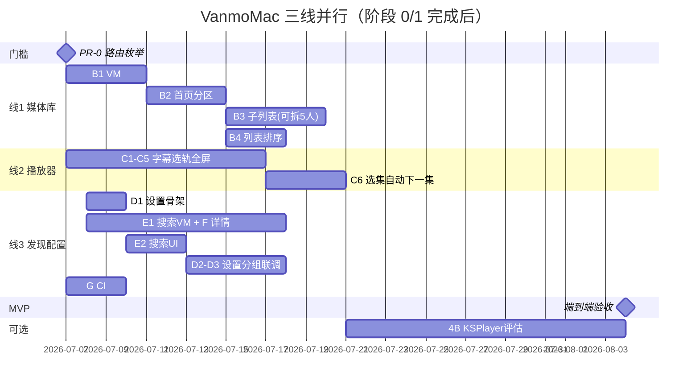

# VanmoMac 功能缺失清单与实施计划

> 基于 Vanmo iOS（`Vanmo/`，约 74 个 Swift 文件）与 VanmoMac（`VanmoMac/`，约 28 个 Swift 文件）对比整理。  
> 核心业务逻辑在 `Packages/VanmoCore`，Mac 端以新建 View + 薄 ViewModel 为主，从 iOS 移植业务逻辑而非复制 SwiftUI 视图。  
> 最后更新：2026-07-07（阶段 0 完成；阶段 1 的 1.1–1.4 完成，1.5 IPTV 延后；**阶段 2 的 2.1–2.4 ✅ 已完成**，2.5 延后；**阶段 4A / 线 2（C1–C7）✅ 已完成**；**线 3 PR-0→D3 ✅ 已完成**，G 未做）

---

## 当前基线（已实现，无需重做）

| 模块 | 状态 | 关键文件 |
|------|------|----------|
| App 入口 | ✅ | `VanmoMac/App/VanmoMacApp.swift` |
| 根导航壳层 | ✅ | `VanmoMac/App/VanmoMacRootView.swift` |
| 全局状态 | ✅ | `VanmoMac/App/MacAppState.swift` |
| 设计系统 | ✅ | `VanmoMac/UI/DesignSystem/MacDesignTokens.swift` |
| 侧边栏 | ✅ | `VanmoMac/UI/Components/MacSidebarView.swift` |
| 媒体库首页（基础） | ✅ | `MacLibraryHomeView` / `MacLibraryViewModel` |
| 空状态页 | ✅ | `MacLibraryEmptyStateView` |
| 媒体详情（只读） | ✅ | `MacMediaDetailView` |
| 连接添加 | ✅ | `MacAddConnectionView` / `MacConnectionsViewModel` |
| 播放器（AVPlayer 增强） | ✅ | `MacPlayerView` / `MacPlayerViewModel` / `MacAVPlayerView` / `MacSubtitleOverlayView` / `MacTrackSelectorView` / `MacEpisodeSelectorView` / `MacPlayerCommands` |
| OAuth AppKit Anchor | ✅ | `OAuthPresentationContextProvider+AppKit.swift` |
| 连接图标资源 | ✅ | `VanmoMac/Resources/Assets.xcassets/MacConn*` |

---

## 成熟度对比

| 维度 | iOS | macOS | 差距 |
|------|-----|-------|------|
| 应用壳层 / 导航 | TabView 四 Tab | 侧边栏 + 主内容 | 🟡 |
| 媒体库首页 | 多数据源聚合分区 + 子列表 | 首页 sections + 5 子列表 + 排序/列表切换 | 🟡 |
| 连接管理 | 添加 + 浏览 + 书签 + IPTV | 添加 + 浏览 + 管理菜单 + 浏览页书签（无首页书签区/IPTV） | 🟡 |
| 搜索 | 本地 + 远程并发 | 侧边栏搜索 + 分组结果页 | 🟡 |
| 设置 | 完整 8 组 | P0/P1 分组（iCloud、播放、字幕） | 🟡 |
| 媒体详情 | 完整交互 + 元数据 + 剧集 | 收藏/已看/元数据/季集/Collections | 🟡 |
| 播放器 | AVPlayer + KSPlayer | AVPlayer 字幕/选轨/倍速/全屏/选集 | 🟡 |
| VanmoCore 复用 | 全面 | 生命周期/播放闭环已接线 | 🟡 |

**估算：** 阶段 0/1 完成后，Mac 距 iOS MVP parity 约 **40–50%** 功能缺口；VanmoCore 已具备大部分逻辑，实施可行性高。

---

## 图例

- **P0** — 阻断核心体验，优先完成
- **P1** — 重要功能，影响 parity
- **P2** — 增强 / 体验完善
- **复用度** — VanmoCore 或 iOS ViewModel 逻辑可直接复用的比例
- **轨道** — 可并行推进的工作流，见下文「后续三线并行方案」

---

## 后续三线并行方案

> **原则：** 不同轨道改不同文件 → 可并行；同一文件多任务 → 串行或同一人负责。  
> VanmoCore 本轮以只读复用为主，一般不产生跨轨道冲突。

### 当前进度快照（2026-07-07）

| 已完成 | 范围 |
|--------|------|
| ✅ 阶段 0 全部 | 0.1–0.5：生命周期、进度、远程 URL、扫描反馈、连接删除 |
| ✅ 阶段 1（1.1–1.4） | 浏览 VM、浏览视图、侧边栏路由、连接管理菜单；浏览页文件夹书签 CRUD |
| ✅ 阶段 2（2.1–2.4） | 线 1：B1 VM sections/缓存、B2 首页分区、B3 五个子列表、B4 列表排序 |
| ✅ 阶段 4A / 线 2（C） | 4A.1–4A.7：字幕、选轨、在线字幕、倍速/缩放、全屏快捷键、选集/自动下一集、缓冲条 |
| ✅ 线 3（PR-0→D3） | 路由定稿、搜索 VM/UI、详情交互、设置 P0/P1、偏好联动 |
| ⏸️ 明确延后 | **1.5 IPTV / EPG**、**2.5 流派/地区筛选（B5）**（本轮不做） |
| 🔴 待启动 | 6（收尾 / G）；4B（KSPlayer）可选 |

**已解锁：** 0.2+0.3 ✅ → 轨道 C 可全面启动；阶段 0 全完成 ✅ → B / E1 / F / D 骨架可并行；阶段 1 浏览路由 ✅ → E2 可直接规划侧边栏分区（无需再等 A2）。

---

### 后续三线并行方案（当前主计划）

> **目标：** 在阶段 0/1 基础上，以 **3 条并行主线** 推进至 MVP。  
> **预估：** 三人并行约 **4–5 周**；单人交错推进约 **6–8 周**。

```text
                    ┌─────────────────────────────────────┐
                    │  合并门槛 PR-0：路由枚举一次性定稿    │
                    │  MacAppState / RootView / Sidebar   │
                    └─────────────────────────────────────┘
           ┌────────────────┬────────────────┬────────────────┐
           ▼                ▼                ▼
    【线 1】媒体库        【线 2】播放器        【线 3】发现与配置
     轨道 B               轨道 C              轨道 D + E + F (+G)
     低冲突区             Player/ 目录         壳层文件须线内串行
           │                │                │
           └──────── 联调点 ────────────────┘
              B↔F（剧集）  C↔D（偏好）  B↔6.1（书签）
```

| 线 | 建议负责人 | 核心目标 | 主要文件域 | 跨线冲突 |
|----|-----------|----------|------------|----------|
| **线 1** 媒体库 | 开发者 A | 首页结构对齐 iOS | `MacLibraryViewModel`、新建 5 个子列表 View | 仅 B↔F 联调 |
| **线 2** 播放器 | 开发者 B | AVPlayer 完整体验 | `MacPlayer*`、`VanmoMacApp` | C↔D 偏好 key 约定 |
| **线 3** 发现与配置 | 开发者 C | 搜索 + 详情 + 设置 + CI | `MacSidebarView`、`MacAppState`、`MacMediaDetailView` | **线内串行为主** |

#### 线 1 — 媒体库 parity（轨道 B · 阶段 2）

| 步骤 | 任务 | 并行性 | 工期 | 验收 |
|------|------|--------|------|------|
| **B1** | 2.1 扩展 `MacLibraryViewModel`（sections、缓存、排序） | 串行起点 | 3–4 天 | Emby 连接 → sections 非空 | ✅ |
| **B2** | 2.2 首页分区 UI（收藏/书签/各连接预览横滑） | 等 B1 | 3–4 天 | 首页结构与 iOS 一致 | ✅ |
| **B3** | 2.3 五个子列表 View | **B1 稳定后 5 文件可并行** | 4–5 天 | 分区 → 网格 → 详情 → 播放 | ✅ |
| **B4** | 2.4 列表视图 + `MacHeaderToolbar` 排序 | 与 B3 并行 | 2 天 | 网格/列表切换、排序生效 | ✅ |
| **B5** | 2.5 流派/地区筛选 | P2，最后 | 1–2 天 | Filter chips 过滤列表 | ⏸️ 延后 |

**B3 可拆并行（线 1 有 2 人时）：**

| 子任务 | 新建文件 |
|--------|----------|
| B3-a | `MacCollectionFolderListView.swift` |
| B3-b | `MacScannedLibraryListView.swift` |
| B3-c | `MacEmbyFolderBrowseView.swift` |
| B3-d | `MacScannedShowDetailView.swift` |
| B3-e | `MacFavoritesListView.swift` |

- **iOS 参考：** `LibraryViewModel.swift`、`CollectionFolderListView.swift` 等
- **验收：** Emby 连接后首页出现媒体库预览分区；点击可进入 Collection 列表 → 详情 → 播放

#### 线 2 — 播放器增强（轨道 C · 阶段 4A）✅

> **前置：** 0.2 + 0.3 已完成 ✅  
> **状态：** C1–C7 已全部完成（2026-07-07）

| 步骤 | 任务 | 并行性 | 工期 | 验收 |
|------|------|--------|------|------|
| **C1** | 4A.3 在线字幕 Provider 注册 | **随时可开** | 0.5 天 | Provider 注册无 crash |
| **C2** | 4A.1 `MacSubtitleOverlayView` + `SubtitleManager` | 与 C3/C4/C5 并行 | 2–3 天 | 内嵌/外挂 SRT 显示 |
| **C3** | 4A.2 `MacTrackSelectorView` 音轨/字幕切换 | 同上 | 1–2 天 | Sheet 列出 AVPlayer tracks |
| **C4** | 4A.4 倍速 / `VideoScaleMode` / 读 `playback.*` | 同上；key 由线 3 先定 | 1–2 天 | 倍速/缩放随设置变化 |
| **C5** | 4A.5 全屏 + 快捷键 + `commands` | C1 后改 App；与 C2 并行 | 2 天 | Space/←→/F/Esc 可用 |
| **C6** | 4A.6 选集 / 自动下一集 / `MacEpisodeSelectorView` | **等 C2/C3 稳定** | 2–3 天 | 剧集播完自动下一集 |
| **C7** | 4A.7 缓冲进度条 | P2，最后 | 1 天 | `bufferProgress` 可见 |

- **验收：** 字幕、倍速、全屏、快捷键、自动下一集可用

#### 线 3 — 发现与配置（轨道 D + E + F + G · 阶段 3/5/6.6）

> **约束：** `MacAppState`、`VanmoMacRootView`、`MacSidebarView` 多任务共用 → **线内须串行 + 分区约定**。

| 步骤 | 任务 | 并行性 | 工期 | 验收 | 状态 |
|------|------|--------|------|------|------|
| **PR-0** | 扩展路由枚举：`library` + 库子路由 / `connectionBrowser` / `search` / `settings` / `detail` | **三线开工前 1 次合并** | 0.5 天 | 各线只加 case | ✅ |
| **D1** | 5.1 设置骨架 + 侧边栏/菜单 Settings 入口 | 线 3 串行起点 | 1–2 天 | 空设置页可打开 | ✅ |
| **E1** | 3.1 `MacSearchViewModel`（本地+远程、250ms 防抖） | **与 D1/F 并行**（新建文件） | 2–3 天 | VM 返回分组结果 | ✅ |
| **F** | 3.3 详情交互（收藏/已看/元数据/季集/Collections） | **与 E1 并行**（`MacMediaDetailView`） | 4–5 天 | 收藏双端同步；TV 可选集 | ✅ |
| **E2** | 3.2 搜索框 + `MacSearchResultsView` | **等 D1 侧边栏分区定稿** | 2 天 | 搜索 → 结果 → 详情 | ✅ |
| **D2** | 5.2 P0 iCloud + P1 播放/字幕分组 | 与 E2 可部分并行 | 2–3 天 | key 与 iOS 一致 | ✅ |
| **D3** | 5.3 播放器/扫描读偏好 | **等线 2 C4 就绪后联调** | 1–2 天 | 改倍速设置 → 播放器生效 | ✅（基础 AVPlayer 路径） |
| **G** | 6.6 CI xcodebuild macOS + cloud-sync 脚本 | **随时并行** | 1–2 天 | CI 绿 | 🔴 未做 |

**线 3 侧边栏分区约定（线 1 已完成连接区，线 3 只改以下区域）：**

```text
MacSidebarView 分区
├── [顶] 搜索框          ← E2 负责
├── [中] 导航（媒体库）   ← 线 1 不动
├── [中] 连接列表         ← 阶段 1 已完成，线 3 勿改
└── [底] 设置入口         ← D1 负责
```

---

### 跨线同步点（并行中的串行门槛）

| 门槛 | 时机 | 参与线 | 动作 |
|------|------|--------|------|
| **PR-0** | 三线开工第 1 天 | 全线 | 合并路由 enum PR；之后各线只追加 case |
| **Key 清单** | 第 1 周 | 线 2 ↔ 线 3 | 线 3 输出 `@AppStorage` key 文档；线 2 C4/C6 按 key 读取 |
| **F ↔ B 联调** | 第 2–3 周 | 线 1 ↔ 线 3 | F 季/集播放对接 B3-d 或 VM episode 数据 |
| **D3 ↔ C4 联调** | 第 3–4 周 | 线 2 ↔ 线 3 | 设置改倍速/自动下一集 → 播放器验证 |
| **MVP 合并** | 第 4–5 周 | 全线 | 按文末 MVP 清单走端到端验收 |

---

### 跨轨道文件冲突矩阵

合并 PR 前对照此表，避免互相覆盖。

| 文件 | 涉及线/轨道 | 协调策略 |
|------|-------------|----------|
| `MacAppState.swift` | 线 3 PR-0、B 导航、E2 | **PR-0 先合并**；各线只加 case |
| `VanmoMacRootView.swift` | 线 3 PR-0/D1、B2、E2 | 各线只加 `switch` 分支 |
| `MacSidebarView.swift` | 线 3 D1/E2 | 按分区约定；**E2 等 D1 定稿** |
| `MacLibraryViewModel.swift` | 线 1 | 仅线 1 长期持有 |
| `MacPlayerViewModel.swift` | 线 2 | 仅线 2 长期持有 |
| `MacMediaDetailView.swift` | 线 3 F | 仅线 3 长期持有 |
| `VanmoMacApp.swift` | 线 2 C1/C5 | `init` 与 `commands` 分区合并 |

**低冲突区（可放心并行）：** 所有新建 View 文件、`VanmoCore`（只读）、轨道 G。

---

### 推荐分工方案（当前阶段）

#### 三人（推荐 · 三线并行）

| 人 | 线 | 任务链 |
|----|-----|--------|
| **甲** | 线 1 | B1 → B2 → B3 → B4 ✅（B5 延后） |
| **乙** | 线 2 | C1 → C2/C3/C4/C5（并行）→ C6 → C7（可选） |
| **丙** | 线 3 | PR-0 → D1 → E1∥F → E2 → D2 → D3；G 随时穿插 |

约 **4–5 周** 达 MVP。

#### 双人

| 人 | 线 |
|----|-----|
| **甲** | 线 1（B）+ 线 3 的 F（详情） |
| **乙** | 线 2（C）+ 线 3 的 D/E/G |

线 3 壳层改动由一人集中负责（建议乙：D1 定侧边栏后再 E2）。

约 **5–6 周**。

#### 单人（逻辑三线、物理交错）

```text
Week 1: PR-0 → B1 → C1+C2 → D1+E1
Week 2: B2 → C3+C4+C5 → F(收藏/已看)
Week 3: B3(逐个) → C6 → F(季集)
Week 4: B4 → E2 → D2
Week 5: D3 联调 C4/C6 → G CI → MVP 验收
```

约 **6–8 周**。

#### 四人

在线 1 基础上，**丁** 专注 B3 五个子列表页（B3-a–e 各一文件）。

约 **3–4 周**。

---

### 当前立即可并行（2026-07-07 快照）

**当前主要推进：线 3；线 1 / 线 2 已完工**

| 线 | 任务 | 阻塞 |
|----|------|------|
| **线 1** | — | B1–B4 ✅ 已完成 |
| **线 2** | — | C1–C7 ✅ 已完成 |
| **线 3** | G CI；E1 搜索 VM；F 详情（收藏/已看） | PR-0 与 D1 建议第 1–2 天完成 |

**须协调后再动：**

| 任务 | 阻塞 |
|------|------|
| E2 搜索 UI（改 `MacSidebarView`） | 等 D1 侧边栏分区定稿 |
| D3 播放器偏好联调 | C4 ✅ 已就绪，待线 3 D2 设置 UI |
| F 季/集完整链路 | 与 B3-d 或 B1 episode 数据联调 |

**MVP 之后按需插队（不在三线主路径）：**

| 优先级 | 内容 | 时机 |
|--------|------|------|
| P1 收尾 | 6.1 文件夹书签 | 可并入线 3 或收尾迭代 |
| 可选 | 4B KSPlayer 评估 | 线 2 完成后可独立 1–2 周 |
| 延后 | 1.5 IPTV | 本轮不做 |
| P2 | B5 筛选、6.2–6.5 体验打磨 | MVP 后迭代 |

---

### 并行时间线（三线 · 自 2026-07-07）



---

### 历史参考：阶段 0 内部三线（已完成 ✅）

| 并行线 | 任务 | 主要文件 | 状态 |
|--------|------|----------|------|
| **0-α App/连接** | 0.1 生命周期 + 0.5 连接删除 | `VanmoMacRootView.swift`、`MacConnectionsViewModel.swift`、`MacSidebarView.swift` | ✅ |
| **0-β 播放器** | 0.2 进度持久化 + 0.3 远程 URL / 预取 | `MacPlayerViewModel.swift`、`MacPlayerView.swift` | ✅ |
| **0-γ 连接 UI** | 0.4 扫描进度反馈 | `MacAddConnectionView.swift` | ✅ |

### 历史参考：轨道 A — 连接浏览（阶段 1 · 已完成 ✅，IPTV 延后）

| 顺序 | 任务 | 状态 |
|------|------|------|
| A1 | 1.1 扩展 `MacConnectionsViewModel` | ✅ |
| A2 | 1.3 浏览路由 + 侧边栏接线 | ✅ |
| A3 | 1.2 `MacConnectionsBrowseView` | ✅ |
| A4 | 1.4 编辑/删除/重扫菜单 | ✅ |
| A5 | 1.5 IPTV | ⏸️ 延后 |

---

## 阶段 0：基础闭环（预计 1–2 周）`轨道 0 · 门槛任务`

> 目标：修掉数据不同步、播放失败、进度丢失等 P0 问题，让现有功能「真的能用」。

### 0.1 应用生命周期接线 — P0，复用度：高 `0-α`

- [x] 启动时 `CloudSyncCoordinator.performSync(reason: "app-launch")`
- [x] 前台恢复时 `performSync(reason: "foreground")` + `loadSavedConnections()`
- [x] 启动时 `attemptAutoReconnectIfNeeded()`（从 iOS `ConnectionsViewModel` 移植）
- [x] 参考 iOS：`Vanmo/App/ContentView.swift` `.task` / `.onChange(of: scenePhase)`
- [x] 修改：`VanmoMac/App/VanmoMacRootView.swift`

### 0.2 播放进度持久化 — P0，复用度：高 `0-β`

- [x] 关闭播放器时写回 `lastPlaybackPosition` / `lastPlayedAt` / `isWatched`
- [x] 触发 `CloudSyncCoordinator.markMediaProgressChanged` + `requestSync`
- [x] 参考 iOS：`PlayerViewModel.saveProgress()`
- [x] 修改：`VanmoMac/Player/MacPlayerViewModel.swift`、`MacPlayerView.swift`

### 0.3 远程播放 URL 解析 — P0，复用度：高 `0-β`

- [x] 移植 iOS 云盘流 URL 解析（`resolveCloudDriveStreamURLIfNeeded`）
- [x] 接入 `PrefetchRegistration`（当前 `MacPlayerViewModel` 已声明未使用）
- [x] OAuth 网盘播放时携带 Bearer token 请求头
- [x] 修改：`VanmoMac/Player/MacPlayerViewModel.swift`

### 0.4 扫描进度反馈 — P1，复用度：低 `0-γ`

- [x] `MacAddConnectionView` 绑定 `isLoading` / `loadingMessage` 展示进度遮罩
- [x] 修改：`VanmoMac/UI/Browser/Views/MacAddConnectionView.swift`

### 0.5 连接删除 — P0，复用度：高 `0-α`

- [x] 从 iOS 移植 `deleteConnection`（含 Keychain、FolderBookmark、CloudSync 清理）
- [x] 侧边栏或浏览页提供删除入口
- [x] 修改：`MacConnectionsViewModel.swift`、`MacSidebarView.swift`

**阶段 0 验收标准：**
- 添加 SMB 连接 → 扫描 → 播放 → 退出 → 重开，Continue Watching 有进度
- 与 iOS 同一 iCloud 账号，连接/进度可双向同步
- 云盘/OAuth 媒体可实际播放（非仅 `fileURL` 直读）

---

## 阶段 1：连接浏览 + 即时播放（预计 2–3 周）`轨道 A`

> 目标：补齐 iOS「文件」Tab 等价能力；侧边栏点击连接可浏览目录并播放。

### 1.1 扩展 Connections ViewModel — P0，复用度：高

- [x] 移植 iOS 浏览相关状态：`selectedConnectionID`、`currentPath`、`pathStack`、`files`、`isBrowsingFiles`
- [x] 移植方法：`enterConnection`、`navigateTo`、`navigateUp`、`play(RemoteFile)`、`loadDirectory`
- [x] 移植连接状态：`ConnectionStatus`、`connectionErrorMessages`
- [x] 修改/扩展：`MacConnectionsViewModel.swift`

#### 执行计划

**目标文件：** `VanmoMac/UI/Browser/ViewModels/MacConnectionsViewModel.swift`

**参考实现：**

| mac-todo 名称 | iOS 源文件 | iOS 实际 API |
|---|---|---|
| 浏览状态 | `Vanmo/Features/Browser/ViewModels/BrowserViewModel.swift` | `selectedConnectionID`、`currentPath`、`pathStack`、`files`、`isBrowsingFiles` |
| 目录方法 | 同上 | `selectConnection`、`openDirectory`、`goBackDirectory`、`loadDirectory` |
| 连接状态 | 同上 | `ConnectionStatus`、`connectionStatuses`、`connectionErrorMessages` |
| 播放 | `Vanmo/Features/Browser/Views/BrowserView.swift` | `streamURL(for:)` + 构造 `MediaItem` → `appState.play` |

**共享依赖（无需新建）：** `RemoteFile`、`SavedConnection`、`RemoteFileService`、`RemoteServiceFactory`、`ConnectionConfig`、`FileNameParser`（均在 `Packages/VanmoCore`）；播放入口 `MacAppState.play(_:from:)`（`VanmoMac/App/MacAppState.swift`）。

**当前 Mac 缺口：** 已有连接 CRUD、OAuth、`connectAndScan`、本地文件夹 `activeLocalServices` 缓存；缺少浏览状态、浏览专用 service 生命周期、`ConnectionStatus` 状态机、`streamURL` / `play` 链路。

---

**Step 1 — 补充浏览状态属性**

在 `MacConnectionsViewModel` 增加（对齐 iOS `ConnectionsViewModel` 第 27–36、42–46 行）：

```swift
@Published private(set) var selectedConnectionID: UUID?
@Published private(set) var currentPath = "/"
@Published private(set) var pathStack: [String] = []
@Published private(set) var files: [RemoteFile] = []
@Published private(set) var isBrowsingFiles = false
@Published private(set) var fileBrowserErrorMessage: String?
private var connectionStatuses: [UUID: ConnectionStatus] = [:]
@Published private(set) var connectionErrorMessages: [UUID: String] = [:]
private var browserService: RemoteFileService?
private var browserServiceConnectionID: UUID?
```

同文件顶部定义 `ConnectionStatus`（`idle` / `connecting` / `connected` / `failed`），与 iOS 保持一致。增加计算属性 `selectedConnection` 与查询方法 `connectionStatus(for:)`、`connectionErrorMessage(for:)`。

**Step 2 — 移植目录浏览方法**

| mac-todo | 实现方法 | 行为 |
|---|---|---|
| `enterConnection` | `selectConnection(_:)` | 切换连接时重置 `currentPath`/`pathStack`/`files`，断开旧 `browserService`，再 `loadDirectory(path: "/")` |
| `navigateTo` | `openDirectory(_:)` | 仅目录项；`loadDirectory` 成功后把旧路径压入 `pathStack` |
| `navigateUp` | `goBackDirectory()` | `pathStack.popLast()` 后 `loadDirectory`；失败则回滚栈 |
| `loadDirectory` | `loadDirectory(path:)` | 通过 `browserFileService` 调 `listDirectory`，排序写入 `files`，更新 `currentPath` |

`loadDirectory` 核心流程：

1. 无 `selectedConnection` → `resetFileBrowser()` 并返回 `false`
2. `isBrowsingFiles = true`，`connectionStatuses[id] = .connecting`
3. `browserFileService(for:)` → `listDirectory(path:)` → `files.sorted(by: fileSortPredicate)`
4. 成功：`.connected`，更新 `lastConnectedAt` 并保存
5. 失败：清空 `files`，写入 `fileBrowserErrorMessage`，`.failed`

辅助方法一并移植：`normalizedDirectoryPath`、`fileSortPredicate`、`userFacingFileBrowserMessage`、`resetFileBrowser`、`reconcileSelectedConnection`。

**Step 3 — 浏览专用 Service 生命周期**

移植 `browserFileService(for:)` / `disconnectBrowserServiceIfNeeded()`：

- **本地文件夹**：复用已有 `activeLocalServices`，浏览期间**不断开**
- **远端 / OAuth**：浏览期间保持 `browserService` 长连接；切换连接或 `resetFileBrowser` 时再 `disconnect`
- **与 `connectAndScan` 分离**：扫描用临时 service，扫完对非本地连接 `disconnect`；浏览用独立 `browserService`，避免互相踩连接

**Step 4 — 扩展 `connectAndScan` 连接状态**

在现有 `connectAndScan` 中写入状态机：

- 开始：`connectionStatuses[id] = .connecting`
- 成功：`.connected`，清除 `connectionErrorMessages[id]`
- 失败：`.failed`，写入 `connectionErrorMessages[id] = error.localizedDescription`（`showErrorAlert == false` 时仅写状态，不弹窗）

**Step 5 — 播放 URL 与 `play(RemoteFile)`**

移植 `streamURL(for: RemoteFile)`：通过 `browserFileService` 调 `service.streamURL(for:)`。

`play(RemoteFile)` 对齐 iOS `BrowserView.play`（第 330–369 行）：

1. 若 `connection.type.usesEphemeralStreamURLs`（如百度网盘）→ `catalogPlaybackURL(serverPath:)`
2. 否则 → `streamURL(for:)`
3. `FileNameParser.parse(file.name)` 构造 `MediaItem`（标题、类型、季集、年份等）
4. 设置 `serverId`、`sourceConnectionId`、`originalFileName`、`container`
5. 调用 `MacAppState.play(item)`

在 VM 中提供 `play(_ file: RemoteFile, via appState: MacAppState)`，将上述逻辑内聚到 ViewModel，供 1.2 浏览视图直接调用。

**Step 6 — 与现有 CRUD 集成**

| 现有方法 | 需补充的浏览态处理 |
|---|---|
| `deleteConnection` | 若删除的是 `selectedConnectionID` → `resetFileBrowser()` + `disconnectBrowserServiceIfNeeded()` |
| `updateConnection` | 编辑后 `activeLocalServices.removeValue` + 若当前选中则重置浏览路径并重新 `loadDirectory` |
| `loadSavedConnections` | 末尾调用 `reconcileSelectedConnection()`（选中连接已不存在时清空或回退到首个连接） |
| `saveConnection` / OAuth 成功 | 可选：自动 `selectConnection` 进入浏览（与 iOS 行为对齐） |

**Step 7 — 1.1 验收标准（纯 VM 层，不含 UI）**

- [x] `selectConnection` → `loadDirectory` → `openDirectory` → `goBackDirectory` 状态机正确
- [x] SMB / WebDAV / 本地文件夹 `listDirectory` 返回排序后的 `files`
- [x] `streamURL(for:)` 对常见连接类型返回可播放 URL
- [x] `play(RemoteFile, via:)` 能构造 `MediaItem` 并触发 `MacAppState.play`
- [x] `connectAndScan` 失败时 `connectionErrorMessages` 有值；成功时 `.connected`
- [x] 切换连接时旧 `browserService` 正确断开；本地文件夹 access 持续有效

**明确不在 1.1：** `MacConnectionsBrowseView`（1.2）、侧边栏路由（1.3）、连接管理菜单（1.4）、IPTV 完整 UI / EPG 展示（1.5）。

### 1.2 连接文件浏览视图 — P0，复用度：中

- [x] 新建 `VanmoMac/UI/Browser/Views/MacConnectionsBrowseView.swift`
- [x] 面包屑导航 + 文件/文件夹列表
- [x] 双击/单击播放视频、进入子目录
- [x] 右键菜单：编辑、删除、全量重扫
- [x] 浏览页添加/取消文件夹书签（`FolderBookmark` CRUD；首页书签区见 6.1 / B2）

### 1.3 侧边栏接线 — P0

- [x] 连接点击 → 设置 `selectedConnectionID` + 进入浏览态
- [x] `MacAppState` 增加浏览路由枚举（如 `activeConnectionId`）
- [x] 修改：`MacSidebarView.swift`、`MacAppState.swift`、`VanmoMacRootView.swift`

### 1.4 连接管理菜单 — P1

- [x] 编辑连接：唤起 `MacAddConnectionView(editingConnection:)`
- [x] 删除连接、全量重扫上下文菜单
- [x] 连接状态指示（连接中/失败）

### 1.5 IPTV 支持 — P1，复用度：高 `⏸️ 延后 · 不在本轮三线范围`

- [ ] 移植频道分组列表 UI（参考 iOS `BrowserView` IPTV 区块）
- [ ] EPG 指南拉取与展示（`EPGGuide`）
- [ ] 直播播放：LIVE 标识、跳过续播、失败频道标记
- [ ] 新建：`MacIPTVBrowseView` 或合入 `MacConnectionsBrowseView`

**阶段 1 验收标准：**
- SMB/WebDAV/本地文件夹可逐级浏览并播放视频
- ~~IPTV 连接可列出频道并播放~~（1.5 延后，本轮不做）
- 可编辑/删除已有连接

---

## 阶段 2：媒体库首页 parity（预计 2–3 周）`轨道 B`

> 目标：Mac 首页展示与 iOS 相同的数据源结构。

### 2.1 扩展 Library ViewModel — P0，复用度：高

- [x] 移植 `serverCollectionFolders` / `embyConnectionsById`
- [x] 移植 `scannedLibraryFolders` / `scannedConnectionsById`
- [x] 移植 `folderBookmarks` / `folderPreviews` / `folderTotalCounts`
- [x] 移植 `HomeCollectionCache` 磁盘缓存（启动秒开 + 后台刷新）→ `MacHomeCollectionCache`
- [x] 移植 `loadInitialSections(connections:)`（Emby/Jellyfin live 刷新）
- [x] 移植排序：`MacLibrarySortOption`
- [x] 修改：`MacLibraryViewModel.swift`、`MacConnectionsViewModel.swift`（`librarySyncCompletionID`）

### 2.2 首页分区 UI — P0

- [x] 收藏叠卡区（`MacFavoritesStackedCard`）
- [x] 文件夹书签横滑区
- [x] 各 Emby/Plex/Jellyfin 连接媒体库预览横滑
- [x] 各扫描库（SMB/本地等）预览横滑
- [x] 库同步状态 Toast（`librarySyncMessage`）
- [x] 修改：`MacLibraryHomeView.swift`、`MacMediaCards.swift`

### 2.3 子列表页 — P0

- [x] `MacCollectionFolderListView` — Emby/Jellyfin/Plex Collection 分页网格
- [x] `MacScannedLibraryListView` — 扫描库电影/剧集网格
- [x] `MacEmbyFolderBrowseView` — 服务端 Folder/Season/BoxSet 子级浏览
- [x] `MacScannedShowDetailView` — 扫描库电视剧季/集列表
- [x] `MacFavoritesListView` — 收藏列表（搜索/分页）

### 2.4 列表视图 + 排序 — P1

- [x] 实现 `viewMode == .list` 的 `MacMediaListRow` 布局
- [x] `MacHeaderToolbar` 排序按钮接入 `MacLibrarySortOption`
- [x] 修改：`MacLibraryHomeView.swift`、`MacHeaderToolbar.swift`、各子列表 View

### 2.5 流派/地区筛选 — P2

- [ ] 移植 `LibraryFilters` + `FilterChipsRow` 桌面版
- [ ] 新建：`MacFilterChipsRow.swift`（可选）

**阶段 2 验收标准：**
- 配置 Emby 后，首页可见该服务器的电影/剧集库预览
- 点击可进入 Collection 列表 → 详情 → 播放
- 列表/网格切换、排序生效

---

## 阶段 3：搜索 + 详情交互（预计 1.5–2 周）`轨道 E + F`

### 3.1 搜索 ViewModel — P0，复用度：高 `轨道 E`

- [x] 新建 `MacSearchViewModel`（直接复用/薄封装 iOS `SearchViewModel`）
- [x] 本地 SwiftData 搜索 + 远程连接并发搜索（Emby/Plex 等）
- [x] 按连接分组：`SearchResultSection`
- [x] 防抖 250ms

### 3.2 搜索 UI — P0 `轨道 E · ⚠️ 与 A2 协调 MacSidebarView`

- [x] `MacSearchField` 改为可输入 `TextField` + 绑定 `searchText`
- [x] 新建 `MacSearchResultsView`（主内容区或搜索结果覆盖层）
- [x] 点击结果 → `MacMediaDetailView`
- [x] 修改：`MacSidebarView.swift`

### 3.3 详情页交互 — P0/P1 `轨道 F · 🔀 可与 A/B/C 并行`

- [x] 收藏切换 + `CloudSyncCoordinator.markMediaFavoriteChanged`（当前按钮空 action）
- [x] 已看标记切换 + 进度云同步
- [x] 接入 `MetadataRefreshCoordinator` 元数据刷新
- [x] Cast 从元数据缓存读头像与角色名（当前仅 `item.cast` 字符串，无头像）
- [x] TV Show 季/集列表 + 选集播放（当前硬编码 `"Episodes"`）
- [x] 关联合集（Collections）展示
- [x] 更多菜单：刷新元数据、标记已看等
- [x] 修改：`MacMediaDetailView.swift`；可选新建 `MacMediaDetailStore.swift`

**阶段 3 验收标准：**
- 侧边栏搜索可找到本地 + 远程媒体
- 详情页可收藏/取消收藏，双端同步
- 电视剧可浏览季/集并播放

---

## 阶段 4A：播放器增强（不依赖 KSPlayer，预计 2 周）`轨道 C`

> 优先完成 AVPlayer 路径下的完整体验。

### 4A.1 字幕 — P1

- [x] 新建 `MacSubtitleOverlayView`（SwiftUI/AppKit）
- [x] 接入 VanmoCore `SubtitleManager`、SRT/VTT 解析
- [x] 读 `@AppStorage` 字幕样式偏好（字号、颜色、位置）
- [x] `MacPlayerControlsOverlay` 字幕按钮接线

### 4A.2 音轨/内嵌字幕切换 — P1

- [x] 新建 `MacTrackSelectorView` sheet
- [x] 从 `AVPlayerItem` 读取 `audioTracks` / `subtitleTracks`

### 4A.3 在线字幕 — P1，复用度：高

- [x] `VanmoMacApp.init` 注册 OpenSubtitles / Shooter / Subhd Provider
- [x] 播放器内搜索、下载、加载在线字幕
- [x] 参考 iOS：`VanmoApp.swift`、`TrackSelectorView.swift`

### 4A.4 倍速 / 画面缩放 — P1

- [x] 控制栏倍速选择（读 `playback.defaultRate` 偏好）
- [x] `VideoScaleMode` Fit/Fill/Stretch 切换
- [x] 读 `@AppStorage` 硬件解码、断点续播、自动下一集偏好

### 4A.5 全屏 + 键盘快捷键 — P1

- [x] 全屏：`NSWindow.toggleFullScreen` 或独立播放器窗口
- [x] 快捷键：Space 播放暂停，←/→ 跳转，↑/↓ 音量，F 全屏，Esc 关闭
- [x] `VanmoMacApp.commands` 扩展

### 4A.6 选集 / 自动下一集 — P1，复用度：高

- [x] 移植 iOS `episodeGroups` / `currentEpisodeID` 逻辑
- [x] 播放结束自动播放下一集（读 `playback.autoPlay`）
- [x] 新建 `MacEpisodeSelectorView`

### 4A.7 缓冲进度条 — P2

- [x] 显示 `bufferProgress`（参考 iOS `PlayerProgressBar`）

**阶段 4A 验收标准：**
- 内嵌/外挂字幕可显示与切换
- 倍速、全屏、键盘快捷键可用
- 电视剧可自动下一集

---

## 阶段 4B：特殊格式播放（视 KSPlayer macOS 支持，预计 1–2 周，可选）`独立 · 等 4A 后`

> 风险较高，不阻塞 4A 上线。

### 4B.1 KSPlayer macOS 评估 — P1，风险：中

- [ ] 在 `project.yml` 为 `Vanmo-macOS` 添加 KSPlayer 依赖并编译验证
- [ ] 评估 macOS 上 FFmpeg/软解路径可用性

### 4B.2 FFmpeg 引擎 — P2，风险：高

- [ ] 新建 `MacKSPlayerEngine` 或 macOS FFmpeg 封装
- [ ] `PlayerEngineFactory` macOS 分支：native → AVPlayer，ffmpeg/disc → KSPlayer

### 4B.3 原盘 / ISO / 特殊编码 — P2，风险：高

- [ ] 蓝光 BDMV / ISO playlist 解析播放
- [ ] 不支持的格式给出明确提示

---

## 阶段 5：设置页（预计 1 周）`轨道 D · 🔀 0.1 后即可并行`

### 5.1 设置视图 — P0

- [x] 新建 `VanmoMac/UI/Settings/MacSettingsView.swift`
- [x] 新建 `MacSettingsViewModel.swift`（复用 iOS `SettingsViewModel` 逻辑与 `@AppStorage` key）
- [x] 侧边栏或菜单栏 `Vanmo → Settings…` 入口

### 5.2 设置分组 — 按优先级

- [x] **P0** iCloud 同步开关 + 上次同步时间
- [x] **P1** 播放：自动下一集、断点续播、硬件解码、默认倍速
- [x] **P1** 字幕：自动加载、字号、语言、颜色/背景/位置（OpenSubtitles 配置待线 2 C1 后补）
- [ ] **P2** 音频：输出模式
- [ ] **P2** 媒体库：自动扫描、未观看标记
- [ ] **P2** 元数据：自动下载、元数据缓存清理
- [ ] **P2** 外观：主题选择（接入 `MacAppState.theme`，当前 `isDarkMode` 未接线）
- [ ] **P2** 存储：通用缓存清理
- [ ] **P2** 关于：版本号、重置所有设置

### 5.3 设置与播放器/扫描联动 — P1

- [x] 播放器读 `playback.*` / `subtitle.*` 偏好（倍速、断点续播；字幕样式 key 已对齐）
- [x] 扫描读 `library.autoScan` 偏好

**阶段 5 验收标准：**
- 设置页可配置并与 iOS 共享 `@AppStorage` key（双端偏好一致）
- 播放器行为随设置变化

---

## 阶段 6：体验打磨（持续迭代）`轨道 G + 各轨道收尾`

### 6.1 文件夹书签 — P1

- [x] 浏览页添加/取消书签（`FolderBookmark` CRUD，已在 1.2 / `MacConnectionsViewModel` 实现）
- [ ] 首页展示书签区块（依赖 B2）→ ✅ B2 已完成；点击跳转连接浏览 ✅
- [ ] 参考 iOS：`BrowserViewModel` 书签系列方法

### 6.2 库同步与反馈 — P2

- [ ] 扫描/同步完成 Toast
- [ ] 连接错误状态在侧边栏展示

### 6.3 图片加载 — P2

- [ ] 评估 Kingfisher macOS 或磁盘缓存层（当前 `AsyncImage` + 占位）

### 6.4 macOS 原生增强 — P2

- [ ] 文件列表右键菜单、Quick Look 预览
- [ ] 拖拽本地文件到窗口播放
- [ ] 菜单栏常驻控制（播放/暂停）

### 6.5 视觉打磨 — P2

- [ ] 首页模糊海报背景（参考 iOS `LibraryView` backdrop）
- [ ] 详情页标题 Logo（`MediaTitleLogoView` 桌面版）
- [ ] TV-MA 分级从元数据读取（当前硬编码）

### 6.6 CI 与测试 — P1 `轨道 G · 🔀 随时可并行`

- [ ] CI 覆盖 `Vanmo-macOS` xcodebuild
- [ ] 纳入 `scripts/check-cloud-sync-multiplatform-scope.sh`
- [ ] 扩展 `VanmoCoreTests`：双端 schema 一致性
- [ ] macOS Release：验证 `Vanmo-Mac-Cloud.entitlements` 下 CloudKit 双端同步

---

## 排期总览

> 详细并行方案见上文 **「后续三线并行方案」**。

| 阶段 | 线/轨道 | 内容 | 预计工期 | 状态 |
|------|---------|------|----------|------|
| **0** | 门槛 | 生命周期 + 播放闭环 | 1–2 周 | ✅ 已完成 |
| **1** | A | 连接浏览（1.1–1.4 ✅；1.5 IPTV 延后） | 2–3 周 | ✅ 核心已完成 |
| **2** | **线 1 / B** | 媒体库首页 parity（2.1–2.4 ✅；2.5 延后） | 2–3 周 | ✅ 核心已完成 |
| **3** | **线 3 / E+F** | 搜索 + 详情交互 | 1.5–2 周 | ✅ 已完成 |
| **4A** | **线 2 / C** | 播放器增强（AVPlayer） | 2 周 | ✅ 已完成 |
| **5** | **线 3 / D** | 设置页（P0/P1 + 偏好联动） | 1 周 | ✅ 核心已完成 |
| **4B** | 独立 | FFmpeg/KSPlayer（可选） | 1–2 周 | 等 4A |
| **6** | G+ | 体验打磨 | 持续 | 部分可提前（CI） |

**当前最大并行窗口：** 三线核心（B / C / D+E+F）均已完成；剩余以 **6（G 体验打磨）** 为主，4B / B5 按需延后或可选。

**MVP 目标日期（三人）：** 约 2026-08-04。

---

## 最小可用 Mac 版（MVP）定义

完成 **阶段 0 + 1 + 2 + 3（核心）+ 4A（核心）+ 5（P0/P1）** 后：

1. 与 iOS 数据 CloudKit 同步一致
2. 可添加 / 浏览 / 播放各协议媒体
3. 首页结构与服务端库基本对齐
4. 可搜索、可收藏、进度可续播
5. 基础字幕 / 倍速 / 全屏 / 自动下一集可用（线 2 ✅）
6. 关键设置可配置

**v1.1+ 迭代：** FFmpeg 特殊格式、IPTV EPG 精细 UI、文件夹书签、拖拽播放、菜单栏控制等。

---

## MVP 端到端验收清单（三线完成后）

1. CloudKit 连接/进度/收藏双向同步（阶段 0 ✅）
2. 浏览连接并播放（阶段 1 ✅）
3. **线 1：** 首页 Emby/扫描库分区 → 子列表 → 播放
4. **线 3：** 搜索本地+远程；详情收藏/季集播放
5. **线 2：** 字幕 + 倍速 + 全屏快捷键 + 自动下一集
6. **线 3：** 设置 P0/P1（iCloud、播放、字幕）生效

---

## 技术决策备忘

| 决策点 | 建议 | 理由 |
|--------|------|------|
| ViewModel 策略 | Mac 独立 VM，从 iOS 移植方法体 | 桌面状态机与 Tab 导航不同 |
| 是否共享 iOS View | 否 | 布局/交互差异大；共享 VanmoCore 即可 |
| KSPlayer 时机 | 4A 完成后再评估 | Mac target 目前无 KSPlayer 依赖 |
| 导航结构 | 保持 HStack + `MacAppState` 路由枚举 | 避免大规模改 NavigationSplitView |
| 设置存储 | 复用 iOS `@AppStorage` key | 保证双端偏好一致 |

---

## 明确不在本轮范围

以下 iOS 也未完全生产化，**不作为 Mac 追赶优先级**：

- `SecondFloorView`（继续观看二楼）— 仅 Preview，未挂到 `LibraryView`
- Trakt 集成 — 双端均无
- 后台下载队列 — 双端均无完整实现
- tvOS 适配 — 见根目录 `todos.md`

---

## 相关文档

- 架构计划：`doc/vanmocore-macos-architecture-plan.md`
- iOS 总待办：`todos.md`
- 多端同步检查：`scripts/check-cloud-sync-multiplatform-scope.sh`
