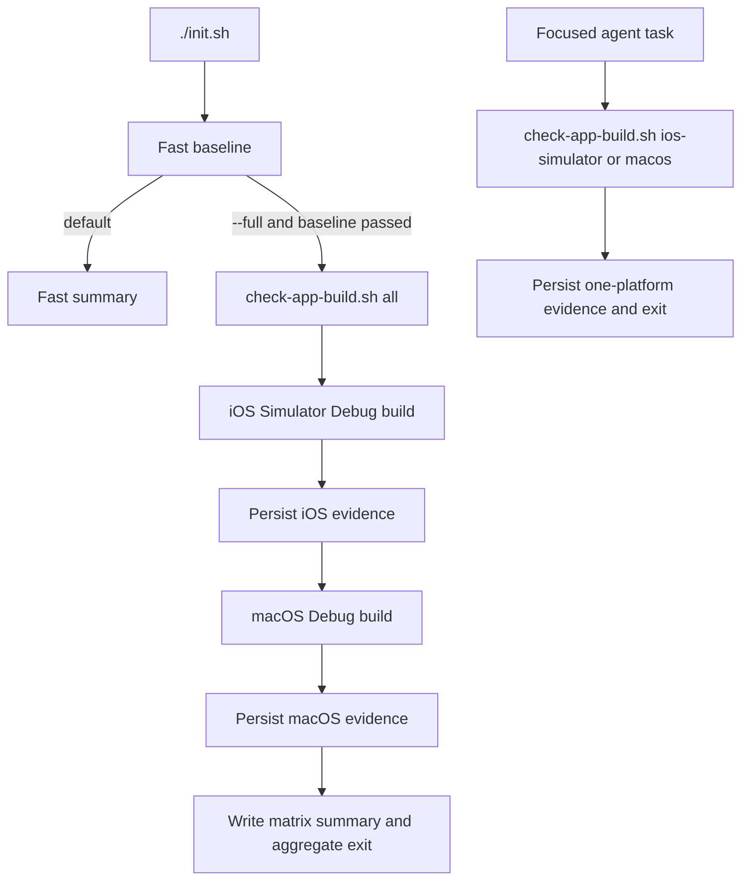

# Debug Build Evidence Layer - Plan

**Status:** Implemented; first matrix recorded  
**Plan type:** Harness infrastructure  
**Related reliability authority:** [`../../RELIABILITY.md`](../../RELIABILITY.md)

## Goal Capsule

- **Objective:** Add a repeatable Debug build evidence layer for the iOS Simulator and native macOS applications without turning every repository bootstrap into a full Xcode build.
- **Authority order:** Current code and schemes, `project.yml`, `Packages/VanmoCore/Package.swift`, `ARCHITECTURE.md`, then this plan.
- **Execution profile:** Add one platform-aware build primitive, expose a layered `./init.sh --full` entry point, preserve evidence for each selected platform, and update the repository guidance.
- **Stop conditions:** Do not install or launch an app, run XCUITest, request device provisioning, regenerate the Xcode project, repair unrelated compile failures, or claim runtime behavior from a build result.
- **Tail ownership:** The infrastructure change may finish with an accurately recorded red iOS result. Making the complete build matrix green is separate follow-up work when the failure is outside this plan.

---

## Product Contract

### Summary

Vanmo needs a build evidence layer between the current fast baseline and platform runtime validation.
The default `./init.sh` path remains fast.
After the fast baseline succeeds, `./init.sh --full` adds Debug builds for both applications, while a standalone script lets an agent run one platform during focused iteration.

### Problem Frame

The current bootstrap validates shared tests, static boundaries, Harness documentation, and the iOS UI CLI structure, but it deliberately does not compile either application.
This boundary is documented correctly, yet a fresh agent still lacks one discoverable command that proves whether both app targets compile.
The repository already records an iOS `build-for-testing` failure caused by the missing `.paused` branch in `SettingsView.swift`; the new evidence layer must expose that failure rather than silently fixing or bypassing it.

### Requirements

#### Layered entry points

- R1. Running `./init.sh` without arguments must preserve the existing fast baseline and must not compile either application.
- R2. Running `./init.sh --full` must run the fast baseline first, then request Debug build evidence for the iOS Simulator and macOS applications.
- R3. `scripts/check-app-build.sh` must support `ios-simulator`, `macos`, and `all` so an agent can request the narrowest relevant platform evidence.
- R4. Unknown or conflicting CLI input must fail with a non-zero usage result instead of being ignored.

#### Build boundary

- R5. The iOS check must build the `Vanmo` scheme for a generic iOS Simulator destination without booting or selecting a simulator.
- R6. The macOS check must build the `Vanmo-macOS` scheme for the local macOS destination without launching the app or requiring the repository's configured development team.
- R7. Both checks must use Debug configuration and the committed `Vanmo.xcodeproj`; they must not run `xcodegen generate`.
- R8. The checks must allow Xcode to resolve the app-level Swift package dependencies because the repository does not commit an Xcode `Package.resolved`.

#### Evidence and result semantics

- R9. Each invocation must preserve the selected platform's complete `xcodebuild` log, command metadata, toolchain identity, Git HEAD, dirty-tree state, and exit code under `build/app-build-evidence/`.
- R10. Platform DerivedData directories must be separate, while the package checkout cache may be shared because `all` runs platforms serially.
- R11. `all` and `./init.sh --full` must attempt both platform builds after the fast baseline succeeds, even when the first platform fails.
- R12. The aggregate command must return non-zero when any selected platform fails and must print a stable final summary containing each platform status and evidence path.
- R13. A successful build proves only that the selected target compiled in the recorded configuration and environment; it does not prove installation, launch, UI behavior, real-source behavior, physical-device signing, or Release CloudKit.

### Acceptance Examples

- AE1. **Covers R1:** Given a normal repository bootstrap, when `./init.sh` runs without arguments, then the existing four stages run and no app-build evidence directory is created.
- AE2. **Covers R2, R11, R12:** Given the fast baseline passes, when `./init.sh --full` runs and iOS fails while macOS succeeds, then both statuses are reported, both evidence paths exist, and the aggregate command returns non-zero.
- AE3. **Covers R3, R5:** Given no simulator is booted, when the iOS primitive runs, then it addresses a generic Simulator destination and never invokes `simctl`.
- AE4. **Covers R6:** Given no usable Vanmo development certificate, when the macOS primitive runs, then it performs an unsigned Debug build and never opens the resulting application.
- AE5. **Covers R9:** Given an `xcodebuild` failure, when the command exits, then the failure log and metadata remain available at the printed evidence path.
- AE6. **Covers R13:** Given both builds succeed, when the summary is written, then it describes compile evidence only and makes no runtime or CloudKit claim.

### Success Criteria

- The fast baseline remains behaviorally unchanged.
- One standalone command can build either platform or the full matrix.
- Full mode returns an honest matrix result and retains evidence for both attempted platforms.
- The current iOS compile blocker appears as a source failure in the iOS evidence rather than as a Harness success.
- Repository documentation teaches agents which command to run and what its result does and does not prove.

### Scope Boundaries

#### Deferred to Follow-Up Work

- Fix the missing `.paused` settings presentation after the required Figma and product decision is available.
- Add `build-for-testing` evidence for the UI-test bundle after the app compile gate is healthy.
- Add CI execution, Release builds, warning baselines, clean-build scheduling, evidence retention, or automatic evidence cleanup.
- Add an XcodeGen drift check as a separate architecture-guard improvement.

#### Outside This Plan

- App installation, launch, screenshots, accessibility trees, XCUITest actions, and golden journeys.
- Physical-device signing, provisioning updates, or development-team configuration.
- Release CloudKit validation, archives, IPA export, notarization, or distribution.
- Remote logging, telemetry, or evidence upload.
- Changes to application behavior, `project.yml`, schemes, package versions, or generated Xcode project files.

---

## Planning Contract

### Key Technical Decisions

- KTD1. **Use a layered gate.** `(session-settled: user-directed — chosen over compiling both apps during every bootstrap: preserve fast feedback for documentation and VanmoCore-only work.)` The default entry point satisfies R1, while `--full` satisfies R2.
- KTD2. **Separate the build primitive from orchestration.** `scripts/check-app-build.sh` owns platform mapping, build execution, evidence capture, and aggregation. `init.sh` owns the fast baseline and decides whether to invoke the full matrix.
- KTD3. **Use one platform-aware script.** A single script avoids duplicating evidence format, exit semantics, dependency-cache rules, and failure handling across two platform files while still exposing the platform primitives required by R3.
- KTD4. **Use ordinary app `build`, not `build-for-testing`.** This layer proves application target compilation only. UI-test bundle compilation belongs to the separate UI Harness evidence layer.
- KTD5. **Keep the build non-mutating.** The script consumes the committed project and records Git state but does not regenerate the project, edit settings, install dependencies outside Xcode's normal package resolution, or repair source errors.
- KTD6. **Collect the whole selected matrix.** After the fast baseline succeeds, an iOS failure must not hide the macOS result. The aggregate status is red if any selected platform is red.
- KTD7. **Treat failures as first-class evidence.** `xcodebuild` exit status is authoritative for the process result, while platform success additionally requires the expected `.app` product to exist. Log text such as `BUILD SUCCEEDED` is diagnostic only, and a known source failure may be the correct output of a working evidence layer.
- KTD8. **Keep platform build state isolated.** iOS Simulator and macOS use separate stable DerivedData roots for incremental speed. They share one package checkout cache and run serially to avoid package-cache contention.
- KTD9. **Record portable metadata.** Every run records Xcode version, Swift version, destination, scheme, configuration, Git HEAD, dirty state, command shape, timestamps, and exit status next to the raw log.

### High-Level Technical Design

The following is directional guidance, not an implementation specification:

The evidence root uses a unique run directory.
Each selected platform receives its own raw log and metadata path.
The run-level summary remains available even when one `xcodebuild` process fails.

### Build Profiles

- **iOS Simulator:** `Vanmo` scheme, Debug configuration, generic iOS Simulator destination, dedicated iOS DerivedData, no `-allowProvisioningUpdates`, and no `simctl`.
- **macOS:** `Vanmo-macOS` scheme, Debug configuration, local macOS destination, dedicated macOS DerivedData, and `CODE_SIGNING_ALLOWED=NO`, `CODE_SIGNING_REQUIRED=NO`, `CODE_SIGN_IDENTITY=`, and `DEVELOPMENT_TEAM=` command-line overrides. The empty identity keeps the existing conditional post-build `codesign` branch inactive.
- **Packages:** A shared checkout cache is allowed. Automatic package resolution remains enabled because app-level dependencies include Kingfisher, KSPlayer, and Lottie outside the local package's resolve step.

### Sequencing

1. Implement and validate the standalone build primitive.
2. Add `--full` orchestration without changing the no-argument path.
3. Update discoverability and evidence-boundary documentation.
4. Run the fast and platform checks, then record observed results without repairing application code.

### Risks and Mitigations

- **Known iOS source failure:** The new command is expected to expose the missing `.paused` branch. Treat this as successful Harness detection and create separate remediation work.
- **Signing asymmetry:** The iOS post-build script and macOS post-build script handle identities differently. Keep platform-specific signing arguments instead of forcing one shared flag set.
- **Package network variability:** A cold Xcode dependency resolution may fail for network reasons. Preserve the raw log and classify the platform result as failed without mislabeling it as a Swift source error.
- **Pipeline exit loss through `tee`:** Capture the actual `xcodebuild` status explicitly and use it for platform and aggregate results.
- **Dirty working tree:** Record dirty state in evidence. Do not claim that a run represents a clean commit.
- **Evidence growth:** Preserve logs and compact metadata only. Keep result bundles and automatic pruning outside the first version so unused artifacts and cleanup logic do not expand the P0 scope.

---

## Implementation Units

### U1. Platform Build Evidence Primitive

- **Goal:** Add a non-mutating script that produces focused or matrix Debug build evidence.
- **Requirements:** R3–R13; AE2–AE6.
- **Files:** `scripts/check-app-build.sh`.
- **Approach:** Follow the repository's strict Bash style and root-resolution pattern. Map each supported platform to its scheme, destination, DerivedData root, expected app product, and signing arguments. Create one unique evidence directory per invocation, preserve platform outputs, attempt all selected platforms serially, and compute the aggregate result from captured process statuses.
- **Test scenarios:**
  - `--help` returns zero and documents all supported platform values.
  - Missing, unknown, or extra platform input returns a usage error before invoking Xcode.
  - `ios-simulator` works without a booted simulator and does not call device or launch tools.
  - `macos` does not require a development-team identity and does not open the app.
  - `all` records both platform attempts when the first platform fails.
  - A source failure, dependency-resolution failure, and successful build each retain a complete log and accurate status.
  - The selected build succeeds only when the expected `.app` product exists in the platform DerivedData output.
- **Verification:** Bash syntax, focused platform runs, an aggregate run, evidence inspection, and tracked-file status inspection.

### U2. Layered Bootstrap Orchestration

- **Goal:** Add full-mode orchestration while preserving the fast default.
- **Requirements:** R1, R2, R4, R11–R13; AE1, AE2.
- **Files:** `init.sh`.
- **Dependencies:** U1.
- **Approach:** Parse `--help` and `--full` before tool preflight. Keep the existing no-argument stages and order unchanged. Invoke the full build matrix only after the fast baseline passes. Preserve the existing explicit `RUN_START_COMMAND=1` launch opt-in without treating it as part of build evidence.
- **Test scenarios:**
  - No arguments run only the existing four baseline stages.
  - `--help` exits before dependency resolution or verification.
  - An unknown or repeated argument fails instead of being ignored.
  - A fast-baseline failure prevents app builds.
  - `--full` delegates to the matrix primitive and returns its aggregate status.
  - `RUN_START_COMMAND=1` remains an explicit launch path and is not reported as compile evidence.
- **Verification:** Bash syntax, help and error-path checks, normal bootstrap, and full bootstrap.

### U3. Discoverability and Evidence Boundaries

- **Goal:** Make the new evidence layer discoverable without overstating what it proves.
- **Requirements:** R13.
- **Files:** `AGENTS.md`, `README.md`, `ARCHITECTURE.md`, `docs/RELIABILITY.md`, `docs/references/xcodegen-build-reference-llms.txt`.
- **Dependencies:** U1, U2.
- **Approach:** Document the fast/full distinction, focused platform commands, evidence location, and exact proof boundary. Replace statements that `init.sh` never builds apps with the narrower statement that its default mode does not build apps.
- **Test scenarios:**
  - A fresh reader can find the fast, full, iOS-only, and macOS-only commands from the normal documentation route.
  - Documentation does not claim launch, UI, device, Release, or CloudKit evidence.
  - All new repository-local links resolve.
- **Verification:** `./scripts/check-harness-docs.sh` and manual cross-check against the script help text.

### U4. Execute and Record the First Matrix

- **Goal:** Prove the evidence layer itself and record the actual repository build state.
- **Requirements:** R9–R13; AE2, AE5, AE6.
- **Files:** `docs/exec-plans/active/2026-08-26-debug-build-evidence-layer.md`, `docs/QUALITY_SCORE.md` only when supported by new evidence, and `docs/exec-plans/tech-debt-tracker.md` only when the run confirms new debt.
- **Dependencies:** U1–U3.
- **Execution note:** Run the fast proof first, one focused platform proof, then `./init.sh --full`. Let full mode's internal `all` call supply the aggregate evidence; invoke `scripts/check-app-build.sh all` directly only when diagnosing orchestration. Preserve an expected red iOS result rather than changing application code during this unit.
- **Test scenarios:**
  - The current iOS failure is attributed to the source path and retained in the iOS evidence directory.
  - macOS receives an independent status even when iOS fails.
  - The aggregate result matches the two platform statuses.
  - The Progress log records commands, environment, outcomes, and remaining unverified evidence without secrets or private paths.
- **Verification:** Compare terminal summary, run-level metadata, raw platform logs, expected products, and command exit statuses.

---

## Verification Contract

| Gate | Command | Applicability | Pass condition |
| --- | --- | --- | --- |
| Shell syntax | `bash -n init.sh scripts/check-app-build.sh` | U1–U2 | Both scripts parse successfully. |
| Fast baseline | `./init.sh` | U2–U4 | Existing four stages retain their prior behavior and no app build is attempted. |
| iOS compile evidence | `./scripts/check-app-build.sh ios-simulator` | U1, U4 | Evidence is retained and status matches the real iOS Debug build result. Infrastructure acceptance does not require the current source failure to be green. |
| macOS compile evidence | `./scripts/check-app-build.sh macos` | U1, U4 | Evidence is retained and status matches the real macOS Debug build result. |
| Matrix aggregation | `./scripts/check-app-build.sh all` | U1, U4; direct run only when diagnosing the primitive | Both selected platforms are attempted and aggregate exit matches the platform statuses. |
| Full bootstrap | `./init.sh --full` | U2, U4 | Fast baseline runs first, both builds are attempted after it passes, and the final result is honest. |
| Documentation | `./scripts/check-harness-docs.sh` | U3–U4 | Required files and repository-local links pass. |
| Working-tree safety | `git status --short` | All units | No generated build evidence or unintended project changes are tracked. |

The first execution may produce a red full bootstrap because of a real iOS source error.
That result can still satisfy this plan when the Harness records it correctly and macOS receives an independent result.
A green two-platform matrix is a later repository-health milestone, not a hidden requirement for shipping the evidence primitive.

---

## Definition of Done

- U1–U3 satisfy their requirements and test scenarios.
- The default bootstrap remains fast and the full bootstrap is opt-in.
- Platform build checks are independently callable, non-mutating, and preserve inspectable evidence.
- Aggregate status is derived from actual process exits and does not hide a platform.
- At least one real focused run and one real aggregate run exercise the new layer.
- The plan Progress section records observed results and clearly separates Harness correctness from application compile health.
- Documentation reflects the implemented command surface and evidence boundary.
- `docs/QUALITY_SCORE.md` changes only if the new execution evidence supports a quality claim.
- No app behavior, Xcode target configuration, package version, signing identity, or generated project file changes are included.
- Temporary experimental code and accidental generated artifacts are absent from the tracked diff.

---

## Progress

- **2026-08-26:** Plan created. The user selected a layered gate: default `./init.sh` remains fast and `./init.sh --full` adds both app builds.
- **2026-08-26:** Implemented `scripts/check-app-build.sh` and `./init.sh --full`. Fast `./init.sh` passed the four baseline stages and created no `build/app-build-evidence/` directory. Focused `./scripts/check-app-build.sh macos` passed (`xcodebuild` 0, `Vanmo-macOS.app` present). `./init.sh --full` then recorded an honest matrix on a dirty tree at `8f12677`: iOS Simulator Debug failed with `xcodebuild` 65 at `Vanmo/Features/Settings/Views/SettingsView.swift:489` missing `.paused`; macOS Debug passed independently; aggregate exit was 1. Evidence: `build/app-build-evidence/runs/20260826-140652-6333` and `build/app-build-evidence/runs/20260826-141002-10994`. Toolchain: Xcode 26.0.1 / Swift 6.2. The Harness layer is complete; making the iOS compile green remains follow-up work.

## Open Decisions

No planning-blocking decisions remain.
Execution must determine the exact first-run results from real `xcodebuild` output without broadening scope.
