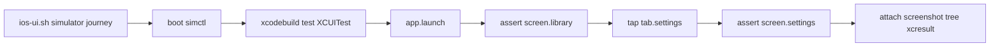

# iOS UI Golden Journey - Plan

**Status:** Completed; first simulator journey recorded  
**Plan type:** Harness infrastructure  
**Related reliability authority:** [`../../RELIABILITY.md`](../../RELIABILITY.md)

## Goal Capsule

- **Objective:** Unlock one repeatable iOS tab-navigation golden journey that an agent can run without a physical device or signing identity.
- **Authority order:** Current code and tests, `project.yml`, `ARCHITECTURE.md`, [`../../RELIABILITY.md`](../../RELIABILITY.md), then this plan.
- **Execution profile:** Repair the known iOS compile blocker, add a few stable accessibility identifiers, route simulator UI commands through XCUITest, and record tree/tap/assert plus `xcresult` evidence.
- **Stop conditions:** Do not require a physical device, do not add XCUITest to the default `./init.sh` path, do not implement connect/play/download journeys, and do not design a full Settings pause UI.
- **Tail ownership:** Simulator XCUITest is the completion gate. A physical-device run is optional and must not block this plan.

---

## Product Contract

### Summary

Vanmo already has a one-command XCUITest runner and a compile-evidence layer, but the iOS app does not compile, the simulator backend cannot inspect or tap UI, and no golden journey has recorded artifacts.

The smallest mechanical journey is platform tab navigation: launch on the library tab, discover stable selectors, tap Settings, assert the settings screen, and retain screenshot, tree, and `result.xcresult` files.

### Problem Frame

Each `ios-ui.sh` command launches the app. Tap and assert therefore cannot be split across two processes without losing navigation state. The simulator backend currently uses `simctl` for screenshots and rejects interaction. The iOS Debug compile is blocked by a missing `.paused` branch in Settings.

### Requirements

- R1. Repair the Settings `DownloadTaskStatus` switch with a compile-safe `.paused` label that matches the existing macOS "已暂停" copy. Do not add pause controls or a new layout.
- R2. Add 3–5 stable identifiers for this journey only: `screen.library`, `screen.settings`, `tab.library`, and `tab.settings`.
- R3. `ios-ui.sh device` and `ios-ui.sh simulator` share one XCUITest entry for screenshot, tree, tap, type, swipe, wait, assert, and journey.
- R4. `simctl` remains only for simulator boot, launch, and terminate. It must not capture screenshots or validate UI.
- R5. Single-step tree/tap/assert remain available. An in-process `journey --name tab-navigation` performs launch-default library assert, Settings tap, and settings-screen assert in one XCUITest process.
- R6. If SwiftUI hides tab-item identifiers, the journey may tap the stable Chinese label "设置", but `screen.settings` must exist.
- R7. Simulator XCUITest uses a separate DerivedData root from the device path and does not request a development team or provisioning updates.
- R8. Each XCUITest run retains `result.xcresult`, the `xcodebuild` log, attachment-export diagnostics, and exported attachments under `build/ui-cli/runs/`.
- R9. Default `./init.sh` remains a four-stage fast baseline and must not run XCUITest.
- R10. A successful simulator journey proves only that the recorded selectors and in-process navigation worked on that simulator. It does not prove physical-device signing, Figma fidelity, or product journeys 1–3.

### Acceptance Examples

- AE1. **Covers R1:** `./scripts/check-app-build.sh ios-simulator` compiles and no longer fails on the missing `.paused` case.
- AE2. **Covers R2, R5:** `ios-ui.sh simulator tree` includes `screen.library`.
- AE3. **Covers R5:** `ios-ui.sh simulator assert --identifier screen.library --state exists` returns zero after a fresh launch.
- AE4. **Covers R3, R5, R8:** `ios-ui.sh simulator journey --name tab-navigation` returns zero and retains `result.xcresult` plus screenshot/tree attachments.
- AE5. **Covers R4, R9:** `./init.sh` still runs only the four baseline stages. `simulator launch|terminate` still use `simctl`.
- AE6. **Covers R10:** Documentation describes the simulator journey as XCUITest evidence, not as a physical-device or real-source proof.

### Success Criteria

- iOS Simulator Debug compile is green.
- Simulator `tree`, default-screen `assert`, and `journey tab-navigation` all return zero.
- The journey run directory contains `result.xcresult` and exported attachments.
- Documentation no longer treats a simulator `simctl` screenshot as UI validation.
- A missing physical-device run does not fail the plan.

### Scope Boundaries

#### Deferred to Follow-Up Work

- Physical-device signing, `TEST_RUNNER_*` delivery, and a recorded device journey.
- Full Settings pause controls after an iOS Figma decision.
- Connect, scan, play, download, or CloudKit journeys.
- Broader accessibility-identifier coverage.

#### Outside This Plan

- Adding XCUITest to default `./init.sh`.
- Remote logging or telemetry.
- macOS UI journeys.
- Regenerating the Xcode project or changing `project.yml`.

---

## Planning Contract

### Key Technical Decisions

- KTD1. **Use simulator XCUITest as the completion gate.** `(session-settled: user-directed)` Physical-device evidence is optional.
- KTD2. **Keep the `device|simulator` CLI shape.** Both modes share one XCUITest runner. `simctl` is limited to simulator management.
- KTD3. **Keep one-action commands and add one in-process journey.** Independent tap/assert cannot preserve navigation across launches.
- KTD4. **Use a compile-safe paused label.** Reuse the macOS "已暂停" copy instead of inventing a new Settings pause UI.
- KTD5. **Keep identifier coverage narrow.** Only the library and settings tabs needed by this journey receive identifiers.

### High-Level Technical Design

### Sequencing

1. Record this plan and update the active index.
2. Repair the compile blocker and add identifiers.
3. Unify the XCUITest CLI and add the journey action.
4. Update static checks and evidence-boundary documentation.
5. Run the simulator commands and record observed results.

### Risks and Mitigations

- **SwiftUI TabBar may hide tab identifiers.** The journey falls back to the label "设置" after waiting for `tab.settings`. Screen identifiers remain mandatory.
- **TEST_RUNNER environment delivery.** The simulator run is the first verification of `TEST_RUNNER_VANMO_UI_*` → `VANMO_UI_*`. Preserve the raw log if delivery fails.
- **Simulator boot or package resolution cost.** Boot with `simctl` before `xcodebuild test`. Treat a cold package-resolution failure as a failed run, not as a passing Harness.
- **Attachment export variability.** Keep the `xcresult` even when a requested output copy fails.

---

## Implementation Units

### U0. Active Plan Record

- **Files:** this file; [`../active/index.md`](../active/index.md).

### U1. Compile-Safe Paused Label

- **Files:** `Vanmo/Features/Settings/Views/SettingsView.swift`.
- **Verification:** `./scripts/check-app-build.sh ios-simulator`.

### U2. Journey Identifiers

- **Files:** `Vanmo/App/ContentView.swift`.
- **Verification:** simulator `tree` after U3.

### U3. Unified XCUITest CLI

- **Files:** `scripts/ios-ui.sh`, `VanmoUITests/VanmoDeviceInteractionTests.swift`.
- **Verification:** Bash syntax, help/usage, simulator XCUITest commands.

### U4. Static Checks and Documentation

- **Files:** `scripts/check-ios-ui-cli.sh`, `AGENTS.md`, `README.md`, `ARCHITECTURE.md`, `docs/RELIABILITY.md`, `docs/FRONTEND.md`, `docs/sops/apple-ui-validation-loop.md`, `docs/references/xcodegen-build-reference-llms.txt`.
- **Verification:** `./scripts/check-ios-ui-cli.sh` and `./scripts/check-harness-docs.sh`.

### U5. Execute and Record

- **Files:** this plan, `docs/QUALITY_SCORE.md`, and `docs/exec-plans/tech-debt-tracker.md` only when evidence supports the change.
- **Verification:** fast `./init.sh`, iOS compile, simulator tree/assert/journey, documentation checks.

---

## Verification Contract

| Gate | Command | Pass condition |
| --- | --- | --- |
| Fast baseline | `./init.sh` | Four stages pass; no XCUITest runs |
| iOS compile | `./scripts/check-app-build.sh ios-simulator` | Green; no missing `.paused` error |
| Simulator tree | `./scripts/ios-ui.sh simulator tree --output ...` | Exit 0; `screen.library` present |
| Simulator assert | `./scripts/ios-ui.sh simulator assert --identifier screen.library --state exists` | Exit 0 |
| Simulator journey | `./scripts/ios-ui.sh simulator journey --name tab-navigation` | Exit 0; `result.xcresult` retained |
| CLI static | `./scripts/check-ios-ui-cli.sh` | Pass |
| Documentation | `./scripts/check-harness-docs.sh` | Pass |

---

## Progress

- **2026-08-26:** Plan created. The user selected simulator XCUITest as the completion gate and limited `simctl` to simulator management.
- **2026-08-26:** Implemented the compile-safe `.paused` label, library/settings identifiers, unified XCUITest CLI, and `journey --name tab-navigation`. Fast `./init.sh` passed 4/4. Focused `./scripts/check-app-build.sh ios-simulator` passed (`xcodebuild` 0, evidence `build/app-build-evidence/runs/20260826-145050-52563/ios-simulator`). Simulator XCUITest on iPhone 17 Pro (`0811807F-3DD6-4DF5-B5B3-C734ABC76F1F`) with Xcode 26.0.1 / Swift 6.2: `tree` exported `screen.library`, `tab.library`, and `tab.settings`; `assert --identifier screen.library --state exists` passed; `journey --name tab-navigation` tapped `tab.settings`, asserted `screen.settings`, and retained `result.xcresult` plus screenshot/tree attachments at `build/ui-cli/runs/20260826-145830-63647`. The first tree copy failed because Xcode 26 suffixes attachment names; the matcher now accepts that suffix. No physical-device XCUITest ran.

## Open Decisions

No planning-blocking decisions remain. Tab-item identifiers were visible in the first simulator tree, so the journey tapped `tab.settings` without the label fallback.
