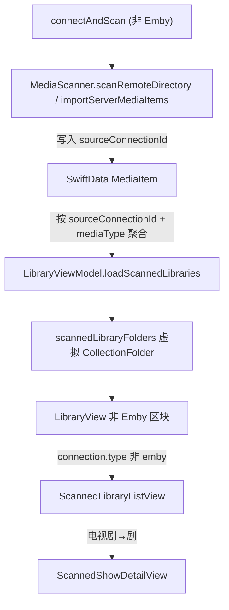

# 非 Emby 协议首页显示与缓存

## 背景

- 非 Emby 协议（SMB/WebDAV/FTP/NFS/本地）经 `scanRemoteDirectory` 写入 SwiftData `MediaItem`，Plex 经 `importServerMediaItems`（[MediaScanner.swift](Vanmo/Core/Storage/MediaScanner.swift)），首页无对应区块。
- `MediaItem`（[MediaItem.swift](Vanmo/Features/Library/Models/MediaItem.swift)）无连接来源字段，无法按连接分组。
- 首页 `CollectionFolder` 区块仅 Emby/Jellyfin（[LibraryView.swift](Vanmo/Features/Library/Views/LibraryView.swift)），其「查看全部」走 live API（[CollectionFolderListView.swift](Vanmo/Features/Library/Views/CollectionFolderListView.swift)）。

## 目标形态（已确认）

- 每个非 Emby 连接 = 一个首页区块，复用现有 `serverSectionHeader` + `folderRow` 布局。
- 区块内按类型聚合成虚拟媒体库行：`电影`（movie）、`电视剧`（按 `showTitle` 去重聚合成「剧」）。
- 数据来自 SwiftData，启动即读，无白屏，无需 JSON 缓存（区别于 Emby 方案）。

## 数据流

## 实现要点

### 1. `MediaItem` 增加来源字段
- 加 `var sourceConnectionId: UUID?`（[MediaItem.swift](Vanmo/Features/Library/Models/MediaItem.swift)）。
- SwiftData 新增 optional 属性属于轻量自动迁移，现有 schema 无 `VersionedSchema`（[VanmoApp.swift](Vanmo/App/VanmoApp.swift)），旧数据该字段为 `nil`，无需 MigrationPlan。

### 2. `MediaScanner` 记录并回填来源
- `scanRemoteDirectory(service:path:connectionId:in:)` 新增 `connectionId` 参数，新建 item 时 `item.sourceConnectionId = connectionId`。
- 将去重用的 `existing` 从 `Set<String>` 改为 `[String: MediaItem]`，跳过已存在项时若其 `sourceConnectionId == nil` 则补写（回填旧数据，配合「全量重扫」）。
- `importServerMediaItems(_:connectionId:in:)` 加可选 `connectionId`，在 `apply(serverItem:to:)` 中写入（Plex 传连接 id；Emby resume/favorites 调用保持 `nil`，因 Emby 走真实 CollectionFolder，不进非 Emby 区块）。

### 3. 扫描入口传连接 id
- [BrowserViewModel.swift](Vanmo/Features/Browser/ViewModels/BrowserViewModel.swift) `connectAndScan` 中两处调用分别传 `connection.id`（`scanRemoteDirectory` 与 Plex 的 `importServerMediaItems`）。

### 4. `LibraryViewModel` 聚合非 Emby 虚拟库
新增与 Emby 解耦的并行状态（[LibraryViewModel.swift](Vanmo/Features/Library/ViewModels/LibraryViewModel.swift)）：
- `scannedLibraryFolders: [UUID: [CollectionFolder]]`、`scannedFolderPreviews: [String: [MediaItem]]`、`scannedFolderTotalCounts: [String: Int]`、`orderedScannedConnections`。
- `loadScannedLibraries(connections:)`：对 `type != .emby/.jellyfin` 的连接，按 `sourceConnectionId` 从 SwiftData 查询，组内：
  - `电影`：`mediaType == .movie`；
  - `电视剧`：`mediaType == .tvEpisode`（必要时含 `.tvShow`）按 `showTitle` 去重，每剧取代表条目。
  - 构造虚拟 `CollectionFolder`（id 形如 `scanned-{connId}-movies` / `-tvshows`，`collectionType` 复用 `EmbyCollectionType.movies/.tvshows`），预览取前 `folderPreviewPageSize`，总数取去重后计数。空类型不生成。
- 在 `loadInitialSections` 与 `refreshAfterLibrarySync` 中调用；`LibraryView` 监听 `librarySyncCompletionID` 时一并刷新。

### 5. 首页渲染与分流
- [LibraryView.swift](Vanmo/Features/Library/Views/LibraryView.swift) `libraryContent` 增加非 Emby 区块（独立于 `hasEmbyConnectionsConfigured`），复用 `serverSectionHeader` + `folderRow`。
- `folderRow(folder:connection:)` 已持有 `connection`，按 `connection.type` 分流「查看全部」：Emby → `CollectionFolderListView`；非 Emby → `ScannedLibraryListView`。
- `updateLibraryEmptyState` 增加 `scannedLibraryFolders` 非空判断。

### 6. 新建 SwiftData 列表视图
- `Vanmo/Features/Library/Views/ScannedLibraryListView.swift`：输入 `connection` + `collectionType`，用 SwiftData 按 `sourceConnectionId`(+`mediaType`) 查询。`电影`走 grid 进 `MediaDetailView`；`电视剧`按 `showTitle` 分组展示「剧」卡片，进 `ScannedShowDetailView`。
- `Vanmo/Features/Library/Views/ScannedShowDetailView.swift`：按 `sourceConnectionId` + `showTitle` 查所有分集，按 `seasonNumber`/`episodeNumber` 排序，点击 `appState.play(item)`。
- 两个新文件需登记到 [Vanmo.xcodeproj/project.pbxproj](Vanmo.xcodeproj/project.pbxproj)（参考 `HomeCollectionCache.swift` 的 PBXBuildFile/PBXFileReference/Group/Sources 四处登记）。

## 已知限制
- 旧 `MediaItem`（`sourceConnectionId == nil`）需「全量重扫」回填后才进区块。
- 非 Emby 电视剧无 Series 海报/聚合元数据，「剧」卡片多为占位图，预览以剧名为主。

## 验证
- 迁移：升级安装后旧库可正常打开，无崩溃。
- 扫描：新增 SMB/本地连接后，`MediaItem.sourceConnectionId` 被写入；全量重扫回填旧项。
- 首页：每个非 Emby 连接出现独立区块，含 电影/电视剧 虚拟库行；空类型不显示。
- 查看全部：电影 grid 正常；电视剧按剧分组，点剧进入分集列表并可播放。
- 重启 App 首页直接显示（无白屏、无需网络）。